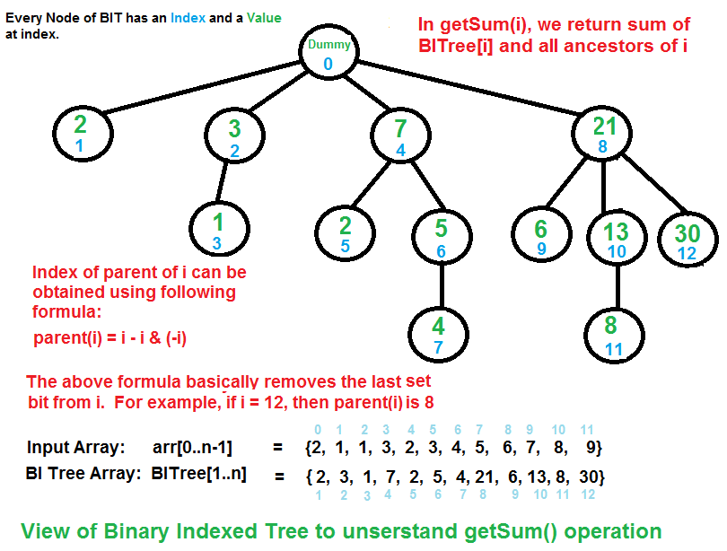

-   Fenwick Tree (Binary Indexed Tree)
    -   Used for fixed Input Array and Multiple Queries of the following types:
        -   Prefix Operations (Sum, Product, XOR , OR, etc)
        -   Update a Value (change an element of an array)
        -   For an array arr[1..n], a Fenwick Tree supports:
            -   Update(index, value) – add value to arr[index]. -> Complexity: O(log n)
            -   Query(index) – get the prefix sum from arr[1] to arr[index]. -> Complexity: O(log n)
            -   Range Sum(l, r) – get sum of arr[l..r]. -> Done as Query(r) - Query(l-1) in O(log n).
    -   It is Actually an Array, but the concept is tree based
    -   Requires O(nlogn) processing time and O(n) Auxillary space
    -   Also known as Binary Indexed Tree or Fenwick Tree
    -   Adavantages
        -   Much faster than a segment tree in practice (lower constant factors).
        -   Simple to implement.
        -   Space complexity: O(n).
    1.  Implementation (Prefix Sum)
        -   Core Idea
            -   The tree is stored as a 1-based array ft[].
            -   Each index i in ft[] stores the sum of a block of elements from the original array.
            -   The block size is determined by the Lowest Set Bit (LSB) of i.
            -   Each index i in Fenwick Tree (ft[i]) stores the sum of a range of size = in power of 2 : 1,2,4,8,..... and then divides in subarrays and do the same.
            -   LSB means the rightmost 1 in the binary form of i.
                Example:
                    i=4 (100₂) → LSB=4 → block size 4
                    i=6 (110₂) → LSB=2 → block size 2
                    📦 Example (arr = [1, 2, 3, 4, 5])
                    Index i	Binary	LSB	Range covered	Meaning of ft[i]
                    1	0001	1	[1]	arr[1]
                    2	0010	2	[1..2]	arr[1]+arr[2]
                    3	0011	1	[3]	arr[3]
                    4	0100	4	[1..4]	arr[1]+arr[2]+arr[3]+arr[4]
                    5	0101	1	[5]	arr[5]
            
        -   Movement Intuition (all about 2’s)
            -   Update: move upward → keep adding to larger powers of 2 (1 → 2 → 4 → 8 → …).
            -   Query: move downward → keep subtracting to break into smaller powers of 2.
            Think of it like:
                -   Update = merging into bigger binary blocks.
                -   Query = splitting into smaller binary blocks.
        -   Operations
            -   Update(index, val) : Goal: Add val to arr[index].
                -   Intuition: The position index is part of larger prefix blocks in the tree.So, when we update, we must also update all   parent ranges that include this index.
                -   Formula: i += (i & -i) → move upward to parent.
                -   Why upward? Because parents represent bigger ranges that cover the current index.
                    Example:
                    update(3, +2)
                    Start at i=4 (since internally we use 1-based index).
                    Add +2 to ft[4] (which stores arr[1..4]).
                    Jump upward to parent: i=8 → stop (out of range).
            -   Query(i) : Goal: Find prefix sum [1..i].
                -   Intuition: The Fenwick Tree stores disjoint blocks that together make up [1..i]. To compute, we keep moving to smaller ranges until we reach the root.
                -   Formula: i -= (i & -i) → move downward to smaller child ranges.
                -   Why downward? Because children represent smaller ranges that build up the full prefix.
                    Example:
                    query(5) → sum[1..5]
                    Steps:
                    Add ft[5] (arr[5])
                    Move down: i=4, add ft[4] (arr[1..4])
                    Move down: i=0 → stop
                    Total = arr[1..5]
-   Segment Tree
    -   What is a Segment Tree?
        -   A Segment Tree is a binary tree data structure used to store information about intervals (segments) of an array.
        -   Each node represents a range [L, R] of the array.
        -   The root represents the entire array [0, n-1].
        -   The children of a node divide the range into two halves:
        -   Left child → [L, mid]
        -   Right child → [mid+1, R]
        👉 Example: For array A = [3, 8, 7, 6, -2, -8, 4, 9]
            -   Root stores sum of [0,7].
            -   Left child stores sum of [0,3].
            -   Right child stores sum of [4,7].
            -   And so on until single elements (leaf nodes).
    -   Why Use Segment Tree?
        -   We need Segment Trees when:
        -   The array is large (n up to 1e5 or more).
        -   We want to answer queries like:
            -   Range sum queries
            -   Range minimum/maximum queries
            -   Range GCD/LCM
            -   Even advanced operations (like range updates with lazy propagation).
        -   A naive approach (looping over range every time) would take O(n) per query.
        -   Segment Tree reduces this to O(log n) per query.
    -   Benefits of Segment Tree
        -   ✅ Fast Queries: Range query in O(log n).
        -   ✅ Updates Supported: Point update (change a value) in O(log n).
        -   With lazy propagation, range updates also possible in O(log n).
        -   ✅ Flexible: Not just sums — works with min, max, gcd, etc.
        -   Any operation that is:  Associative → (a ⊕ b) ⊕ c = a ⊕ (b ⊕ c) Has an identity element (e.g., 0 for sum, +∞ for min)
    -   Limitations
        -   ❌ Extra Memory: Needs about 4*n space (can be heavy for very large n).
        -   ❌ Complexity of Implementation: Harder to implement and debug compared to Fenwick Tree (BIT).
        -   ❌ Not always best choice: If only prefix sums are needed → Fenwick Tree (BIT) is simpler.
        -   If the array is static (no updates) → use a Sparse Table instead (O(1) queries).
    1.  Implementation of prefix sum
        -   Implementation (High-Level, No Code)
        -   Building: Divide array recursively into halves. Each node stores result (like sum or min) for its segment. Time = O(n)
        -   Querying: To answer a range [L, R], check three cases:
            -   No overlap → ignore.
            -   Complete overlap → use node’s value directly.
            -   Partial overlap → combine results from children.
                Query time = O(log n).
            -   Updating: Change a value at an index → update its leaf, then propagate the change up to root. Time = O(log n).
    2.  Lazy Propogation
        -   What it is ?
            -   Lazy propagation is an optimization technique used with Segment Trees to handle range updates efficiently.
            -   Instead of immediately updating all affected nodes in a range, we delay ("lazily") the updates and store pending operations in a lazy[] array.
            -   When a node is visited later (during query or update), the pending update is applied ("pushed down") to ensure correctness
        -   Why it’s needed ?
            -   Without lazy propagation, a range update (like adding x to all elements in [L, R]) would take O(n) in the worst case (updating each element or node).
            -   Lazy propagation reduces this to O(log n) by updating only relevant segment tree nodes and deferring detailed updates until necessary.
            -   Useful when you have a lot of range updates + range queries.
        -   Time Complexity
            -   Build Tree: O(n)
            -   Range Update (with Lazy): O(log n)
            -   Range Query (with Lazy): O(log n)
            -   Same asymptotic complexity as normal segment tree, but with better efficiency for updates.
        -   Space Complexity
            -   Segment tree requires O(4n).
            -   Lazy array adds O(4n) → total O(8n) ≈ O(n).
        -   Key Changes in Implementation
            -   Maintain an additional lazy[] array (same size as tree[]) to store pending updates.
            -   On visiting a node:
                -   Push down the pending update from lazy[i] to the current node (apply it), and if not a leaf, pass it to its children
                -   Clear the lazy[i] after applying.
                -   Range updates just mark/update lazy[] instead of traversing the whole range.
                -   Queries first check and resolve any pending updates with pushdown() to ensure correctness.

-   Normal Segment Tree handles point updates in O(log n) but range updates take O(n).
-   Lazy Propagation reduces range updates to O(log n) by postponing unnecessary work.