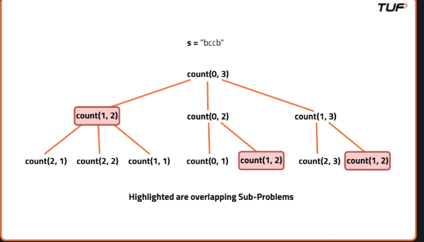

-   Easy Problems
    1.  Remove outermost Parenthesis : https://leetcode.com/problems/remove-outermost-parentheses/
    2.  Reverse string : https://leetcode.com/problems/reverse-words-in-a-string/
    3.  Odd String : https://leetcode.com/problems/largest-odd-number-in-string/
    4.  longest common prefix : https://leetcode.com/problems/longest-common-prefix/
    5.  Isomorphic string : https://leetcode.com/problems/isomorphic-strings/
    6.  Search Pattern
        ## 🔍 Pattern Searching Algorithms Comparison

        ### 1. Naive
        - **Time Complexity**: O(n * m)
        - **Space Complexity**: O(1)
        - **When to Use**: Very small input sizes; good for explaining the brute-force idea
        - **Advantages**: Simple, easy to implement
        - **Common in Interviews?** ✅ Sometimes (as a warm-up)

        ---

        ### 2. KMP (Knuth-Morris-Pratt)
        - **Time Complexity**: O(n + m) : 
            construct_lps: O(n)
            search (kmp):  O(m)
            --------------------
            Total:         O(n + m)
        - **Space Complexity**: O(m)
        - **When to Use**: Efficient single-pattern search in large texts
        - **Advantages**: No backtracking; uses LPS (prefix table) to skip unnecessary comparisons
        - **Common in Interviews?** ✅ Frequently

        ---

        ### 3. Rabin-Karp
        - **Time Complexity**: Average: O(n + m), Worst: O(n * m)
        - **Space Complexity**: O(1) or O(m) (for rolling hash)
        - **When to Use**: Hash-based search, multiple patterns, plagiarism detection
        - **Advantages**: Efficient in average case; good when multiple or repeated searches
        - **Common in Interviews?** ✅ Occasionally
        -   Imp : hash[i] = (hash[i-1] * base) + s[i]
                  gethash_substr(l,r) = hash[r] - (hash[l-1] * power(r-l+1))
                  base = 31, mode = 1e9+7

        ---

        ### 4. Z Algorithm
        - **Time Complexity**: O(n + m)
        - **Space Complexity**: O(n + m)
        - **When to Use**: Pattern-prefix/suffix problems; overlapping matches
        - **Advantages**: Efficient prefix matching; useful in advanced string problems
        - **Common in Interviews?** 🟡 Rarely

        ---

        ### 5. Boyer-Moore
        - **Time Complexity**: Best case: Sublinear (avg O(n/m))
        - **Space Complexity**: O(m)
        - **When to Use**: Long patterns with large alphabets; practical in real-world search tools
        - **Advantages**: Skips ahead using good/bad character heuristics
        - **Common in Interviews?** ❌ Rarely (too complex for most interviews)

        ---

        ### 6. Aho-Corasick
        - **Time Complexity**: O(n + total pattern length + z)
        - **Space Complexity**: O(trie size)
        - **When to Use**: Multiple patterns in one scan (e.g., keyword filters, antivirus, NLP)
        - **Advantages**: Combines Trie + failure links for fast multi-pattern matching
        - **Common in Interviews?** ❌ Rarely (only in domain-specific roles like search engines)

        ---
    7.  Rotate String : https://leetcode.com/problems/rotate-string/description/
    8.  Is Anagram : https://leetcode.com/problems/valid-anagram/
-   Medium Problems
    1.  Sort Characters by Frequency : https://leetcode.com/problems/sort-characters-by-frequency/
    2.  Maximum Nesting Depth of the Parentheses : https://leetcode.com/problems/maximum-nesting-depth-of-the-parentheses/description/
    3.  Roman to Integers : https://leetcode.com/problems/roman-to-integer/description/
    4.  Integers to Roman : https://leetcode.com/problems/integer-to-roman/
    5.  Implement Atoi : https://leetcode.com/problems/string-to-integer-atoi/
    6.  Sum of Beauty : https://leetcode.com/problems/sum-of-beauty-of-all-substrings/
-   Hard Problems
    1.  Add char to make balanced : https://leetcode.com/problems/minimum-add-to-make-parentheses-valid/
    2.  Count and Say : https://leetcode.com/problems/count-and-say/
    3.  Shortest Palindrome : https://leetcode.com/problems/shortest-palindrome/description/
    4.  Happy prefix : https://leetcode.com/problems/longest-happy-prefix/description/
    5.  Count Palindrome : https://takeuforward.org/data-structure/count-palindromic-subsequence-in-given-string
        string ==> x1------------middle--------------x2
            approach ==> count(x1middle) + count(middlex2) + count(middle) + count(x1middlex2)
            case when x1 == x2 ==> count(xmiddlex) = 1 + count(middle), also count(middlex2),count(x1middle) will both have middle in them (). So, total = 1 + count(middle) + count(middle) + count(x1middle) + count(middlex2) =======> 1 + count(x1middle) + count(middlex2) ------> as count(middle) will cancel out
            case when x1 != x2 ==> count(x1middlex2) = 0, so
                total = count(x1middle) + count(middlex2) - count(middle)
    6.  Count Unique Palindrome : https://leetcode.com/problems/count-different-palindromic-subsequences/description/
        It is similar as above just different when x1 == x2
            so total = c(xmiddle) + c(middlex) + c(middle) + c(xmiddlex)
            case 1 : when there is no x inside middle. so c(xmiddlex) = 1 + c(middle), c(xmiddle) and c(middlex) will only have a 1 unique palindromic subsequence which is 'x' then :
                total = 2 + 2*c(middle)
            case 2 : when ther is 1 x middle then only difference is c(xmiddle) and c(middlex) will not have any unique palindromic subsequence
                total = 1 + 2*c(middle)
            case 3 : multiple so --> x___m1__x__m'__x__m2__x
                here c(xmiddlex) won't be 1+c(middle) it will be just c(xmiddlex) = c(middle) bcoz string 'xx' will be there inside. also c(xmiddle), c(middlex) will have no unique subsequence
                total = 2*c(middle) - count(m')
                why? bcoz we will count m' subsequence once with outer x then with inner x once so we are subtracting once 