-   Basic Terminologies
    -   Basic Terms
        -   Server: Provides services like web pages, files, APIs.
        -   Client: Requests services from a server (e.g., browser).
        -   Host: Any device with an IP address in a network.
        -   Node: Any device participating in network communication (switch, router, PC, etc.) All hosts are nodes, but not all nodes are hosts.
    -   Network Devices
        -   Switch
            -   Connects devices within a LAN and forwards data based on MAC addresses
            -   Layer 2 (Data Link). Maintains MAC Address Table.
        -   Router
            -   Connects different networks and forwards data based on IP addresses
            -   Layer 3 (Network). Maintains Routing Table.
        -   Modem
            -   Converts ISP signal → digital network signal for your router
            -   “Modulate / Demodulate” → converts signals.
        -   Hub
            -   Broadcasts data to all connected devices.
            -   No intelligence; mostly outdated.
        -   Access Point (AP)
            -   Provides Wi-Fi connectivity.
            -   Works like a wireless switch.
        -   Firewall
            -   Filters network traffic based on rules.
            -   Protects against unauthorized access.
        -   Gateway
            -   Entry/exit point between different networks or protocols.
            -   Your router acts as a gateway between LAN ↔ internet.

    -   Addressing & Identification
        -   IP Address
            -   Logical address of a device (e.g., 192.168.0.12).
            -   Used for routing.
        -   MAC Address
            -   Physical hardware address (e.g., A4:6E:11:BC:33:99).
            -   Used inside local networks (LAN).
        -   Subnet
            -   Logical division of network to reduce broadcast range.
        -   DNS
            -   Converts domain names → IP addresses.
            -   Example: google.com → 142.250.x.x.

    -   Data Transmission Terms
        -   Packet
            -   Unit of data at network layer.
            -   Contains header + payload.
        -   Frame
            -   Unit of data at data link layer.
            -   Uses MAC addresses.
        -   Routing Table
            -   Router’s internal map of where to send packets next.
        -   NAT (Network Address Translation)
            -   Converts private IP ↔ public IP at router.
            -   Allows multiple devices to share one public IP.

    -   Cloud / System Design Terms
        -   Load Balancer
            -   Distributes load across multiple servers.
            -   Helps in scaling & fault tolerance.
        -   CDN (Content Delivery Network)
            -   Delivers content from servers closer to users.
            -   Reduces latency (e.g., Netflix, YouTube).
        -   Reverse Proxy
            -   Sits between clients and backend servers.
            -   Common example: Nginx / HAProxy.
        -   API Gateway
            -   Central entry point for microservices.
            -   Handles authentication, routing, rate limits.

    -   Quick Differences
        -   Switch vs Router
            -   Switch → MAC addresses (LAN).
            -   Router → IP addresses (connects networks).
        -   Hub vs Switch
            -   Hub → sends data to all devices.
            -   Switch → sends data only to target device.
        -   Public vs Private IP
            -   Public → visible to internet.
            -   Private → used only within local network.

-   Why Layers Needed?
    -   Layering ensures every protocol works independently in its own layer, without worrying about how other layers send, route, or deliver data.
        -   Example flow:
            -   Application Protocol (HTTP) → formats data
            -   Transport Protocol (TCP/UDP) → handles reliability & port-level delivery
            -   Network Protocol (IP) → handles routing & addressing
            -   Link Layer Protocol (Ethernet/Wi-Fi) → handles frame transmission
            -   Each protocol trusts the layer below to do its job.
    -   To divide complexity into manageable parts.
    -   To allow independent updates (change one layer without affecting others).
    -   To standardize communication so different systems can work together.
    -   To simplify troubleshooting by isolating issues layer-wise.

-   OSI Model
    -   The OSI model is a conceptual framework that divides network communication into 7 layers.
Each layer has a specific role and communicates only with the layer above and below it.
    -   This helps make networking organized, modular, and easier to understand and troubleshoot.
    -   It is not used in Real life
    -   The OSI model is mainly a conceptual framework; real-world networks use the simpler TCP/IP model because it is practical, widely implemented, and more efficient.

    1. Physical Layer
        -   Responsible for actual physical transmission of data.
        -   Converts bits ↔ electrical/optical/radio signals.
        -   Handles:
            -   Bit synchronization (clock)
            -   Bit-rate control (bits per second)
            -   Physical topology (bus, star, ring)
            -   Transmission mode: simplex / half-duplex / full-duplex

    2. Data Link Layer
        -   Responsible for Node-to-Node delivery.
        -   Converts packets → frames.
        -   Handles:
            -   Physical addressing (MAC)
            -   Framing
            -   Error detection & correction
            -   Flow control
        -   Uses ARP to map IP → MAC address.

    3. Network Layer
        -   Responsible for Logical Addressing and Routing.
        -   Determines the best path for packet delivery.
        -   Uses:
            -   IP (IPv4/IPv6) for addressing
            -   Routing algorithms/protocols (e.g., OSPF, BGP)
        -   Chooses next-hop device in routing path.

    4. Transport Layer
        -   Responsible for End-to-End delivery
        -   Segmentation & Reassembly (splitting/joining packets) — especially when exceeding MTU.
        -   Multiplexing / De-multiplexing using port numbers.
        -   Protocols:
            -   TCP → reliable, connection-oriented
            -   UDP → fast, connectionless

    5. Session Layer
        -   Manages sessions between systems.
        -   Handles:
            -   Establishment
            -   Maintenance
            -   Termination
            -   Authentication & Security
            -   Synchronization (checkpoints → useful for resume after disconnection)
            -   Dialog control (manages turns when multiple systems communicate)

    6. Presentation Layer
        -   Responsible for data formatting and representation.
        -   Handles:
            -   Translation (e.g., ASCII ↔ EBCDIC)
            -   Encryption / Decryption (security)
            -   Compression / Decompression (performance)
        -   E.x. SSL/TLS, JPEG, MP3

    7. Application Layer
        -   Closest layer to the user.
        -   Provides application-specific protocols to produce and access data.
        -   Examples: HTTP, HTTPS, FTP, SMTP/IMAP, DNS
        -   Interfaces directly with software like web browsers, messaging apps, VoIP apps.
    
    -   How Layers Work Together
        -   When sending data: It starts from the Application Layer and goes down the layers → gets encapsulated.
        -   When received, it moves up the layers → gets de-encapsulated.
        -   Each layer adds its own header describing how to handle the data.

-   TCP/IP Model
    -   Real-world practical networking model, widely used in the Internet.
    -   Divides communication into 4 layers:
        1. Network Interface (Link) → Physical & Data Link tasks (Ethernet, Wi-Fi)
        2. Internet → Logical addressing & routing (IP)
        3. Transport → End-to-end delivery (TCP/UDP, ports)
        4. Application → Application-specific protocols (HTTP, FTP, DNS, SMTP)
    -   Key Point: Unlike OSI, TCP/IP combines some OSI layers (e.g., OSI’s Physical + Data Link → Link Layer).
    -   Unlike OSI, this model was built after protocol introduced

-   Data Link Layer
    -   Primary Role: Provides reliable node-to-node communication over a physical medium.
    -   Position: Sits above Physical Layer and below Network Layer.
    -   Data Link layer is handled by the NIC (Network Interface Card) and device drivers of host machines.
    -   Encapsulation: Receives packets from Network Layer and encapsulates them into frames.
    -   2 Major Layer : Logical Link Control, Media Access Control

    The functions of the Data Link layer are :
    1. Framing
        -   Converts raw bits from the physical layer into structured frames.
        -   Each frame typically contains: Header + Payload + Trailer.
        -   Stuffing Techniques:
            -   Bit Stuffing: Inserts a 0 after a sequence of consecutive 1s to avoid frame boundary confusion (HDLC).
                -   Example:
                    -   Frame Flag: 01111110
                    -   Original Data: 111110111111101
                    -   Final Frame with Flags : 01111110 1111100111110101 01111110
                -   If data itself is frame flag then just repeat twice
            -   Byte Stuffing: Inserts a escape characters frame in data to distinguish frame delimiters (PPP).(Most Used and Practical)

    2. Physical Addressing (MAC)
        -   Uses hardware (MAC) addresses to identify devices in the same LAN.
        -   Ensures frames reach the correct device.
        -   Address Resolution: Uses ARP to map IP addresses → MAC addresses.

    3. Error Detection & Control
        -   Detects and corrects errors introduced by the physical layer.
        -   Techniques:
            -   Parity Check: Simple error detection using even/odd parity.
            -   Checksum: Sum of data bytes; receiver verifies correctness.
            -   CRC (Cyclic Redundancy Check): Polynomial division for highly reliable detection.
        -   May request retransmission if errors are found.

    4. Flow Control
        -   Ensures sender does not overwhelm receiver.
        -   Algorithms:
            -   Stop-and-Wait: Sender waits for acknowledgment before sending next frame (simple, but slow).
            -   Sliding Window: Multiple frames sent before acknowledgment; increases efficiency.
            -   Variants: Go-Back-N, Selective Repeat.

    5. Access Control / Media Access
        -   Manages who can transmit on a shared medium.
        -   Techniques(only in case switch is not there in LAN):
            -   FDMA (Frequency Division Multiple Access): Assigns frequency bands → rarely used in LANs.
            -   TDMA (Time Division Multiple Access): Assigns time slots → impractical for fast LANs.
            -   CSMA/CD (Carrier Sense Multiple Access with Collision Detection):
                -   Used in wired Ethernet.
                -   Devices sense the channel; if idle → transmit; if collision → backoff & retry.
            -   CSMA/CA (Carrier Sense Multiple Access with Collision Avoidance):
                -   Used in Wi-Fi.
                -   Devices signal before sending to avoid collisions; includes acknowledgment to confirm receipt.

    - Devices Operating at Data Link Layer
        -   Switch: Forwards frames based on MAC addresses; builds MAC address table dynamically.
        -   Bridge: Connects two LAN segments, filters frames, reduces collision domains.

    - Common Protocols
        -   Ethernet (IEEE 802.3): Wired LANs.
        -   Wi-Fi (IEEE 802.11): Wireless LANs.
        -   PPP (Point-to-Point Protocol): Direct serial links.
        -   Frame Relay, ATM: WAN protocols (enterprise/legacy).

    -   Key Insights
        -   Ensures reliable delivery within a single network segment.
        -   Handles framing, addressing, error detection, flow control, and access control.
        -   Simplifies the Network Layer’s job, because the Data Link Layer guarantees delivery within the LAN.

-   Transmition and Propogation Delay

    -   In packet-switched networks, the total time for a packet to reach its destination includes four main types of delay:

    1. Transmission Delay
    2. Propagation Delay
    3. Queuing Delay
    4. Processing Delay

    -   Transmission Delay (Time to push bits onto the link)
        - Definition: Time required to place all packet bits onto the communication link.
        - Depends on: Packet size (L) and link bandwidth (B).
        - Formula:  
            Transmission Delay = L / B   (seconds)
    -   Propagation Delay (Time for bits to travel)
        -   Definition: Time taken for the first bit to travel from sender to receiver.
        -   Depends on: Distance (d) and propagation speed (s).
        -   Formula:
                PropagationDelay=d/s
    -   Queuing Delay
        -   Definition: Time a packet waits in a queue before being processed.
        -   Depends on: Network congestion, number of packets in queue, and bandwidth.
        -   Formula (average queuing delay):
                QueuingDelay=(N−1)∗L/(2∗R)

                N = number of packets
                L = packet size
                R = link bandwidth
    -   Processing Delay
        -   Definition: Time routers take to process the packet header, perform error checking, and decide forwarding.
        -   Typical Value: Microseconds in high-speed routers.
        -   Simplified: Time to process packets.
    -   Total End-to-End Delay
        -   Single packet, single hop:
            TotalDelay=TransmissionDelay+PropagationDelay+QueuingDelay+ProcessingDelay
        -   Multiple hops (M) and multiple packets (N):
            TotalDelay=M∗(Transmission+Propagation)+(M−1)∗(Processing+Queuing)+(N−1)∗Transmission
        -   Interpretation:
            -   Transmission + Propagation occurs per hop.
            -   Processing + Queuing occurs at intermediate routers.
            -   Extra transmission accounts for subsequent packets.

-   Stop and Wait ARQ (Automatic Repeat Request)
    -   Characteristics
        - Used in connection-oriented communication.
        - Provides both error control and flow control.
        - Implemented in Data Link Layer and Transport Layer.
        - Based on Sliding Window Protocol with Window Size = 1.
        - Uses only two sequence numbers: `0` and `1`.

    -   Useful Terms
    | Term | Meaning |
    |------|---------|
    | Propagation Delay | Time taken by a signal to physically travel from sender to receiver. |
    | Propagation Delay Formula | `Propagation Delay = Distance / Signal Speed` |
    | RTT (Round Trip Time) | Time taken for a signal to go from sender to receiver and back. `RTT = 2 × Propagation Delay` |
    | Timeout (TO) | Time after which sender retransmits if no ACK received. `TO = 2 × RTT` |
    | Time To Live (TTL) | Maximum survival time of a packet. `TTL = 2 × TO (Max = 180 seconds)` |

    -   Simple Stop and Wait (Without ARQ)
        -   Sender Rules:
            1. Sends one packet at a time.
            2. Sends the next packet only after ACK for previous packet.
        -   Receiver Rules:
            1. Sends acknowledgement after receiving each packet.
            2. Ensures flow control by sending ACK only after processing the packet.

    -   Problems in Simple Stop and Wait
        1. Lost Data Packet
        2. Lost Acknowledgement
        3. Delayed Acknowledgement — may get misinterpreted as ACK for another packet.

    -   Stop and Wait ARQ (Automatic Repeat Request)
        -   How It Solves Problems:
            -   Lost Data -> Timeout triggers retransmission. |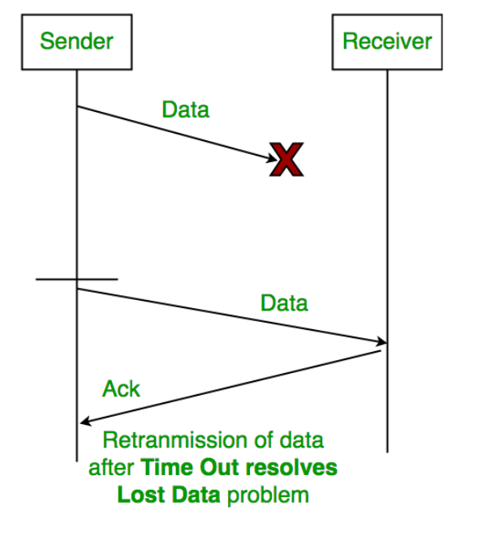
            -   Duplicate Frames -> Sequence Numbers (0 and 1) differentiate frames. |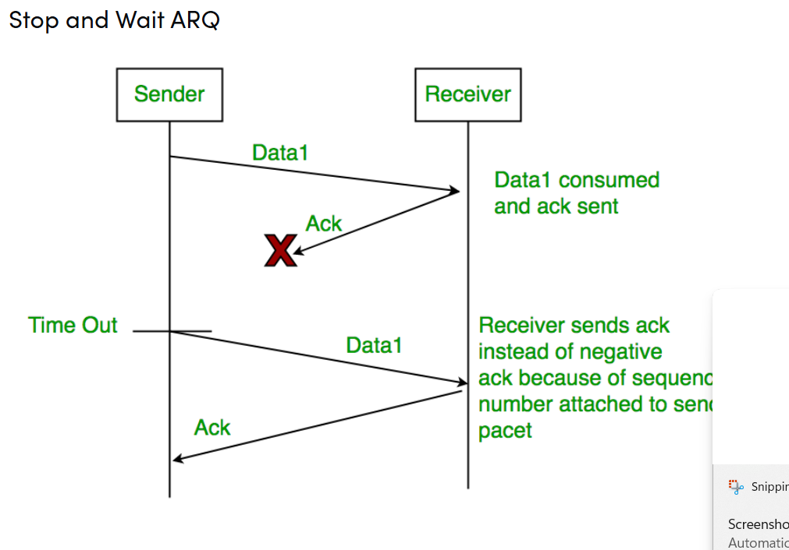
            -   Delayed ACK -> ACKs also carry sequence numbers (expected frame number). |
                -   Working
                    1. Sender sends packet with sequence number 0.
                    2. Receiver receives packet → sends ACK with sequence number 1 (next expected).
                    3. Sender sends next packet with sequence number 1, and so on.

    -   Characteristics of Stop and Wait ARQ
        - Works on half-duplex links.
        - Throughput = 1 data packet per RTT.
        - Performs poorly when Bandwidth × Delay product is high.
        - Efficient for short distance (LAN); poor performance for long distance (WAN/Satellite).
    
    -    Performance Consideration
        - Stop and Wait ARQ ensures reliability, but its transmission efficiency is low.
        - The sender must wait for ACK before sending the next packet, even if it already has more packets ready.
        - This becomes a major issue when:
            - Bandwidth is high, and
            - Propagation delay is large,  
            e.g., communication across countries or satellite networks.
        - In such cases, the link remains under-utilized, causing poor throughput.

    -   Where Stop and Wait Works Well
        - Works efficiently when propagation delay is very small, such as in LAN (Local Area Network) environments.
        - Performs poorly in MAN/WAN/Satellite networks due to large propagation delays.

    -   Key Efficiency Note
        - Stop and Wait is simple and reliable, but efficiency is low because:
            - Sender sends only one packet per RTT.
            - If ACK is lost or delayed, sender retransmits → further reducing efficiency.

-   Go Back-N ARQ
    -   Go-Back-N is a Sliding Window Protocol where the sender can transmit multiple frames at once (up to window size N) without waiting for acknowledgements. However, if an error is detected, the sender retransmits the lost/damaged frame and all frames after it, hence the name Go-Back-N.

    -   Characteristics
        - Pipeline (continuous) sending: Sender can send up to N frames before needing an ACK.
        - Sender Window Size = N
        - Receiver Window Size = 1  
        (Receiver only accepts frames in correct order; out-of-order frames are discarded.)
        - Uses cumulative ACKs:  
            - A single ACK acknowledges all frames up to a certain sequence number.
        - If a frame is lost or corrupted, sender goes back and retransmits that frame and all subsequent frames.
        - More efficient than Stop-and-Wait, especially when Bandwidth × Delay product is high.

    -   Working Example 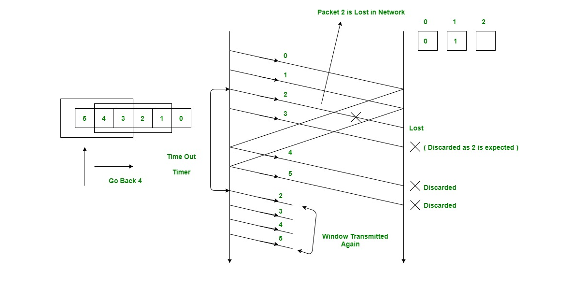
        1. Sender transmits `Frame 0, 1, 2, ..., N` continuously.
        2. Suppose Frame 2 is lost.
        3. Receiver discards Frame 3, 4, ... since Frame 2 is missing.
        4. Receiver sends ACK 2 (meaning: "I am expecting Frame 2 next").
        5. Sender retransmits Frame 2, 3, 4, ....

    -   Relationship Between Window Size and Sequence Numbers in Go-Back-N (Simple Explanation)

        -   In Go-Back-N ARQ, the sender can send multiple packets at once, up to a limit called the sender window size (N). Each packet has a sequence number. These sequence numbers repeat (wrap around), so we must be careful to avoid confusing new packets with old retransmitted packets.

        -   To avoid this confusion, the number of sequence numbers available must always be N + 1.
            So:

            -   If window size = N
            -   Minimum sequence numbers required = N + 1
            -   This ensures correct identification of new vs. old packets.
            
            Why Do We Need the Extra Sequence Number?
            Consider window size = 4.
            So sender can send packets numbered: 0, 1, 2, 3
            
            What happens without an extra sequence number? 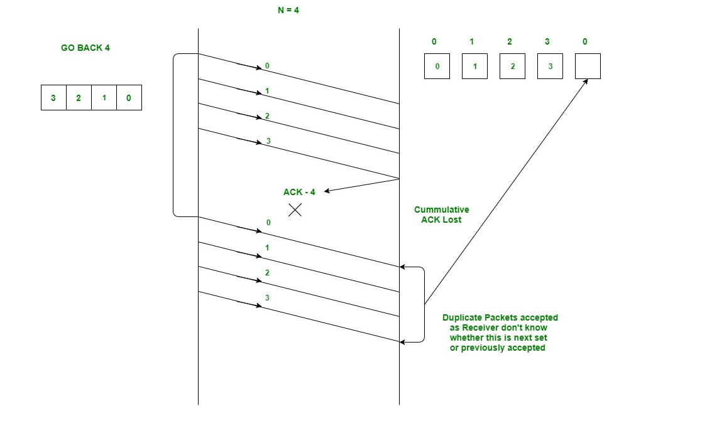
            Sender sends packets: 0, 1, 2, 3.
            Receiver receives them correctly and expects next packet = 0 again (since numbering wraps back).
            But suppose the ACK from receiver is lost.
            Sender times out and retransmits packets 0, 1, 2, 3.
            Receiver now receives packets 0, 1, 2, 3 again.
            Receiver cannot tell whether these packets are:
            The old duplicates being retransmitted, or the new cycle of packets.Because the sequence numbers are the same.
            So receiver accepts duplicates, causing wrong data at the application layer.

            How Does Using N + 1 Sequence Numbers Fix This? 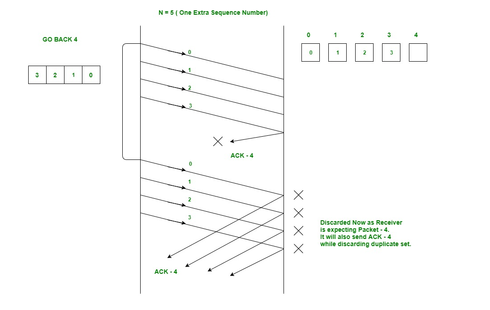
            If window size = 4, use 5 sequence numbers: 0, 1, 2, 3, 4
            Now:
            After receiver receives packets 0, 1, 2, 3, it will expect next packet = 4, not 0.
            So when sender retransmits packets 0, 1, 2, 3 due to timeout:
            Receiver sees that it is currently expecting packet 4
            So it rejects packets 0, 1, 2, 3 as duplicates
            Thus, no confusion occurs.

            -   Final Points (In Simple Words)
                -   Sender Window Size = N
                -   Minimum sequence numbers must be = N + 1
                -   Otherwise, receiver can get confused and accept duplicate data.
                -   This prevents errors when ACKs are lost and packets are retransmitted.   
                -   Sender Window Size + Receiver Window Size = 2ⁿ (In General for All)
                    -   in case of go back N. receiver WS is 1 so sender side = (2^n)-1
                    -   incase of selective repeat: WS of sender = WS of receiver. WS = 2^(n-1)

    -   Advantages
        - Higher channel utilization than Stop-and-Wait.
        - Better suited for high bandwidth and high latency networks.
        - Reduces idle waiting time because sender can continue sending multiple frames.

    -   Disadvantages
        - Wasteful retransmission:  
        If one frame is lost, all subsequent frames in window are retransmitted, even if they were correctly received.
        - Requires more memory to store multiple outstanding frames.
        - Receiver cannot buffer out-of-order frames, so frames may be discarded unnecessarily.

    -   Where Go-Back-N Works Well
        - Networks where error rate is low, so retransmissions are rare.
        - Networks with high bandwidth-delay product (e.g., WAN).
        - Situations where simplicity is preferred over maximum efficiency.

    -   Comparison with Stop-and-Wait

    | Feature | Stop-and-Wait | Go-Back-N |
    |--------|---------------|------------|
    | Window Size | 1 | N (>1) |
    | Channel Utilization | Low | Much Higher |
    | ACK Type | Per-frame | Cumulative |
    | Performance | Good only in LAN | Good in LAN, MAN, WAN |
    | Lost Frame Handling | Retransmit same frame | Retransmit that frame + all after it |

-   Selective Repeat ARQ
    -   Why Selective Repeat Protocol?
        The go-back-n protocol works well if errors are less, but if the line is poor it wastes a lot of bandwidth on retransmitted frames. An alternative strategy, the selective repeat protocol, is to allow the receiver to accept and buffer the frames following a damaged or lost one.

    -   Selective Repeat attempts to retransmit only those packets that are actually lost (due to errors) :
        -   Receiver must be able to accept packets out of order.
        -   Since receiver must release packets to higher layer in order, the receiver must be able to buffer some packets.

    -   Retransmission requests :
        -   Implicit - The receiver acknowledges every good packet, packets that are not ACKed before a time-out are assumed lost or in error.Notice that this approach must be used to be sure that every packet is eventually received.
        -   Explicit - An explicit NAK (selective reject) can request retransmission of just one packet. This approach can expedite the retransmission but is not strictly needed.
        -   One or both approaches are used in practice.

    -   Selective Repeat Protocol (SRP) : 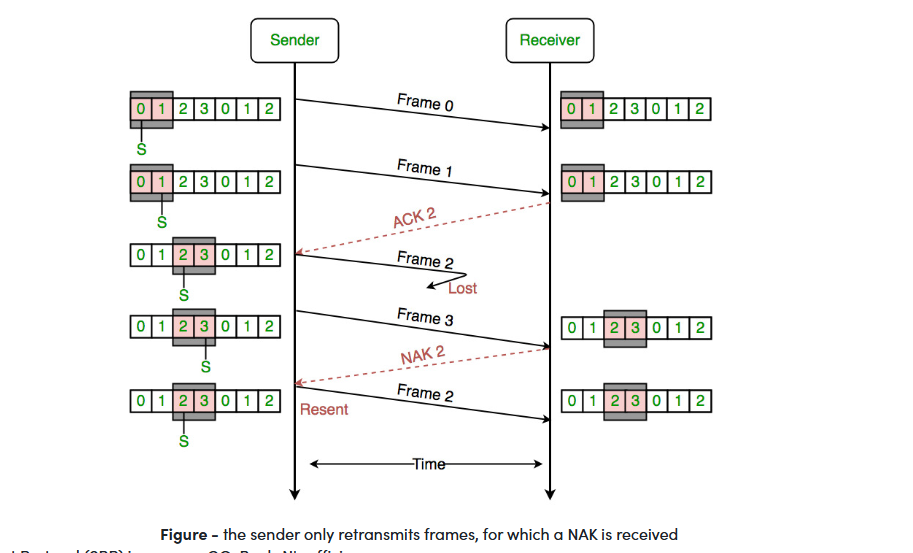
        This protocol(SRP) is mostly identical to GBN protocol, except that buffers are used and the receiver, and the sender, each maintains a window of size. SRP works better when the link is very unreliable. Because in this case, retransmission tends to happen more frequently, selectively retransmitting frames is more efficient than retransmitting all of them. SRP also requires a full-duplex link. Backward acknowledgements are also in progress.

        -   Sender's Windows ( Ws) = Receiver's Windows ( Wr).
        -   Window size should be less than or equal to half the sequence number in SR protocol. This is to avoid packets being recognized incorrectly. If the size of the window is greater than half the sequence number space, then if an ACK is lost, the sender may send new packets that the receiver believes are retransmissions.
        -   Sender can transmit new packets as long as their number is with W of all unpacked packets.
        -   Sender retransmit un-ACKed packets after a timeout – Or upon a NAK if NAK is employed.
        -   Receiver ACKs all correct packets.
        -   Receiver stores correct packets until they can be delivered in order to the higher layer.
        -   In Selective Repeat ARQ, the size of the sender and receiver window must be at most one-half of 2^m.

-   Imp for ARQ Algorithms
    -   Comparison : 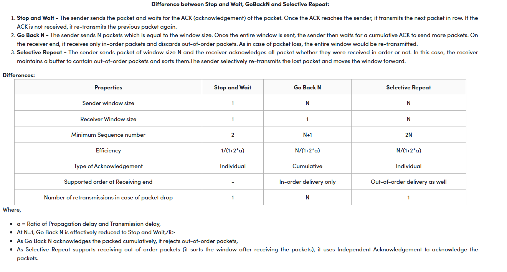
    -   Generally, Stop and Wait mostly used in Data Link layer as the propogation delay is very small.
    -   Go back N and selective Repeat are used in Transport Layer Because propogation delay is huge and Bandwidth is High

-   Network Layer

    The Network Layer is responsible for delivering data from one host to another located in different networks. It handles logical addressing, routing, path selection, and packet forwarding.

    At this layer, the segment is called a Packet.

    -   Core Responsibilities of the Network Layer

         1. Routing
        - Determines the best path (shortest/optimal route) for packets to travel from source to destination.
        - Uses routing algorithms and routing tables within routers.

         2. Logical Addressing
        - Assigns IP addresses to uniquely identify devices globally.
        - Adds Source IP and Destination IP to the packet header.
        - Allows communication across different networks.

         3. Internetworking
        - Connects different networks (LAN, WAN, Wi-Fi, 3G, Ethernet, etc.).
        - Achieved using routers that operate at the network layer.

         4. Fragmentation & Reassembly
        - If a packet is too large, the network layer breaks it into smaller fragments.
        - Destination reassembles the fragments to form the original packet.
        - Necessary due to varying MTUs (Maximum Transmission Units) across networks.

         5. Routing and Forwarding
        - Routing → Global decision (finding the path).
        - Forwarding → Local decision (hop-by-hop packet delivery using routing table).

         6. Scalability via Hierarchy
        - Uses hierarchical IP addressing (network + host portions).
        - Helps Internet scale to billions of devices.

         7. Bandwidth Control
        - Optimizes usage of network bandwidth.
        - Avoids packet flooding and congestion.

    -   Devices Involved in Network Layer Operations

         1. Switch
        - Operates at Data Link Layer (Layer 2).
        - Multi-port bridge with buffering.
        - Forwards frames using MAC addresses.
        - Divides collision domains but keeps broadcast domain same.
        - Performs error checking before forwarding.

         2. Router
        - Operates at Network Layer (Layer 3).
        - Routes packets using IP addresses.
        - Connects LANs, WANs, and different technologies.
        - Maintains a routing table.
        - Divides broadcast domains.

         3. Brouter (Bridge + Router)
        - Can work at Layer 2 or Layer 3.
        - Routes IP packets like a router.
        - Filters LAN traffic like a bridge.

         4. Repeater
        - Operates at Physical Layer (Layer 1).
        - Regenerates weak/corrupted signals bit-by-bit.
        - Does not amplify, only regenerates.
        - Extends network length.
        - 2-port device.

         5. Hub
        - Multiport repeater (Layer 1).
        - Broadcasts incoming data to all ports → single collision domain.
        - Cannot filter data or choose optimal paths.

        Types:
        - Active Hub: Boosts and regenerates signals (extends distance).
        - Passive Hub: Just connects wires; does not boost signals.

         6. Bridge
        - Operates at Data Link Layer (Layer 2).
        - Filters frames using MAC addresses.
        - Connects two LANs with the same protocol.
        - 2-port device.

        Types:
        - Transparent Bridge: Stations unaware of its existence; supports learning & forwarding.
        - Source Routing Bridge: Route specified by sender via a discovery frame.

         7. Gateway
        - Operates at any OSI layer (often Layer 7).
        - Connects networks using different protocols.
        - Performs protocol conversion.
        - More complex than router/switch.

    -   Why Network Layer Is Needed

        1. Delivers data across different networks (beyond single LAN).
        2. Adds logical addressing (IP) for global communication.
        3. Selects the best route using routing algorithms.
        4. Enables internetworking using routers.
        5. Provides fragmentation for networks with smaller MTUs.
        6. Maintains scalability for large internetworks like the Internet.

    -   Key Functions (Summary)

        - Delivers packets end-to-end.
        - Uses IP addresses for communication.
        - Performs routing using routers.
        - Enables communication across different networks.
        - Handles fragmentation and reassembly.
        - Supports hierarchical addressing and scalability.

-   Circuit Switching vs Packet Switching

    Circuit Switching and Packet Switching are two standard methods of transmitting data between end-devices over a network. Circuit Switching is historically used but has largely been replaced by Packet Switching in modern networks.

    -   Circuit Switching
        - A dedicated communication path is established between sender and receiver.
        - Thus, a dedicated fixed path is established where data is transmitted without delays (as there is no concept of network congestion).
        - Example: Traditional telephone networks.

        Key Points
        - Suitable for continuous transmission (dedicated line).
        - Guaranteed data rate.
        - Inefficient if line is idle.
        - Leads to under-utilization of resources in most cases.

    -   Packet Switching
        - Data is divided into small units called packets.
        - Each packet contains payload + control information.
        - No pre-established path; packets may take different routes to the destination. In other words, packets belonging to the same file may or may not travel through the same path. If there is congestion at some path, packets are allowed to choose different path possible over an existing network
        - Uses store-and-forward technique: each hop stores the packet temporarily before forwarding.

        Key Points
        - Efficient use of network resources.
        - Packets may arrive out-of-order.
        - Variable transmission delay.
        - More suitable for small messages or bursty traffic.

    -   Advantages of Packet Switching over Circuit Switching
        - Better bandwidth utilization (no dedicated line reservation).  
        - Minimal transmission latency.  
        - Reliable (destination can detect missing packets).  
        - Fault tolerant (packets can take alternative paths if a link fails).  
        - Cost-effective and easier to implement.

    -   Disadvantages of Packet Switching over Circuit Switching
        - Packets may arrive out-of-order → need sequence numbers.  
        - Higher node complexity (routers must handle multiple paths).  
        - Transmission delay can increase due to rerouting.  
        - Circuit switching can be better for large/bursty data.

    -   Modes of Packet Switching

    1. Connection-Oriented Packet Switching (Virtual Circuit)
        - Establishes a logical path before sending data.
        - All packets follow the same path.
        - Virtual Circuit ID is provided by switches/routers to uniquely identify this virtual connection.
        - Uses sequence numbers to maintain order.
        - Phases: Setup → Data Transfer → Teardown.
        - All address information is only transferred during setup phase. Once the route to destination is discovered, entry is added to switching table of each intermediate node. During data transfer, packet header (local header) may contain information such as length, timestamp, sequence number etc. Connection-oriented switching is very useful in switched WAN.
        - Example protocols: X.25, Frame-Relay, ATM, MPLS.

    2. Connectionless Packet Switching (Datagram)
        - Each packet contains full addressing information (source, destination, port, etc.).
        - Packets are independent; may take different routes.
        - No setup/teardown phase.
        - Reliability is handled by end systems using additional protocols.
        - Packet delivery is not guaranteed in connectionless packet switching, so the reliable delivery must be provided by end systems using additional protocols.
        - Example: Internet (IP networks).

-   Classful Addressing
    To uniquely identify a device in a network, we use logical addresses called IP addresses.  

    - IPv4: 32-bit addresses → 2³² addresses.  
    - IPv6: 128-bit addresses → supports a much larger number of devices.  

    IPv4 addresses are generally represented in dotted decimal format: `x.x.x.x`.

    -    What is Classful Addressing?

        The 32-bit address space in IPv4 is divided into 5 classes (A, B, C, D, E) based on network size:  

        - Network ID: Identifies the network.  
        - Host ID: Identifies each host within the network.  

        Classes A, B, C → Unicast addressing (different organization sizes)  
        Class D → Multicast  
        Class E → Experimental / military  

        -   IP Classes 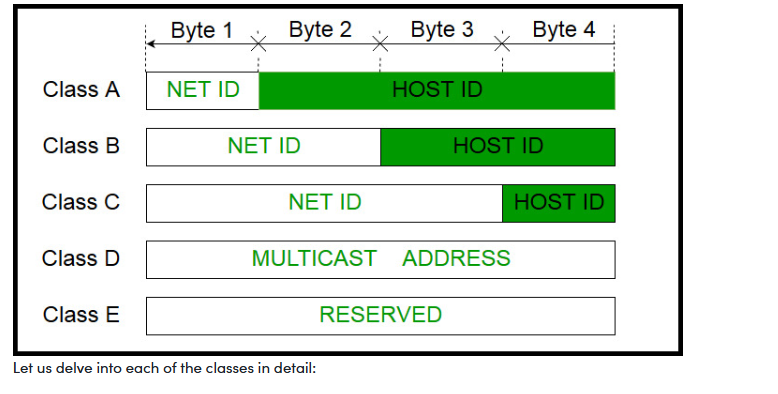

        Class A 
        - Network ID: 8 bits, Host ID: 24 bits  
        - First bit: 0  
        - Subnet Mask: 255.0.0.0  
        - Host IDs per network: 2²⁴ - 2 = 16,777,214 Host IDs (2 is subtracted because of x.0.0.0 is reserved for Network ID and x.255.255.255 is used for limited-broadcasting)
        - Number of networks: 2⁷ - 2 = 127 Networks (2 is subtracted because 0.0.0.0 and 127.x.y.z are reserved for special purposes)
        - IP Range: 1.0.0.0 – 126.255.255.255  

        Class B 
        - Network ID: 16 bits, Host ID: 16 bits  
        - First two bits: 10  
        - Subnet Mask: 255.255.0.0  
        - Host IDs per network: 2¹⁶ - 2 = 65,534  
        - Number of networks: 2¹⁴ = 16,384  
        - IP Range: 128.0.0.0 – 191.255.255.255  

        Class C 
        - Network ID: 24 bits, Host ID: 8 bits  
        - First three bits: 110  
        - Subnet Mask: 255.255.255.0  
        - Host IDs per network: 2⁸ - 2 = 254  
        - Number of networks: 2²¹ = 2,097,152  
        - IP Range: 192.0.0.0 – 223.255.255.255  

        Class D 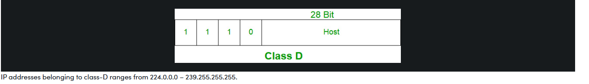
        - Reserved for multicasting  
        - First four bits: 1110  
        - No subnet mask  
        - IP Range: 224.0.0.0 – 239.255.255.255  

        Class E 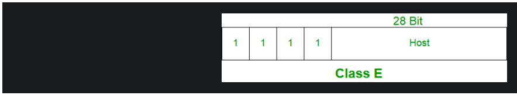
        - Reserved for experimental / research / military use  
        - First four bits: 1111  
        - No subnet mask  
        - IP Range: 240.0.0.0 – 255.255.255.254  

-   Network Address Translation (NAT)
    
    -   Types of IP Addresses

        1. Public IP Address
        - Can be accessed over the Internet.
        - Globally unique IP assigned to a device.
        - Example: Your public IP can be seen on websites like "What is my IP".

        2. Private IP Address
        - Used within a private network.
        - Not exposed directly to the Internet.
        - Example: Computers in a home network get private IPs from the router via DHCP.
        - Reserved Private IP Ranges (by IANA/InterNIC):
        - Class A: 10.0.0.0 – 10.255.255.255  
        - Class B: 172.16.0.0 – 172.31.255.255  
        - Class C: 192.168.0.0 – 192.168.255.255  
        - APIPA: 169.254.0.0 – 169.254.255.255

    -   Network Address Translation (NAT)

        - Purpose: Allow multiple devices in a private network to access the Internet using a single public IP.
        - How it works: Translates private IP → public IP (and vice versa). Also translates port numbers to distinguish hosts.
        - Typically implemented on a router or firewall.

        NAT Working
        1. Inside network → Outside network: NAT converts private IP to public IP.  
        2. Outside network → Inside network: NAT converts public IP back to private IP.  
        3. If NAT runs out of public addresses, packets are dropped and an ICMP host unreachable message is sent.

        Why mask port numbers?
        - Multiple hosts may use the same source port.
        - NAT modifies port numbers to prevent ambiguity when replies arrive.
        - Maintains a NAT table mapping internal IP:port to external IP:port.

    -   NAT Address Types
    Inside refers to the addresses which must be translated. Outside refers to the addresses which are not in control of an organisation. These are the network Addresses in which the translation of the addresses will be done.

    | NAT Term | Meaning | 
    |----------|---------|
    | Inside Local Address | Private IP assigned to a host inside the network (seen internally). |
    | Inside Global Address | Public IP representing one or more private IPs to the outside world. |
    | Outside Local Address | IP of the destination host as seen from inside after translation. |
    | Outside Global Address | Actual IP of the destination host on the Internet (before translation). |

    -   NAT Types

        1. Static NAT
        - One-to-one mapping: private IP → public IP.
        - Commonly used for web hosting.
        - Limitation: Costly if many devices need Internet access.

        2. Dynamic NAT
        - Private IP → Public IP from a pool of available public IPs.
        - Limitation: Only as many private devices can access as there are IPs in the pool.
        Suppose, if there is a pool of 2 public IP addresses then only 2 private IP addresses can be translated at a given time. If 3rd private IP address wants to access Internet then the packet will be dropped therefore many private IP addresses are mapped to a pool of public IP addresses. NAT is used when the number of users who wants to access the Internet is fixed. This is also very costly as the organisation have to buy many global IP addresses to make a pool.

        3. Port Address Translation (PAT) / NAT Overload
        - Many private IPs → single public IP.
        - Port numbers distinguish traffic between devices.
        - Cost-effective; used in home routers for thousands of devices.

    -   Advantages of NAT
        - Conserves public IP addresses.
        - Provides privacy (internal IPs are hidden).
        - Eliminates address renumbering when networks evolve.

    -   Disadvantages of NAT
        - Translation adds path delays.
        - Some applications may not work properly.
        - Complicates tunneling protocols like IPsec.
        - Router interferes with transport layer port numbers (NAT violates strict layering).

-   Subnetting
    When a larger network is divided into smaller networks to improve security and manageability, this process is known as Subnetting. Smaller networks are easier to maintain and control.

    -   Network Address and Mask

        - Network Address: Identifies a network on the Internet. Using this, we can determine the range of addresses and total possible hosts in the network.
        - Mask (Subnet Mask): A 32-bit binary number used to extract the network address from any IP address via a bitwise AND operation.

        Default Masks for IP Classes:

        | Class | Default Subnet Mask |
        |-------|-------------------|
        | A     | 255.0.0.0         |
        | B     | 255.255.0.0       |
        | C     | 255.255.255.0     |

        Example:  
        Given IP address `132.6.17.85` (Class B), default mask `255.255.0.0`:  
        - Keep the first 2 bytes, set others to 0 → Network Address = `132.6.0.0`. (or do bitwise & to get network address 132.6.17.85 & 255.255.0.0)

    -   Calculations in Subnetting

        1. Number of Subnets:  
        `2^(given bits for mask - no. of bits in default mask)`

        2. Subnet Address:  
        Bitwise AND of subnet mask and IP address.

        3. Broadcast Address:  
        Network bits remain, host bits set to 1.

        4. Number of Hosts per Subnet:  
        `2^(32 - subnet mask bits) - 2`

        5. First Host ID:  
        `Subnet Address + 1`

        6. Last Host ID:  
        `Subnet Address + Number of Hosts`

        Example:  
        IP: `172.16.0.0/25` (Class B)
        The /25 means the first 25 bits are the network + subnet ID, and the remaining 7 bits are for host IDs.

        - Number of subnets: `2^(25-16) = 512`  
        - Number of hosts per subnet: `2^(32-25) - 2 = 126`  
        - First subnet block:
        - Subnet Address: `172.16.0.0`
        - First Host ID: `172.16.0.1`
        - Last Host ID: `172.16.0.126`
        - Broadcast Address: `172.16.0.127`

    -   Finding Network ID (NID) of a Subnet

        - Subnet Mask identifies which IP belongs to which subnet.
        - Network ID and Subnet ID bits are 1s, Host ID bits are 0s.

        Example 1:  
        IP: `193.1.2.129` (Class C)  
        Subnet Mask: `255.255.255.192`  

        - Binary AND → `11000001.00000001.00000010.10000000`  
        - NID = `193.1.2.128` → Belongs to subnet 3

        Example 2:  
        IP: `193.1.2.67` (Class C)  
        Subnet Mask: `255.255.255.192`  

        - Binary AND → `11000001.00000001.00000010.01000000`  
        - NID = `193.1.2.64` → Belongs to subnet 2

    -   Dividing Networks

        To divide a network into multiple subnets, bits are borrowed from host ID part:

        - Class C → 24 bits network, 8 bits host
        - Divide into 2 subnets → borrow 1 bit from host ID:
        - Subnet 1: First host bit = 0 → Range `193.1.2.0 - 193.1.2.127`
        - Subnet 2: First host bit = 1 → Range `193.1.2.128 - 193.1.2.255`

        - Divide into 4 subnets → borrow 2 bits from host ID:
        - Subnet 1: `193.1.2.0 - 193.1.2.63`
        - Subnet 2: `193.1.2.64 - 193.1.2.127`
        - Subnet 3: `193.1.2.128 - 193.1.2.191`
        - Subnet 4: `193.1.2.192 - 193.1.2.255`

        - Subnet Mask: `11111111.11111111.11111111.11000000 = 255.255.255.192`

        Bit Summary:  
        - Network ID: 24 bits  
        - Subnet ID: 2 bits  
        - Host ID: 6 bits

    -   Advantages of Subnetting

        - Provides security between networks (e.g., different departments in an organization).  
        - Allows certain subnets to have higher network priority.  
        - Easier maintenance in small networks.

    -   Disadvantages of Subnetting
        - Increases time complexity: Communication requires more routing steps.  
        - Single network: Source → Destination Host → Process  
          Subnetted network: Source → Destination Network → Subnet → Host → Process  
          Wastes IP addresses: Two addresses per subnet are reserved (Network & Broadcast).  
          Example: 4 subnets → 8 wasted addresses  
        - Decreases network size and increases cost: Requires routers, switches, hubs, bridges, and experienced administrators.

    -   Variable Length Subnet Mask (VLSM)
        - VLSM allows different subnets within a network to have different masks, increasing flexibility and efficient IP usage.  
        - It is essentially subnetting a subnet.

-  Classless Addressing (CIDR), Subnetting & Supernetting
    As we have already learned about Classful Addressing, in Classful addressing the number of hosts within a network is fixed depending on the network class:  
    - Class A: 2^24 hosts  
    - Class B: 2^16 hosts  
    - Class C: 2^8 hosts  

    Classful addressing has several shortcomings:  
    - Class A & B networks have huge numbers of IP addresses, most of which get wasted even in large organizations.  
    - Class C networks often have insufficient addresses for many organizations.  
    - Class D is reserved for multicast; Class E is for experimental/research purposes.  

    -   CIDR (Classless Inter-Domain Routing)
    CIDR was introduced to overcome the limitations of Classful addressing. It allows flexible subnetting of the IP address space according to actual requirements, reducing wastage.

    - Representation: `a.b.c.d/n`  
    - `n` = number of bits in the Network/Block ID  
    - Example: `20.10.50.100/20`  

    - Rules for forming CIDR blocks
    1. All IP addresses must be contiguous.  
    2. Block size must be a power of 2 (2^n).  
    3. The first IP address of the block must be evenly divisible by the size of the block.  

    Example: Check if `100.1.2.32 to 100.1.2.47` is a valid block:  
    - Total IPs = 16 → 2^4 = 16 ✅  
    - First IP binary = `100.1.2.00100000` → last 4 bits zero ✅  
    - All rules satisfied → valid block ✅  

    -   Subnetting
    Subnetting divides a large network into smaller sub-networks (subnets) to improve security, management, and efficiency.

    - Network Address: Identifies the network.  
    - Subnet Mask: 32-bit binary used to determine network ID by ANDing with IP address.  

     Example:
    - IP: `172.16.21.23/25`  
    - IP in binary: `10101100.00010000.00010101.00010111`  
    - Subnet mask (/25): `11111111.11111111.11111111.10000000` = 255.255.255.128  
    - Network ID: `172.16.21.0`  
    - Usable hosts: 2^(32-25) - 2 = 126  

     Why Subnet?
    - Improves security between subnets.  
    - Allows prioritization of some networks.  
    - Easier maintenance for smaller networks.  

    Drawbacks:  
    - Communication between subnets may require more steps → higher latency.  
    - Wasted IPs for each subnet (network + broadcast address).  
    - Additional hardware and expertise increase cost.

    -   Supernetting
    Supernetting is the reverse of subnetting: combining multiple contiguous networks into a larger block.

    Rules for Supernetting:  
    1. All IP addresses must be contiguous.  
    2. Networks must be of equal size (power of 2).  
    3. The first IP must be divisible by the total size of the supernet.

     Example:

    Four contiguous /24 networks:  
    - N1: 200.1.0.0/24  
    - N2: 200.1.1.0/24  
    - N3: 200.1.2.0/24  
    - N4: 200.1.3.0/24  

    - Total addresses = 4 * 2^8 = 2^10 → /22  
    - Binary first IP: `200.1.0.0` = `11001000.00000001.00000000.00000000`  
    - Resulting supernet: `200.1.0.0/22` ✅  

    This allows aggregation of multiple networks into a single routing entry, reducing the size of routing tables.

    -   Note: Gateway, DNS, and DHCP
        - Gateway IP: Usually the first usable IP in the subnet, assigned to the router for routing packets outside the subnet. 
        - DNS (Domain Name System) Server: Resolves human-readable domain names into IP addresses so nodes can access resources on the network or Internet.  
        - DHCP (Dynamic Host Configuration Protocol):  
            - Automatically assigns IP addresses to new nodes joining the network.  
            - Provides subnet mask, gateway IP, and DNS server information.  
            - Ensures private IP addresses do not conflict within a local network.  
            - These mechanisms simplify network management and ensure proper addressing for all devices.

-  ARP (Address Resolution Protocol) & Reverse-ARP

    In a computer network, each device has two types of addresses:  
    - Physical Address (MAC): Permanent and fixed for a device, does not change across networks.  
    - Logical Address (IP): Transient, changes when the device moves to a different network.  

    To transmit data, the Data Link layer requires the physical/MAC address, but the Network layer usually only knows the IP address.  

    -   ARP (Address Resolution Protocol)

        ARP is used to map a known IP address to a MAC address.  

        Process:
        1. The sender broadcasts an ARP request to its neighbors asking for the MAC of a target IP.  
        2. ARP request contains:  
            - Sender IP address  
            - Sender MAC address  
            - Destination MAC address (all 0s initially)  
            - Destination IP address  
        3. The device with the matching IP responds with its MAC address (unicast reply to sender).  
        4. Other devices ignore the request.  

        Key points:  
        - Allows devices to learn the MAC address of the next-hop device.  
        - Works only within the same local network/broadcast domain.  

    -   Reverse ARP (RARP) (Mainly replaced by DHCP Server Now)

        RARP is used to obtain the IP address from a known MAC address.  

        Use case:  
        - When a device does not have a stored IP address (e.g., newly booted or diskless machine).  

        Process:
        1. The device sends a RARP broadcast packet containing its own MAC address in both sender and receiver fields.  
        2. A RARP server on the network maintains a MAC-to-IP mapping table.  
        3. The RARP server finds the matching entry and responds with the device's IP address.  

        Key points:  
        - Helps devices learn their IP address dynamically.  
        - Requires a dedicated RARP server within the local network.  
        - Mostly obsolete today, replaced by DHCP, which provides IP along with subnet mask, gateway, and DNS.

-   IPv4 vs IPv6

    IPv4 (Internet Protocol Version 4) and IPv6 (Internet Protocol Version 6) are versions of the Internet Protocol. IPv6 is the newer version designed to overcome the limitations of IPv4, offering greater efficiency, security, and address space.

    -   Key Differences

    | Feature | IPv4 | IPv6 |
    |---------|------|------|
    | Address Length | 32-bit | 128-bit |
    | Address Configuration | Supports Manual and DHCP | Supports Auto and renumbering configuration |
    | End-to-End Connection Integrity | Unachievable | Achievable |
    | Address Space | 4.29 × 10⁹ addresses | 3.4 × 10³⁸ addresses |
    | Security | Dependent on applications | IPSEC is inbuilt |
    | Address Representation | Decimal | Hexadecimal |
    | Fragmentation | Performed by sender and forwarding routers | Performed only by sender |
    | Packet Flow Identification | Not available | Available using Flow Label field in the header |
    | Checksum Field | Available | Not available |
    | Message Transmission | Broadcast | Multicast and Anycast |
    | Encryption & Authentication | Not provided | Provided |

    Summary:  
    IPv6 solves the address exhaustion problem of IPv4, improves security with built-in IPSEC, simplifies packet handling, and provides better support for modern network services.

-   Transport Layer
    The Transport Layer lies just above the Network Layer and is responsible for end-to-end communication between applications on different hosts.  

    Unlike the Network Layer (hop-to-hop delivery), the Transport Layer provides process-to-process delivery using ports.

    The unit of transmission at this layer is called a segment.

    Common Transport Layer protocols:
    - TCP – Transmission Control Protocol  
    - UDP – User Datagram Protocol  
    - DCCP – Datagram Congestion Control Protocol  

    Transport Layer ensures:
    - Reliable delivery (in TCP)
    - Error detection and correction
    - Flow control
    - Congestion control
    - Proper sequencing and reassembly of data

    1. Working of Transport Layer

    At Sender Side
    - Receives data from Application Layer.
    - Performs segmentation.
    - Implements flow control and error control.
    - Adds:
        - Source port number  
        - Destination port number  
        - Forwards segments to the Network Layer.

    Note:  
        Sender must know the destination port number of the receiver's application.  
        Examples:
        - HTTP → 80
        - HTTPS → 443
        - DNS → 53
        - FTP → 21/20

        These ports are usually default or configured manually.

    At Receiver Side
    - Reads the port number from the segment header.
    - Delivers data to the correct application/process.
    - Performs sequencing and reassembly of segments.

    ---

    2. Important Responsibilities of the Transport Layer

        1. Process-to-Process Delivery
        - Uses port numbers (16-bit values) to identify the correct process.
        - Just like:
            - Data Link Layer uses MAC address
            - Network Layer uses IP address
            - Transport Layer uses Port Number

        Example:  
        On a single device, a browser, a game, and a downloader can all use the network simultaneously—ports differentiate them.

        ---

        2. End-to-End Connection
        - TCP: Reliable, connection-oriented, uses 3-way handshake.
        - UDP: Unreliable, connectionless, used where speed matters more than accuracy (e.g., video streaming, VoIP).
        - Ensures data is delivered between two endpoints reliably (TCP) or best-effort (UDP).

        ---

        3. Multiplexing & Demultiplexing
        - Multiplexing:  
        Transport Layer accepts data from multiple applications, adds port numbers, and sends them to the Network Layer.

        - Demultiplexing:  
        Receiver’s Transport Layer uses destination port number to give data to the correct application.

        Example:  
        Port 80 → browser  
        Port 25 → email client  
        Port 443 → secure web traffic  

        ---

        4. Congestion Control
        Congestion occurs when too many sources send data causing router buffer overflow.

        Transport Layer handles this using:
        - Open-loop techniques (prevent congestion)  
        - Closed-loop techniques (remove congestion once it happens)

        TCP congestion control techniques:
        - AIMD – Additive Increase Multiplicative Decrease  
        - Leaky Bucket  
        - Token Bucket  
        - Slow Start, Fast Retransmit, Fast Recovery

        ---

        5. Data Integrity & Error Control
        Ensures received data is not corrupted by:
        - Computing checksums
        - Using ACK (Acknowledgement)
        - Using NACK (Negative Acknowledgement)
        - Retransmitting lost or damaged segments

        ---

        6. Flow Control
        Prevents a fast sender from overwhelming a slow receiver.

        TCP uses:
        - Sliding Window Protocol
        - Receiver advertises a window size telling how much data it can handle.

        Example:  
        If receiver window = 10 KB → sender can send up to that limit before waiting.

    ---

    Summary
    Transport Layer provides:
    - End-to-end communication  
    - Port-based process delivery  
    - Segmentation & reassembly  
    - Reliability (TCP)  
    - Fast, best-effort delivery (UDP)  
    - Congestion, error & flow control  

    It is essential for enabling multiple applications to use the network simultaneously and reliably.

    -   Sockets
        A socket is a combination of:
        - IP Address (identifies the device)
        - Port Number (identifies the application/process)
        - Protocol (TCP/UDP)

    Together they form a communication endpoint used by applications to send/receive data.

    -    Socket Definition
    Socket = IP Address + Port Number + Protocol

    Example:
    (192.168.1.10 , 5000 , TCP)

    This uniquely identifies a process on a specific host.

    -   Full Connection Identification (Socket Pair)
    For TCP connections, a complete communication stream is uniquely identified by:
    (Source IP, Source Port, Destination IP, Destination Port)

    Example:
    (192.168.1.5, 34000, 142.250.182.14, 443)
    
    -   Types of Sockets
        1. TCP Socket (Connection-Oriented)
        - Reliable  
        - Uses handshake (3-way)
        - Ensures ordering, retransmission, congestion control

        Common TCP Socket Functions
        | Function | Purpose |
        |---------|---------|
        | `socket()` | Creates a socket |
        | `bind()` | Assigns IP + port to socket |
        | `listen()` | Marks socket as passive (server waiting for connections) |
        | `accept()` | Accepts an incoming client connection |
        | `connect()` | Client connects to server |
        | `send()` / `write()` | Sends data |
        | `recv()` / `read()` | Receives data |
        | `close()` | Closes socket |

        ---

        2. UDP Socket (Connectionless)
        - Fast  
        - No handshake  
        - No guarantee or ordering  
        - Used for DNS, video streaming, gaming, VoIP, etc.

        Common UDP Socket Functions
        | Function | Purpose |
        |---------|---------|
        | `socket()` | Creates a socket |
        | `bind()` | Assigns IP + port (optional for clients) |
        | `sendto()` | Sends datagram to a specific address |
        | `recvfrom()` | Receives datagram from any address |
        | `close()` | Closes socket |

        No `connect()`, `listen()`, or `accept()` in UDP because it is connectionless.

    -   SummaryS
        - Socket is the endpoint for communication created at the Transport Layer.  
        - TCP uses connect(), listen(), accept() because it is connection-oriented.  
        - UDP uses sendto(), recvfrom() because it is connectionless.  
        - A socket pair uniquely identifies one TCP connection.

-   TCP vs UDP

    -   TCP (Transmission Control Protocol)

        TCP is a connection-oriented, stateful, and reliable transport-layer protocol.  
        Before any data is exchanged, TCP requires a connection to be established using a 3-way handshake.

        🔹 TCP 3-Way Handshake

        1. SYN →  
        Sender asks to start a connection by sending a segment with SYN flag and an initial sequence number.

        2. SYN + ACK →  
        Receiver replies acknowledging sender’s SYN and sends its own SYN.

        3. ACK →  
        Sender acknowledges the receiver’s SYN, and the connection is established.

        This handshake ensures:
        - Both sides agree on initial sequence numbers  
        - A reliable communication pipe is created  
        - Connection state is tracked by both devices  

    -   UDP (User Datagram Protocol)

    UDP is connectionless, stateless, and focuses on speed over reliability.

    - No handshake  
    - No guarantee of delivery  
    - No retransmission  
    - No ordering  
    - Low overhead  

    Used where slight data loss is acceptable and speed is critical:
    - Video streaming  
    - Voice calls (VoIP)  
    - Online multiplayer games  
    - DNS requests  

    -   Detailed Differences Between TCP & UDP

    | Feature | TCP | UDP |
    |--------|-----|-----|
    | Connection Type | Connection-oriented (3-way handshake) | Connectionless (no handshake) |
    | Reliability | Reliable, guaranteed delivery | Unreliable, no delivery guarantee |
    | Error Checking | Extensive (ACKs, flow control, retransmissions) | Basic checksum only |
    | Ordering | Ensures in-order delivery | No ordering; application must handle it |
    | Speed | Slower due to overhead | Faster and lightweight |
    | Retransmission | Yes, lost packets are resent | No retransmission |
    | Header Size | 20 bytes | 8 bytes |
    | Protocol Weight | Heavyweight | Lightweight |
    | Typical Uses | HTTP, HTTPS, FTP, SMTP, Telnet | DNS, DHCP, TFTP, SNMP, RIP, VoIP |

    -   Summary
        - TCP → Reliable, ordered, connection-based, slower, heavy.  
        - UDP → Fast, lightweight, unreliable, unordered, used in real-time systems.

        Suitable choice depends on whether reliability or speed is more important.

-   Introduction to Routing Algorithms

    Routing is the process of selecting an optimal path for data packets to travel from source to destination across a network.  
    It is the responsibility of the Network Layer (Layer 3).

    Routing decisions are usually based on:
    - Hop count  
    - Link cost  
    - Bandwidth  
    - Delay  
    - Reliability  

    Routing protocols help routers share information and build routing tables.

    -   Types of Routing 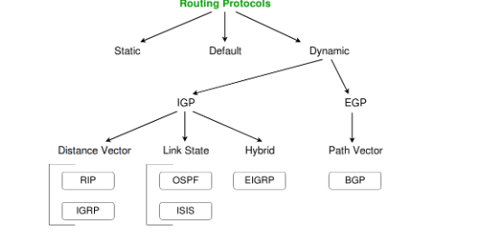

    Routing is classified into three main types:

        -   Static Routing
            Static routing requires the administrator to manually configure routes on each router.

            ✔ Advantages
            - No CPU overhead on routers  
            - More secure (only admin controls routes)  
            - No bandwidth consumption for routing updates  

            ✘ Disadvantages
            - Not suitable for large networks  
            - Manual configuration is time-consuming  
            - Admin must know entire network topology  

            Example Configuration (Cisco)
            R3(config) ip route 192.168.10.0 255.255.255.0 172.16.10.2
            R3(config) ip route 192.168.20.0 255.255.255.0 172.16.10.6

        -    Default Routing

            All unknown packets are forwarded to one fixed next-hop router.  
            Used by stub routers — routers that have only one way to reach external networks.

            Example
            R1(config) ip route 0.0.0.0 0.0.0.0 172.16.10.5

        -   Dynamic Routing

            Routers automatically:
            - Learn routes  
            - Exchange routing tables  
            - Adapt when network topology changes  

            Examples: RIP, OSPF, EIGRP, IS-IS, BGP

            ✔ Advantages
            - Auto-adjusts to changes  
            - Best path selection  

            ✘ Disadvantages
            - Consumes bandwidth  
            - Less secure compared to static routing  

    -   Classes of Routing Protocols

        Routing protocols are divided into three categories:

            1. Distance Vector Routing Protocols (Bellman Ford : Low Convergence)

                Select best path based on hop count.  
                Example → RIP

                Features
                - Periodic updates  
                - Broadcast routing information  
                - Full routing tables exchanged  
                - “Routing by rumor” — trusts neighbors blindly  

                Disadvantages
                - High bandwidth usage  
                - Security risks  
                - Slow convergence  

            2. Link-State Routing Protocols (Dijkstra : High Covergence)

                Routers maintain a full map of the network and compute shortest paths using Dijkstra’s SPF algorithm.  
                Example → OSPF, IS-IS

                Features
                - Hello (keep-alive) messages  
                - Triggered updates (only when changes occur)  
                - Partial updates (not full tables)  

                Tables Maintained
                - Neighbor Table — directly connected routers  
                - Topology Table — entire network map (best + backup routes)  
                - Routing Table — best routes only  

                Advantages
                - Faster convergence  
                - Less bandwidth usage  
                - More scalable  

            3. Advanced Distance Vector (Hybrid Protocols)

                Use features of both distance-vector and link-state protocols.  
                Example → EIGRP

                Behaves like:
                - Link-state: uses Hello packets, forms adjacencies  
                - Distance vector: learns routes from neighbors  

    -   Important Routing Protocols

        Below are popular routing protocols used in different scopes:
            -   Interior Gateway Protocol (IGP)
                Used within a single autonomous system (AS).

                Examples:
                    RIP
                    - Distance vector  
                    - Max hop count = 15  
                    - Periodic updates every 30 sec  
                    - Simple but outdated  

                    OSPF
                    - Link-state  
                    - Uses areas for scalability  
                    - SPF algorithm  

                    EIGRP
                    - Hybrid protocol  
                    - Cisco proprietary  
                    - Uses DUAL algorithm (loop-free, fast convergence)  

            -   Exterior Gateway Protocol (EGP)
                Used between autonomous systems (Internet-level).

                Example:
                BGP (Border Gateway Protocol)
                - Path vector protocol  
                - Backbone of the Internet  
                - Uses AS-paths instead of hop count  
                - Supports full decentralization  

            -   IS-IS (Intermediate System – Intermediate System)
                - Link-state protocol used in large service provider networks  
                - Similar to OSPF  
                - Originally designed for OSI networks  

    -   Summary Table of Protocols

    | Protocol | Type | Example Use |
    |---------|------|--------------|
    | RIP | Distance Vector | Small networks |
    | OSPF | Link-State | Enterprise networks |
    | EIGRP | Hybrid | Cisco networks |
    | BGP | Path Vector | Internet routing |
    | IS-IS | Link-State | ISP backbone networks |

    -   Final Notes

        - Routing enables data to travel across multiple networks.
        - Dynamic routing is preferred for medium–large networks.
        - Link-state protocols (OSPF/IS-IS) scale far better than distance-vector protocols like RIP.
        - BGP is the only protocol used for global Internet routing between ISPs.
    
    -   Types of Information Transfer
        -   Unicast
            -   One-to-one communication.
            -   Involves a single sender and a single receiver.
                Example: Device with IP 10.1.2.0 sends data to device 20.12.4.2.
            -   Most common form of communication in networks.

        -   Broadcast
            Broadcasting refers to one-to-all data transmission. It is of two types:
            -   Limited Broadcast
                -   Used to send packets to all devices within the same local network.
                -   Destination address used: 255.255.255.255 (all bits set to 1).
                -   Ensures the message reaches all hosts on the local network.
            -   Direct Broadcast
                -   Used when a device in one network wants to broadcast to all devices in another network.
                -   Achieved by setting all Host ID bits of the destination network to 1.
                -   Used in applications such as TV network distribution for audio/video.
                -   ARP uses a broadcast mechanism to resolve IP → MAC addresses.

        -   Multicast
            -   One or more senders communicate with one or more receivers.
            -   Falls between unicast (1:1) and broadcast (1:all).
            -   Server sends single copies of data that routers replicate and forward only to interested hosts.
            -   Requires protocols like:
                IGMP (Internet Group Management Protocol)
                Multicast Routing Protocols
            -   Classful addressing: Class D reserved for multicast groups.

        -   Anycast
            -   One-to-nearest communication.
            -   A single sender communicates with the closest receiver (in routing topology).
            -   Same IP address is advertised by multiple nodes.
            -   Routing decision is based on:
                -   Server health
                -   Server capacity
                -   Network distance/cost
            -   Helps in:
                -   Faster content delivery
                -   Load balancing

    -   Factors Affecting Link Cost in Routing Algorithms
        Costs are assigned to links based on several metrics:
        -   Bandwidth
            Higher bandwidth generally means lower cost.
        -   Network Delay
            Includes propagation + transmission delays.
        -   Hop Count
            Lower hop count = more efficient route.
        -   Path Cost
            Different paths incur different costs (overall efficiency matters).
        -   Load
            High congestion on a link increases its cost.
        -   Maximum Transmission Unit (MTU)
            Larger MTU allows bigger packets, affecting routing decisions.

    -   Goals of Routing Algorithms
        -   Routing algorithms aim to:
        -   Deliver packets correctly
        -   Utilize bandwidth efficiently
        -   Avoid starving any node (fairness)
        -   Handle network changes with fast convergence, such as:
            -   Router going down
            -   Link failure
            -   Change in link costs
            -   Addition of a new router

-   Routing Protocols (DVR & LSR)
    
    -   Distance Vector Routing (DVR)
        -   Overview
            -   DVR requires routers to periodically inform neighbors of topology changes.
            -   Historically used in ARPANET.
            -   Based on the Bellman-Ford algorithm.

        -   Bellman-Ford Basics
            -   Each router maintains a Distance Vector (DV) table with the distance to all destinations.
            -   Distances are computed using neighbors’ DV tables.

        -   Information Stored by a DV Router
            -   Router ID
            -   Link cost for each connected link (static or dynamic)
            -   Intermediate hops

        -   Initialization
            -   Distance to itself = 0
            -   Distance to all other routers = ∞ (infinity)

        -   Distance Vector Algorithm
            -   Router sends its DV to neighbors.
            -   Router receives and stores the DV from neighbors.
            -   Router recalculates DV when:
                -   New DV from a neighbor contains changed info.
                -   A link to a neighbor goes down.
            -   Bellman-Ford Equation
                Dx(y) = min { C(x,v) + Dv(y) }
                Where:
                Dx(y) = cost from x to y
                C(x,v) = cost from x to neighbor v
                Dv(y) = neighbor v’s distance to y
            -   Periodic Operation
                -   Routers periodically send DV updates.
                -   When router x receives DV from v, it:
                    -   Saves neighbor v's DV
                    -   Updates its own DV using the Bellman-Ford equation

            -   Example (Routers X, Y, Z) 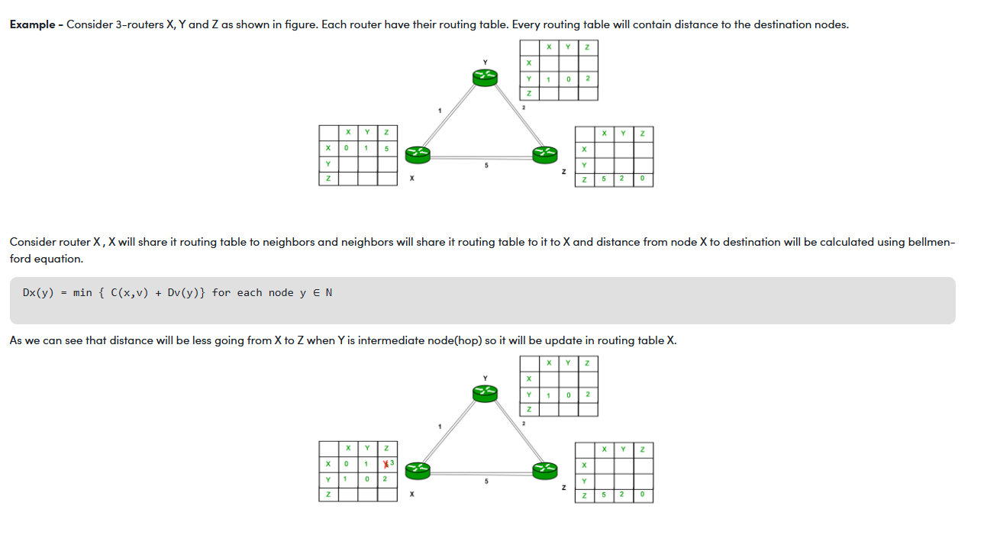 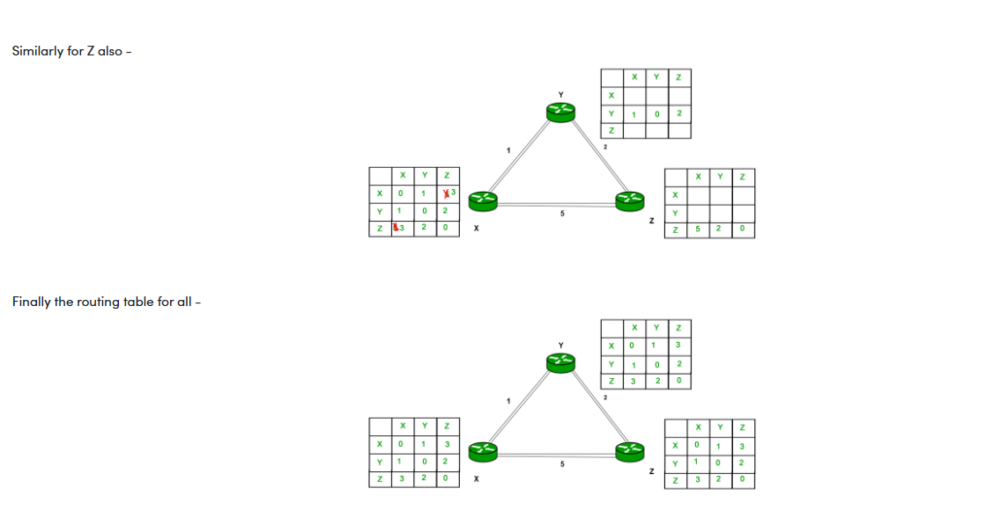
                Each router shares its table with neighbors.
                X calculates cost to Z using Y as an intermediate hop.
                If the path X → Y → Z is cheaper, X updates its DV.
                Same happens for Z.
                Finally, all routers update their routing tables.

            -   Advantages of DVR
                -   Simple to configure and maintain.

            -   Disadvantages of DVR
                -   Slow convergence.
                -   Prone to count-to-infinity routing loops.
                -   Generates more control traffic since updates are periodic.
                -   Larger routing tables in large networks.
                -   Causes WAN congestion.
            
            -   Key Notes
                -   DVR uses UDP for transporting routing info.
                -   RIP is the practical implementation of DVR.

            -   Count-to-Infinity Problem 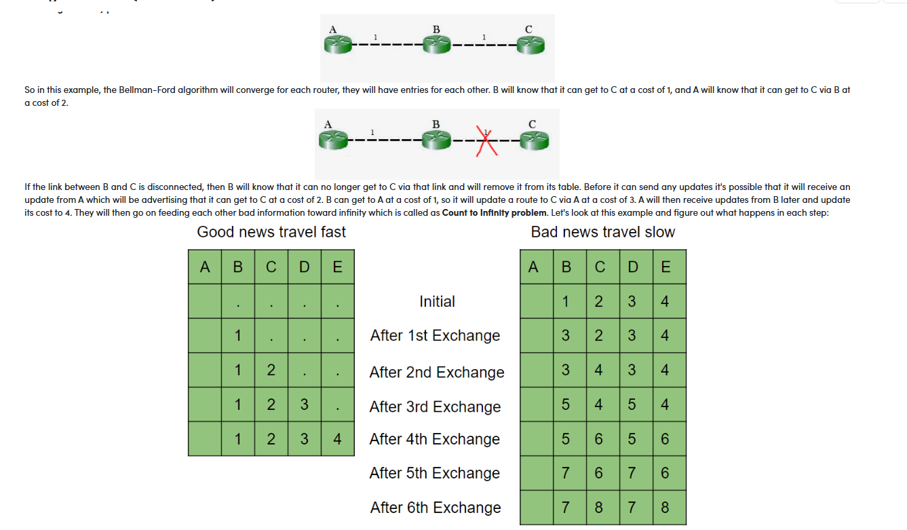
                How it happens
                A, B, C know routes to each other.
                Link B–C fails → B removes C.
                A still advertises C at cost 2 to B.
                B updates route: B → A → C (cost 3).
                A updates route: A → B → C (cost 4).
                Costs increase endlessly → count-to-infinity.

            -   Solutions to Count-to-Infinity
                1. Route Poisoning
                    -   Failed routes are advertised with infinite metric.
                    -   In RIP, infinity = 16.
                    -   Helps routers quickly remove unreachable routes.

                2. Split Horizon
                    -   Do not advertise a route back out the interface from which it was learned.
                    -   Prevents simple loops (A → B → A).

                3. Split Horizon with Poison Reverse
                    Combines both:
                    -   Advertise route back with infinite cost.
                    Used in RIP for loop prevention.

                4. Holddown Timers
                    -   Activated when a route goes down.
                    -   Router ignores updates for that route until:
                        -   Timer expires, or
                        -   Update comes from the connected router.

        -   RIP (Routing Information Protocol)
            Important Characteristics
            -   Uses hop count metric.
            -   Maximum hop count = 15 (16 = infinity).
            -   Sends updates every 30 seconds.
            -   Implements: Split Horizon, Poison Reverse, Holddown timers

    -   Link State Routing (LSR)
        Overview: 
        -   A dynamic routing algorithm (updates on topology change).
        -   Based on Dijkstra’s shortest path algorithm.
        -   Each router:
            -   Builds a complete network topology.
            -   Calculates shortest paths independently.
        -   Phases of LSR
            -   (A) Reliable Flooding
                -   Each router knows hop-costs to directly connected neighbors.
                -   It advertises this info via Link-State Advertisements (LSAs).
                -   LSA Contains: Sequence number, Router ID, Neighbor hop-cost
                -   LSA Handling Procedure
                    -   Router keeps an LSA table.
                    -   On receiving an LSA:
                        -   Compare with stored sequence number.
                        -   If newer → update table & flood to neighbors.

            -   (B) Route Calculation
                -   After all LSAs are flooded, every router knows the full topology.
                -   Each router runs Dijkstra’s Algorithm to compute:
                    -   Shortest path to every router
                    -   Next-hop information
                -   OSPF (Open Shortest Path First)
                    -   Practical implementation of LSR.
                    -   Supports: Fast convergence, Hierarchical routing, Efficient link-state updates

-   Application Layer
    -   The Application Layer is the topmost layer of the OSI Model.
    -   It is where user applications and high-level protocols operate.
    -   When a user browses the internet, the following occurs:
        -   The browser generates Application Data with specific application headers.
        -   The Transport Layer breaks data into segments and adds a TCP header.
        -   The Network Layer adds the destination IP address.
        -   The Data Link Layer sends frames to the router using MAC addresses.
        -   The MAC address of the router is obtained using ARP (Address Resolution Protocol).
        -   Switches read the MAC header to forward frames.
        -   Routers on the internet operate using:
            -   Network Layer, Data Link Layer, Physical Layer
        -   When data reaches the web server, the TCP header helps reconstruct the original data stream.

    -   Protocols in the Application Layer
        1. HTTP (Hyper Text Transfer Protocol)
            -   A request–response protocol used to fetch web content (HTML, JS, images, etc.) in a client-server architecture.
            -   Uses TCP at the transport layer.
            -   HTTP Methods:
                GET – Retrieve data (no side effects).
                HEAD – Retrieve only headers.
                POST – Send data to the server (forms, user data).
                DELETE – Delete the specified resource.
                OPTIONS – Get supported HTTP methods.
                Port: 80 (sometimes 8080)

        2. HTTPS (HTTP Secure)
            -   Secure version of HTTP using TLS (formerly SSL).
            -   Prevents eavesdropping, tampering & MITM attacks.
            -   Port: Same as HTTP (commonly 443 in practice).

        3. TELNET
            -   Stands for TELecommunications NETwork.
            -   Terminal emulation protocol allowing remote access to another machine.
            -   Not secure (no encryption). Replaced by SSH.
            -   Port: 23

        4. SSH (Secure Shell)
            -   Secure version of Telnet with encryption.
            -   Used for remote administration, file access, tunneling.
            -   Port: 22

        5. FTP (File Transfer Protocol)
            -   Transfers files reliably between remote machines.
            -   Uses two ports:
                20 – FTP Data
                21 – FTP Control
        
        6. SMTP (Simple Mail Transfer Protocol)
            -   Used for sending emails.
            -   Uses TCP.
            -   Works with MTA (Mail Transfer Agent) through Store and Forward.
            -   Port: 25

        7. DNS (Domain Name System)
            -   Converts domain names → IP addresses.
            -   e.g., www.example.com → 198.105.232.4
            -   Clients query DNS servers to obtain the IP of requested domains.
            -   Port: 53

        8. DHCP (Dynamic Host Configuration Protocol)
            -   Provides dynamic IP addressing to devices in a network.
            -   DHCP server maintains a pool of IP addresses and leases them temporarily.
            -   Needed because devices frequently join/leave the network.
            -   Ports: 67 (server), 68 (client)

-   Domain Name System (DNS)
    -   Introduction
        -   We are fortunate to live in the age of the internet, whose power and utility we often take for granted. We open a browser, type a URL or a Google search query, and instantly get thousands of results which we can browse, follow links, and explore — a process commonly known as web surfing.
        -   But have you ever wondered what happens under the hood?
        -   In this article, we walk through everything that happens from the moment you enter a URL in the browser to the moment a webpage loads.

    -   Entering the URL
        -   We use browsers (Chrome, Firefox, Edge, etc.) to surf the internet. Each browser has an address bar where we type the URL of the website we want to visit.
        -   When we enter a URL such as www.google.com or youtube.com and press Enter, the landing page loads shortly afterward.
        -   However:
            -   Computers cannot understand human-language addresses.
            -   Human-readable URLs have variations (uppercase/lowercase, typos, etc.).
            -   Networks use IP addresses (IPv4/IPv6) for actual routing.
            -   IPs are numeric and hard to remember.
        -   To bridge this gap, we need a mechanism that maps domain names → IP addresses.
        -   This is where DNS comes into play.
        -   Whenever you type a domain name in the browser:
            -   The system must get the IP address for that domain.
            -   Only after the browser receives the IP can it request data from the server.

    -   DNS Lookup
        DNS lookups add overhead, and to optimize performance, systems maintain a DNS cache. Before querying a DNS server, the browser checks the system’s DNS cache.

        You can view the cache on Windows using: ipconfig /displaydns

        If no cached entry is found, the system queries an external DNS server. DNS server IPs can be:
            -   Provided by ISP
            -   Public DNS such as:
                -   Google: 8.8.8.8 / 8.8.4.4
                -   OpenDNS: 208.67.222.222 / 208.67.220.220
            -   DNS queries typically use UDP because:
                -   DNS requests are small (≤ 512 bytes)
                -   UDP is faster and lightweight
            -   DNS uses port 53
        
    -   DNS Resolution (How DNS Finds the IP)
        Let’s resolve www.youtube.com.

        DNS resolution works right to left:
        -   .com
        -   youtube
        -   www

        -   Steps 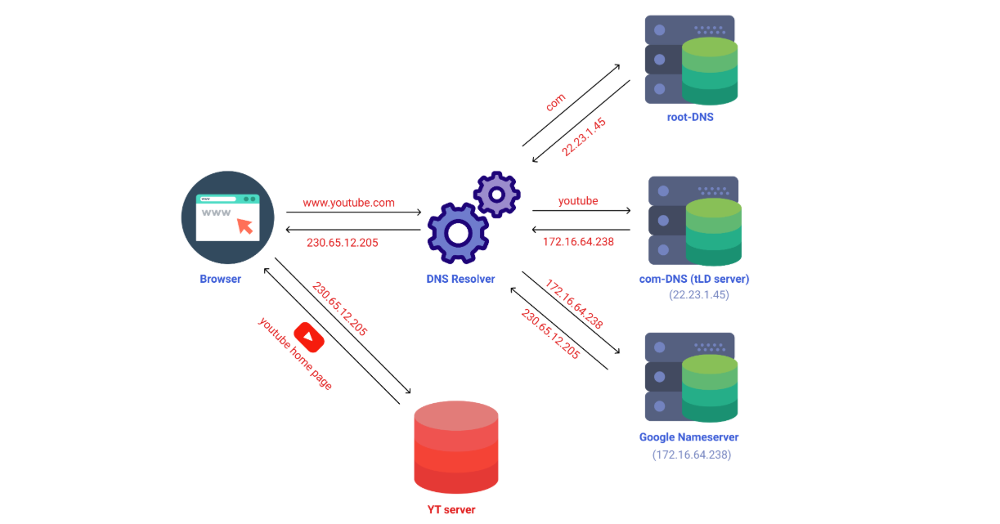 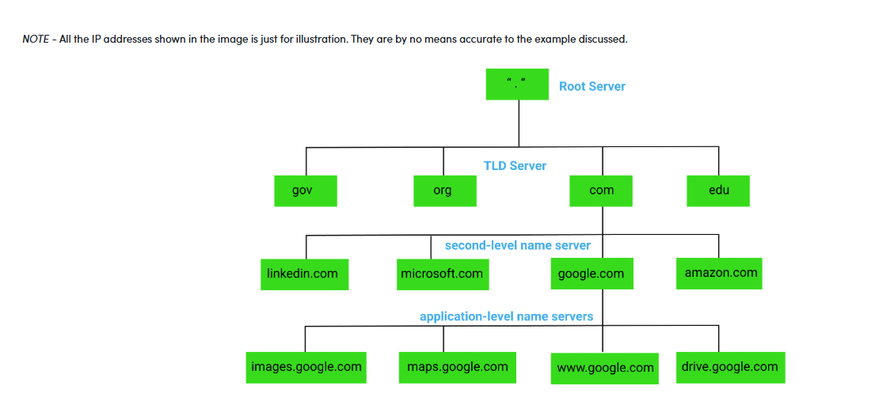
            -   Browser queries a Root DNS Server
                -   Root DNS contains addresses of Top-Level Domain (TLD) servers (.com, .org, .gov, etc.).
                -   Since we need .com, it returns the address of a .com TLD server.
            -   Query to TLD (.com) Server
                -   The .com server checks its database for domains matching youtube.
                -   It returns the authoritative name servers for YouTube, e.g.,
                -   ns1.google.com to ns4.google.com.
            -   Query to Authoritative Name Server
                -   We query one of Google's name servers.
                -   It returns the IP address of a geographically closest YouTube server.

        -   This hierarchical process continues until the final IP is returned.

    -   TCP Connection & HTTP Request
        -   Once the IP is found, the browser establishes a TCP connection using the 3-way handshake:
            -   SYN → Client asks to open a connection
            -   SYN/ACK → Server acknowledges
            -   ACK → Client confirms
        -   After the connection is established, the browser sends an HTTP request to the server.
        -   The server replies with an HTTP response, containing: HTML, CSS, JavaScript, images, JSON data and more.
        -   The browser then parses and renders these to display the webpage.

    -   Sub-URL Resolution
        Example sub-URLs: 
            geeksforgeeks.org/data-structure-and-algorithms/
            geeksforgeeks.org/users/

        -   How does the server serve different pages?
            -   Historically, there were two approaches:
                1. Separate HTML Files (Old Approach)
                    -   Servers had a fixed folder structure: index.html, feed.html, profile.html etc.
                    -   When you visited:
                        -   abc.com/ → serves index.html
                        -   abc.com/feed.html → serves feed.html
                    -   This approach does not scale, especially for millions of user-specific pages such as:
                        -   abc.com/profile/levi.html
                        -   abc.com/profile/eren.html
                        -   abc.com/profile/erwin.html

                2. Single Bundle File + API Endpoints (Modern Approach)
                    -   Modern websites use:
                        -   Single Page Applications (SPAs)
                        -   Frameworks: React, Angular, Vue
                        -   Backend APIs: Node.js, Django, Express
                    -   How it works:
                        -   A single JS bundle is downloaded.
                        -   It contains the base HTML shell.
                        -   When navigating to pages:
                            -   Browser makes API calls
                            -   Data is injected dynamically into the page
                        -   This approach is scalable and efficient.

-   DHCP (Dynamic Host Configuration Protocol)
    -   Introduction
        -   DHCP is an application layer protocol used to automatically provide network configuration parameters to clients, such as:
            -   Subnet Mask (Option 1 — e.g., 255.255.255.0)
            -   Router/Gateway Address (Option 3 — e.g., 192.168.1.1)
            -   DNS Server Address (Option 6 — e.g., 8.8.8.8)
            -   Vendor Class Identifier (Option 43 — e.g., 'unifi' = 192.168.1.9)

        -   DHCP follows a client–server model and operates using the DORA process:
            -   Discover, Offer, Request, ACK
        
        -   It uses: UDP port 67 (server), UDP port 68 (client)

        -   Although DORA consists of 4 main steps, DHCP actually defines 8 message types.
    
    -   DHCP Message Types
        1. DHCP Discover
            -   First message sent by the client.
            -   Used to find available DHCP servers on the network.
            -   Broadcast message.
            -   Size: ~342 or 576 bytes.
            -   Fields:
                -   Source MAC: client’s MAC
                -   Destination MAC: FF:FF:FF:FF:FF:FF
                -   Source IP: 0.0.0.0 (client has no IP yet)
                -   Destination IP: 255.255.255.255 (broadcast)

        2. DHCP Offer
            -   Server replies with an offered IP address + configuration.
            -   Broadcast by the server.
            -   Size: ~342 bytes.
            -   If multiple servers reply, client accepts the first OFFER.
            -   Includes:
                -   Server ID
                -   Offered IP
                -   Lease duration
            -   Fields:
                -   Source IP: DHCP server IP
                -   Destination IP: 255.255.255.255
                -   Source MAC: server MAC
                -   Destination MAC: FF:FF:FF:FF:FF:FF

        3. DHCP Request
            -   Sent by client to accept a DHCP Offer.
            -   Client first sends a gratuitous ARP to check if the offered IP is already in use.
            -   If no ARP reply → client broadcasts DHCP Request.
            -   Fields:
                -   Source IP: 0.0.0.0
                -   Destination IP: 255.255.255.255
                -   Source MAC: client MAC
                -   Destination MAC: broadcast MAC

        4. DHCP ACK (Acknowledgement)
            -   Server confirms the assignment.
            -   Binds the IP address to the client with the lease time.
            -   After this message, the client starts using the assigned IP.
            -   Fields:
                -   Source IP: server IP
                -   Destination IP: broadcast IP
                -   Source MAC: server MAC
                -   Destination MAC: broadcast

        5. DHCP NAK (Negative Acknowledgement)
            -   Sent by the server if:
                -   Client requests an invalid IP
                -   Requested IP is outside the server’s configured scope
                -   IP pool is empty
            -   Client must restart the DHCP process.

        6. DHCP Decline
            -   Client sends this if the offered IP is already in use.
            -   Sent when the gratuitous ARP receives a reply from another host.

        7. DHCP Release
            -   Client sends this to relinquish its IP address.
            -   Tells the server to free the lease early.

        8. DHCP Inform
            -   Used when the client already has a manually assigned IP.
            -   Client requests additional network parameters (e.g., domain name).
            -   Server responds with DHCP ACK (unicast), without assigning a new IP.
            -   Note on DHCP Relay : If the DHCP server is on a different network, a DHCP relay agent can forward the messages, allowing unicast communication across subnets.

    -   Advantages of DHCP
        -   Centralized IP address management
        -   Easy addition of new clients
        -   Efficient reuse of IP addresses
        -   Reconfiguration possible on server without touching clients
        -   Simplifies network administration
        -   Automated handling of users and IP allocations

    -   Disadvantages of DHCP
        -   IP conflicts can occur (rare but possible if misconfigured)

