-   Operating System and its Types
    -   What is an Operating System?
        -   An Operating System (OS) acts as an intermediary between the user and the computer hardware.
        -   Its main goals are:
            -   To provide an environment where users can run programs efficiently and conveniently.
            -   To manage system resources such as CPU, Memory, I/O devices, Files, etc.
            -   To ensure fairness, efficiency, and security while handling multiple tasks.
        -   Based on different use-cases and features, OS are broadly classified into:
            -   Batch OS
            -   Time-Sharing OS
            -   Distributed OS
            -   Network OS
            -   Real-Time OS

    1. Batch Operating System
        -   A Batch OS groups similar jobs into batches using an operator program.
        -   There is no user interaction during execution of a batch.
        -   Key Features
            -   Multiple users submit jobs; OS groups them into batches.
            -   Job completion time is unpredictable.
            -   CPU remains busy; minimal idle time.
            -   Can suffer from the Convoy Effect (slow job blocks faster ones).
        -   Usage Examples: Payroll processing, Bank statements generation

    2. Time-Sharing Operating System
        -   A Time-Sharing OS allows multiple users to interact with the system simultaneously.
        -   Each user gets a small CPU time slice (time quantum).
        -   Key Features
            -   Every user gets equal CPU opportunity.
            -   No user is stuck indefinitely (due to context switching).
            -   Context switching overhead exists.
            -   Examples: Multics, UNIX

    3. Distributed Operating System
        -   A Distributed OS manages multiple independent hardware units (CPUs, memory, I/O), giving the illusion of a single system.
        -   Key Features
            -   Failure in one unit does not affect others.
            -   Faster computation due to resource sharing and parallelism.
            -   Easily scalable by adding more machines.
            -   Supports remote access to resources on other systems.

    4. Network Operating System
        -   A Network OS runs on a server and manages users, data, security, and applications across a network.
        -   These are tightly coupled systems, where users must know the network structure.
        -   Key Features
            -   Centralized management (but single point of failure).
            -   Supports remote access from different locations.
            -   Easy upgrades since changes apply to central server.
            -   Examples: Windows Server, Ubuntu Server, CentOS

    5. Real-Time Operating System
        -   A Real-Time OS (RTOS) executes tasks with strict timing constraints.
        -   Used in mission-critical systems where delays are unacceptable.
        -   Key Features
            -   Maximum utilization and zero downtime.
            -   Domain-specific and optimized for reliability.
            -   Automatic error recovery.
            -   Very predictable response times.
            -   Examples: Defense systems, Robotics, Spacecraft systems, Air-traffic control, Sensor networks

-   Multiprogramming, Multiprocessing & Multithreading
    
    Although these three concepts sound similar and all relate to concurrency, they differ fundamentally in how they achieve it.

    1. Multiprocessing
        -   Multiprocessing uses multiple physical CPUs (or CPU cores) to execute programs in true parallelism.
        -   Key Characteristics
            -   Multiple CPUs/cores exist physically.
            -   True parallel execution of processes.
            -   Higher reliability — if one CPU fails, others continue.
            -   Better performance through horizontal scaling (adding more CPUs instead of upgrading one).
            -   I/O devices can be shared among processors → cost-efficient.
            -   Advantages
                -   Genuine parallel execution
                -   Fault tolerance
                -   High computational throughput

    2. Multiprogramming
        -   Multiprogramming allows multiple programs to reside in memory and share a single CPU.
        -   There is no true parallelism. Instead, the CPU switches rapidly among processes — giving a feeling of concurrency.
        -   How it works
            -   All programs enter a job pool (a queue).
            -   A scheduler selects a process.
            -   CPU executes it until:
                -   Time quantum expires, or
                -   Process requests I/O, or
                -   An interrupt occurs
            -   OS performs a context switch to another process.
        -   Key Characteristics
            -   Only one process executes at a time.
            -   Uses context switching to avoid CPU idle time.
            -   Degree of multiprogramming depends on memory size.

    3. Multithreading
        -   Multithreading refers to multiple threads running within the same process.
        -   Since threads belong to the same process, they share: Code segment, Memory, File descriptors, Resources
        -   But each thread has its own: Stack, Program counter, Execution state, Characteristics
        -   Threads are lightweight processes.
        -   Faster context switching than processes (same PCB used).
        -   Designed for tasks that share data or run concurrently.
        -   Example: Each tab in a web browser is often a separate thread under the same browser process.

-   Introduction to Threads

    -   What Are Threads?
        - A thread is the smallest unit of execution inside a process.  
        - Process = a running program (e.g., Chrome).  
        - Threads = workers inside that program doing tasks (rendering UI, loading a tab, running JS, etc.).  

    -   Why Do We Need Threads?
        1. Parallelism → Run tasks truly in parallel using multiple CPU cores (e.g., video rendering, ML training).  
        2. Concurrency → Handle multiple tasks logically at the same time (e.g., web server serving many requests).  
        3. Responsive Applications → UI thread + background worker threads keep apps smooth.  
        4. Better CPU Utilization → Threads reduce idle CPU time by keeping cores busy.  

    -   How Threads Work
        Each thread has:
        - Program counter → current execution point.  
        - Stack → function calls, local variables.  
        - Registers → CPU state.  
        - Thread-local storage (optional).  

        Threads share:
        - Heap memory  
        - Global variables  
        - File handles  
        - Code  

    -   Types of Threads
        1. User Threads → Managed by program/language runtime (Java threads, Python threads, pthreads).  
        2. Kernel Threads → Managed by OS scheduler (Windows threads, Linux tasks).  
        3. Green Threads → Emulated threads managed by runtime (Golang goroutines, Java virtual threads, Erlang processes).  

    -   Common Problems in Multithreading
        - Race Conditions → Two threads modify shared data simultaneously → corrupted state.  
        - Deadlocks → Thread A waits for B, B waits for A → freeze forever.  
        - Starvation → A thread never gets CPU time.  
        - Context Switching Overhead → Too much switching reduces performance.  

    -   Real-Life Uses of Threads
        - Web Servers → Each request handled by a new thread or thread pool.  
        - Databases → Background compaction, query execution, I/O threads.  
        - Games → Separate threads for physics, rendering, AI.  
        - OS Kernels → Each process may contain multiple threads.  

-   Thread V/S Process
    -   Process
        - A process is an independent program in execution.  
        - It has its own memory and resources.  
    -   Thread
        - A thread is the smallest unit of execution inside a process.  
        - Multiple threads live inside the same process and share its memory.  

    -   Key Differences (Interview Table)

    | Feature          | Process                                      | Thread                                      |------------------------------------------------------------------|---------------------------------------------|
    | Definition       | Independent execution unit (program running) | Lightweight execution unit inside a process |
    | Memory           | Has its own address space (isolated)         | Threads share memory of the process         |
    | Communication    | IPC (Inter-process communication) is slow    | Shared memory → fast communication          |
    | Creation         | Heavy, slow                                  | Light, fast                                 |
    | Context Switching| Slow (more state to save/restore)            | Fast                                        |
    | Crash Impact     | If one process crashes, others live          | If one thread crashes, entire process may crash |
    | Resource Ownership| Owns resources (files, sockets, heap)       | Threads share resources                     |
    | Scheduling       | Done by OS                                   | Also done by OS (kernel threads)            |
    | Use Cases        | Isolated tasks                               | Parallel tasks inside same program          |

    -   Memory Difference (Very Important for Interviews)

        Process Memory Layout
        Each process has separate:
        - Code section  
        - Stack  
        - Heap  
        - Data segment  
        - File descriptors  

        Thread Memory Layout
            Threads share:
            - Code  
            - Heap  
            - Globals  
            - File descriptors  

            But each thread has its own:
            - Stack  
            - Registers  
            - Program counter  

-   User Threads vs Kernel Threads

    Threads can be managed either by:
    - User-level thread library  
    - Operating system kernel

    1. User Threads (ULT)
        - Definition: Threads created and managed in user space by a runtime/library — NOT by the OS.  
        - Examples:  
            - Java green threads (old JVM)  
            - Go goroutines  
            - Python gevent greenlets  
            - Erlang lightweight processes  
            - POSIX ULT implementations  

            🔑 Key Features
            - Kernel does not know these threads exist.  
            - Scheduling is done in user space.  
            - One kernel thread runs many user threads.  

        -   How User Threads Work
            OS Kernel:     [ Kernel Thread ]
            User Space:    [ User Thread 1 ]
                           [ User Thread 2 ]
                           [ User Thread 3 ]
        ➡ All user threads run on a single kernel thread unless mapped differently.

        ⭐ Pros of User Threads
        | Advantage              | Why                          |
        |------------------------|------------------------------|
        | Very fast to create    | No system call needed        |
        | Fast context switching | Done in user space           |
        | Lightweight            | Small stack, cheap           |
        | Highly scalable        | Millions possible (e.g., Go) |

        ❌ Cons of User Threads
        | Limitation                  | Why                                      |
        |-----------------------------|------------------------------------------|
        | No true parallelism         | Only 1 kernel thread is running (no true multiprocessing)          |
        | Blocking system call blocks all | All user threads share one kernel thread |
        | Complex runtime scheduler   | Requires JVM, Go runtime, etc.           |

    2. Kernel Threads (KLT)

        - Definition: Threads created and managed by the OS kernel.  
        - Examples:  
            - Linux threads (each is a task)  
            - Windows threads  
            - POSIX pthreads (1:1 mapping)  
            - Java threads (modern JVM)  
            - C++ `std::thread`  

        🔑 Key Features
            - OS knows each thread.  
            - Each kernel thread can run independently on different CPU cores.  

        -   How Kernel Threads Work
            OS Kernel:     [ Kernel Thread 1 ]
                           [ Kernel Thread 2 ]
                           [ Kernel Thread 3 ]
            User Space:    (User program)
        ➡ Each thread is scheduled like a small process.

        ⭐ Pros of Kernel Threads
        | Advantage                  | Why                                      |
        |----------------------------|------------------------------------------|
        | True parallelism           | Multiple threads run on multiple cores   |
        | Blocking system call blocks only one | Other threads keep running          |
        | Better OS support          | Kernel manages scheduling                |

        ❌ Cons of Kernel Threads
        | Limitation                 | Why                                      |
        |----------------------------|------------------------------------------|
        | Heavier                    | More memory and kernel data structures   |
        | Slower to create/switch    | Requires system calls                    |
        | Limited number             | Not millions like goroutines             |

    -   Hybrid Models (Interview Point)

    Many systems use a mix of user + kernel threads:

    - 1:1 Model → One user thread → one kernel thread  
        - Example: Modern Java, pthreads  

    - N:1 Model → Many user threads → one kernel thread  
        - Example: Old Java green threads  

    - M:N Model → Many user threads → few kernel threads  
        - Example: Go goroutines, Erlang VM, Windows fibers  

-   Process Management – Introduction to Process

    -   What is a Process?
        - A process is a program in execution (active entity).  
        - A program is passive (binary or source code).  
        - Running a program multiple times creates multiple processes (instances).  
        - Example: Compiling C/C++ code → binary program. Running binary → process.

    -   Process in Memory 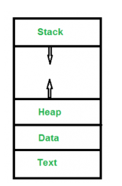
        A process consists of:
        - Text Section → Program code + Program Counter (current instruction).  
        - Stack → Temporary data (function parameters, return addresses, local variables).  
        - Data Section → Global variables.  
        - Heap → Dynamically allocated memory during runtime.  


    -   Process States

        Single Tasking (MS-DOS) 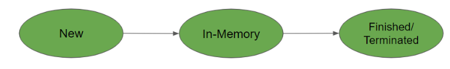
        - Only one process runs at a time.  
        - Next process starts only after the previous ends → inefficient.

        Multiprogramming
        - Multiple processes share hardware resources.  
        - Achieves pseudo-parallelism via context switching.  
        - Number of processes depends on memory size.

    -   State Models
        5-State Model: 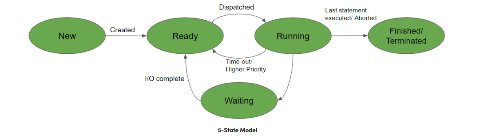
        1. New → Process created but not yet in memory.  
        2. Ready → Loaded into memory, waiting for CPU.  
        3. Running → Instructions executed by CPU.  
        4. Blocked/Wait → Waiting for I/O or resource.  
        5. Terminated → Process finished, PCB deleted.  

        7-State Model (adds suspension states):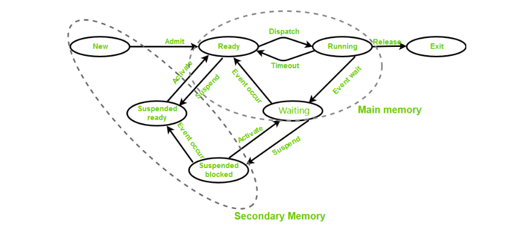
        - Suspend Ready → Ready but swapped out to secondary storage.  
        - Suspend Blocked → Blocked process moved to secondary storage.  

    -   Process Control Block (PCB) 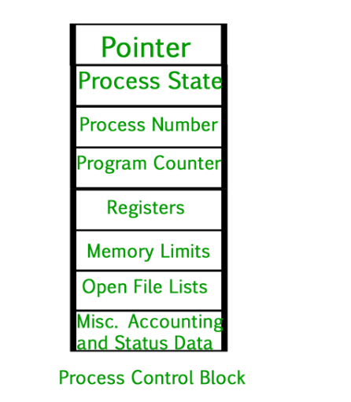
        Each process has a PCB containing:
        - Process ID (PID) → Unique identifier.  
        - Process State → Ready, running, blocked, etc.  
        - Program Counter → Next instruction address.  
        - CPU Registers → Accumulator, base, general-purpose registers.  
        - Pointer → Stack pointer for context switching.  
        - Memory Limits → Page tables, segment tables.  
        - Open Files List → Files used by the process.  
        - Scheduling Info → Priority, quantum.  
        - Accounting Info → CPU usage, time limits.  

    -   The process table is an array of PCBs for all active processes.

    -   Context Switching
        - Definition: Saving the context of one process and loading another.  
        - When it happens:  
            1. Higher-priority process becomes ready.  
            2. Interrupt occurs.  
            3. User ↔ Kernel mode switch.  
            4. Preemptive CPU scheduling.  

    -   Context Switch vs Mode Switch
        - Context Switch → CPU switches from one process to another (changes PCB).  
        - Mode Switch → CPU changes privilege level (user mode ↔ kernel mode).  
        - Mode switch may occur without changing the process.  
        - Only the kernel can trigger a context switch.

    -   Kernel Mode vs User Mode (Super Short)
        -   User Mode
            -   Runs apps (Chrome, games).
            -   Limited access → can’t touch hardware directly.
            -   App crash ≠ system crash.

        -   Kernel Mode
            -   Runs OS + drivers.
            -   Full hardware access.
            -   Crash here = system crash.  
    
    -   Process Spawning in Operating Systems

        🔑 Introduction
        - When the system boots, it begins with a single process.  
        - In UNIX-based systems, this is the init process.  
        - The init process spawns other processes until the OS is fully loaded.  
        - Process spawning allows the OS to create and destroy multiple processes during runtime.  

        👉 If process A creates process B:  
        - A = Parent process  
        - B = Child process

        🏷️ Process Identification
        - Each process has a unique Process ID (PID).  
        - Process information (state, resources, etc.) is stored in the process table.  
        - When a process terminates → its entry is deleted from the table.  
    
        🧟 Zombie Process
        - Definition: A process that has finished execution but still has an entry in the process table.  
        - Exists to report its exit status to the parent.  
        - Lifecycle:  
            1. Child terminates → becomes zombie.  
            2. Parent must reap (collect exit status).  
            3. Once reaped → entry removed from process table.  
        - Reason: Parent may be waiting for I/O or sleeping, delaying the reap.  
        - Until reaped → process remains a Zombie.  

        👶 Orphan Process
        - Definition: A child process still running after its parent has terminated.  
        - Causes:  
            - Parent terminates due to error.  
            - Parent doesn’t wait for child to finish.  
        - Handling:  
            - Orphan is adopted by the init process.  
            - Init reaps the orphan once it finishes execution. 

        -   Daemon Process
            Daemon processes are started working when the system will be bootstrapped and terminate only when the system is shutdown. It does not have a controlling terminal. It always runs in the background.

            -   Characteristics of Daemon Processes
                -   Background Operation: Daemons run in the background, performing system-level tasks without direct user intervention.
                -   Long-lived: Daemons are designed to run for extended periods, handling tasks such as system maintenance, network services, or hardware management. 

-   Process Management – Process Scheduling

    🔑 CPU vs I/O Bound Processes
    - CPU-bound → Intensive in CPU operations.  
    - I/O-bound → Intensive in I/O operations.  

    -   Types of Process Schedulers
        1. Long-Term (Job Scheduler)  
            - Brings new processes into the Ready State.  
            - Controls degree of multiprogramming (number of processes in ready state).  
            - Balances CPU-bound and I/O-bound processes.  

        2. Short-Term (CPU Scheduler)  
            - Selects one process from the ready queue for CPU execution.  
            - Dispatcher loads the selected process onto CPU.  
            - Dispatcher tasks:  
                - Context switching  
                - Switching to user mode  
                - Jumping to correct program location  

        3. Medium-Term Scheduler  
            - Suspends/resumes processes.  
            - Performs swapping (move processes between memory and disk).  
            - Used to improve process mix or free memory.  

    -   Multiprogramming
        - Pre-emption → Process forcefully removed from CPU (time-sharing).  
        - Non-pre-emption → Process runs until completion.  
        - Degree of multiprogramming → Max number of processes in ready state.  

    -   Process Queues
        - Ready Queue → Processes in memory waiting for CPU.  
        - Job Queue → New processes waiting for memory allocation.  
        - Waiting (Device) Queue → Processes waiting for I/O devices.  

    -   Scheduler vs Dispatcher

    | Property       | Scheduler                                   | Dispatcher                                      |
    |----------------|---------------------------------------------|------------------------------------------------|
    | Definition | Selects process among ready ones            | Gives CPU control to selected process          |
    | Types      | Long-term, Short-term, Medium-term          | No types (just a code segment)                 |
    | Dependency | Works independently                         | Depends on scheduler                           |
    | Algorithm  | FCFS, SJF, RR, etc.                         | No algorithm                                   |
    | Time Taken | Negligible                                  | Dispatch latency                               |
    | Functions  | Process selection                           | Context switch, mode switch, jump to program   |

    -   Process Timing Metrics
        - Arrival Time (AT) → Time process enters ready queue.  
        - Completion Time (CT) → Time process finishes execution.  
        - Burst Time (BT) → CPU time required.  
        - Turnaround Time (TAT) → CT – AT.  
        - Waiting Time (WT) → TAT – BT.  
        - Response Time (RT) → First CPU allocation – AT.  

        Example (P0):  
        - AT = 1, CT = 6, BT = 3 → TAT = 5, WT = 2, RT = 0.  

    -   Goals of Scheduling Algorithms
        - Max CPU utilization  
        - Max throughput (jobs/unit time)  
        - Min turnaround time  
        - Min waiting time  
        - Min response time  
        - Fair CPU allocation (avoid starvation)  

    -   Scheduling Algorithms

        1. First Come First Serve (FCFS)  
            - Non-preemptive, FIFO queue.  
            - Simple but can cause long waits if first job is large.  

        2. Shortest Job First (SJF)  
            - Non-preemptive, shortest burst time first.  
            - Optimal average waiting time.  
            - Risk of starvation for long jobs.  

        3. Longest Job First (LJF)  
            - Non-preemptive, longest burst time first.  

        4. Shortest Remaining Time First (SRTF)  
            - Preemptive SJF → shortest remaining time first.  
            - Risk of starvation.  

        5. Longest Remaining Time First (LRTF)  
            - Preemptive LJF → longest remaining time first.  

        6. Round Robin (RR)  
            - Time quantum assigned cyclically.  
            - Fair, good for time-sharing.  
            - Large quantum → behaves like FCFS.  

        7. Priority Scheduling (Non-preemptive)  
            - Highest priority first.  
            - Starvation possible.  

        8. Highest Response Ratio Next (HRRN)  
            - Response Ratio = (Waiting Time + Burst Time) / Burst Time.  
            - Avoids starvation.  

        9. Multilevel Queue Scheduling  
            - Processes divided into queues by priority.  
            - Higher queues executed first → starvation possible.  

        10. Multilevel Feedback Queue Scheduling  
            - Processes can move between queues.  
            - CPU-heavy processes moved to lower-priority queues.  

        -   Useful Facts
            - FCFS → Long waits if first job is large.  
            - SJF/SRTF → Optimal average waiting time but risk starvation.  
            - RR → Large quantum ≈ FCFS.  
            - HRRN → Avoids starvation.  

-   Scheduling Algorithms
    
    -   First Come, First Serve (FCFS) Scheduling

        🔹 Definition
        - Non-preemptive scheduling algorithm  
        - Processes are executed in the order they arrive in the ready queue.  
        - Comparable to a queue at a grocery store: first in line gets served first.

        🔹 How FCFS Works
        1. Arrival → Processes enter the ready queue in order of arrival.  
        2. Execution → CPU executes the process at the front until completion.  
        3. Repeat → Next process is taken from the queue.  
        4. Continues until queue is empty.

        🔹 Key Formulas
        - Turnaround Time (TAT) = Completion Time (CT) − Arrival Time (AT)  
        - Waiting Time (WT) = Turnaround Time (TAT) − Burst Time (BT)  
        - Average TAT = Σ(TAT) / n  
        - Average WT = Σ(WT) / n  

        -   Scenario 1: Same Arrival Time
            | Process | AT | BT | CT | TAT | WT |
            |---------|----|----|----|-----|----|
            | P1      | 0  | 5  | 5  | 5   | 0  |
            | P2      | 0  | 3  | 8  | 8   | 5  |
            | P3      | 0  | 8  | 16 | 16  | 8  |

            - Average TAT = (5+8+16)/3 = 9.67  
            - Average WT = (0+5+8)/3 = 4.33

            Gantt Chart:  
            ```
            | P1 |----| P2 |--| P3 |--------|
            0    5    8    16
            ```

            -   Scenario 2: Different Arrival Times
            | Process | AT | BT | CT | TAT | WT |
            |---------|----|----|----|-----|----|
            | P2      | 0  | 3  | 3  | 3   | 0  |
            | P1      | 2  | 5  | 8  | 6   | 1  |
            | P3      | 4  | 4  | 12 | 8   | 4  |

            - Average TAT = (3+6+8)/3 = 5.67  
            - Average WT = (0+1+4)/3 = 1.67

            Gantt Chart:  
            ```
            | P2 |--| P1 |-----| P3 |----|
            0    3    8         12
            ```

        ✅ Advantages
        - Simple and easy to implement.  
        - Fair: processes served in arrival order.  
        - No starvation.  
        - Suitable for batch systems.

        ❌ Disadvantages
        - Convoy Effect: Short jobs wait behind long jobs.  
        - Poor performance in mixed workloads.  
        - High average waiting time compared to other algorithms.  
        - Not suitable for time-sharing systems.

    -   Shortest Job First (SJF) Scheduling

        🔹 Definition
        - SJF (or Shortest Job Next, SJN) selects the process with the smallest burst time for execution.  
        - Can be non-preemptive (once started, runs till completion) or preemptive (Shortest Remaining Time First, SRTF).  
        - Known for minimizing average waiting time compared to other scheduling algorithms.

        🔹 Estimation Formula (Predicting Burst Time)
            When burst time is unknown, we estimate using exponential averaging:

            T_{n+1} = alpha * t_n + (1 - alpha) * T_n

        - T_{n+1}: Predicted burst time for next process  
        - T_n: Previously predicted burst time  
        - t_n: Actual burst time of the previous process  
        - alpha : Smoothing factor (0 ≤ α ≤ 1)  
            👉 This balances recent history t_n with past predictions T_n.

        🔹 Characteristics
        - Optimal in terms of average turnaround time.  
        - Each task is associated with a unit of time to complete.  
        - May cause starvation if short jobs keep arriving (solved via aging).  
        - Works best in batch systems where burst times are known.


        -   Example (Non-Preemptive SJF)

            | Process | AT | BT | CT | TAT | WT |
            |---------|----|----|----|-----|----|
            | P1      | 0  | 6  | 6  | 6   | 0  |
            | P2      | 2  | 8  | 17 | 15  | 7  |
            | P3      | 4  | 3  | 9  | 5   | 2  |

            - Average TAT = (6 + 15 + 5)/3 = 8.6 ms  
            - Average WT = (0 + 7 + 2)/3 = 3 ms

            Gantt Chart:  
            ```
            | P1 |------| P3 |---| P2 |--------|
            0    6      9    17
            ```

            🔹 Implementation Steps
                1. Input number of processes, burst times, and arrival times.  
                2. Sort processes by burst time (if equal, use arrival order).  
                3. Select the shortest job available at current time.  
                4. Compute Completion Time (CT) = Start Time + Burst Time.  
                5. Compute Turnaround Time (TAT) = CT − AT.  
                6. Compute Waiting Time (WT) = TAT − BT.  
                7. Repeat until all processes are executed.  
                8. Calculate averages (TAT, WT).  
                9. Display results with Gantt chart.


        ✅ Advantages
        - Lower average waiting time compared to FCFS.  
        - Optimal for batch jobs with known burst times.  
        - Reduces turnaround time significantly.  
        - Better CPU utilization in predictable workloads.

        ❌ Disadvantages
        - Starvation: Long jobs may wait indefinitely if short jobs keep arriving.  
        - Requires knowledge or estimation of burst times, which is often difficult.  
        - Prediction of burst times can be inaccurate.  
        - Not ideal for interactive/time-sharing systems.

    -   Shortest Remaining Time First (SRTF) Scheduling

        🔹 Definition
        - SRTF is the preemptive version of Shortest Job Next (SJN) / Shortest Job First (SJF).  
        - At any given time, the CPU is allocated to the process with the least remaining burst time.  
        - If a new process arrives with a shorter burst time than the currently running process, the CPU is preempted and given to the new process.  

        👉 Think of it as “always give the CPU to the process that can finish the quickest from now.”

        🔹 Characteristics
        - Requires knowledge (or estimation) of burst times.  
        - More complex than non-preemptive SJF because the OS must continuously monitor the ready queue.  
        - Involves context switching whenever a shorter job arrives.  
        - Works best in batch systems where burst times are predictable.  
        - Provides better average turnaround and waiting times compared to FCFS and non-preemptive SJF.  

        -   Example

            Consider 3 processes:

            | Process | Arrival Time (AT) | Burst Time (BT) |
            |---------|-------------------|-----------------|
            | P1      | 0                 | 8               |
            | P2      | 1                 | 4               |
            | P3      | 2                 | 2               |

            Step-by-step execution:
            - At time 0 → P1 starts (remaining = 8).  
            - At time 1 → P2 arrives (BT=4). Since 4 < 7 (remaining of P1), CPU switches to P2.  
            - At time 2 → P3 arrives (BT=2). Since 2 < 3 (remaining of P2), CPU switches to P3.  
            - P3 runs till completion (time 4).  
            - CPU returns to P2 (remaining 2) → finishes at time 6.  
            - CPU returns to P1 (remaining 7) → finishes at time 13.  

            Gantt Chart:  
            ```
            | P1 |-| P2 |-| P3 |-| P2 |-| P1 |---------|
            0    1   2    4    6    13
            ```

            Calculations:
            - Turnaround Time (TAT) = CT − AT  
            - Waiting Time (WT) = TAT − BT

            | Process | CT | TAT | WT |
            |---------|----|-----|----|
            | P1      | 13 | 13  | 5  |
            | P2      | 6  | 5   | 1  |
            | P3      | 4  | 2   | 0  |

            - Average TAT = (13+5+2)/3 = 6.67  
            - Average WT = (5+1+0)/3 = 2.0


        ✅ Advantages
        - Better average waiting and turnaround times compared to FCFS and non-preemptive SJF.  
        - More responsive to short processes.  
        - Optimal for minimizing average waiting time (theoretically).  

        ❌ Disadvantages
        - High overhead due to frequent context switching.  
        - Requires accurate knowledge or estimation of burst times.  
        - Starvation risk: long processes may be delayed indefinitely if short jobs keep arriving.  
        - Not suitable for interactive/time-sharing systems.  
    
    -   Priority Scheduling

        🔹 Definition
        - Each process is assigned a priority value (based on memory needs, CPU burst, I/O ratio, etc.).  
        - The highest priority process is selected first.  
        - If multiple processes share the same priority → scheduled in FCFS order.  
        - Can be implemented in two ways:
            - Non-Preemptive Priority Scheduling → once a process starts, it runs till completion.  
            - Preemptive Priority Scheduling → CPU can be taken away if a higher-priority process arrives.  

        -   Non-Preemptive Priority Scheduling Example

            | Process | AT | BT | Priority | CT | TAT | WT |
            |---------|----|----|----------|----|-----|----|
            | P1      | 0  | 4  | 2        | 4  | 4   | 0  |
            | P2      | 1  | 2  | 1        | 6  | 5   | 3  |
            | P3      | 2  | 6  | 3        | 12 | 10  | 4  |

            - Average TAT = (4+5+10)/3 = 6.33  
            - Average WT = (0+3+4)/3 = 2.33

            Gantt Chart:  
            ```
            | P1 |----| P2 |--| P3 |------|
            0    4    6    12
            ```

        -    Preemptive Priority Scheduling Example (Same Arrival Time)

            | Process | AT | BT | Priority | CT | TAT | WT |
            |---------|----|----|----------|----|-----|----|
            | P1      | 0  | 7  | 2        | 13 | 13  | 6  |
            | P2      | 0  | 4  | 1        | 17 | 17  | 13 |
            | P3      | 0  | 6  | 3        | 6  | 6   | 0  |

            - Average TAT = (13+17+6)/3 = 12  
            - Average WT = (6+13+0)/3 = 6.33

            Gantt Chart:  
            ```
            | P3 |------| P1 |-------| P2 |----|
            0    6      13   17
            ```

        -   Preemptive Priority Scheduling Example (Different Arrival Times)

            | Process | AT | BT | Priority | CT | TAT | WT |
            |---------|----|----|----------|----|-----|----|
            | P1      | 0  | 6  | 2        | 10 | 10  | 4  |
            | P2      | 1  | 4  | 3        | 5  | 4   | 0  |
            | P3      | 2  | 5  | 1        | 15 | 13  | 8  |

            - Average TAT = (10+4+13)/3 = 9  
            - Average WT = (4+0+8)/3 = 4

            Gantt Chart:  
            ```
            | P1 |-| P2 |----| P1 |----| P3 |-----|
            0    1   5    10   15
            ```

        ✅ Advantages
        - Flexible: can prioritize critical tasks.  
        - More efficient than FCFS in mixed workloads.  
        - Can reduce waiting time for high-priority processes.  

        ❌ Disadvantages
        - Starvation: low-priority processes may never execute if high-priority jobs keep arriving.  
        - Requires accurate assignment of priorities (not always easy).  
        - Preemptive version → high overhead due to frequent context switching.  

        -   Aging (Solution to Starvation)
            - Problem: In Priority Scheduling, low-priority processes may starve if high-priority jobs keep arriving.
            - Solution: Aging gradually increases the priority of waiting processes the longer they stay in the queue.
            - Mechanism:
            - For every unit of waiting time, increase the process’s priority by a small fixed amount.
            - Eventually, even low-priority processes reach a high enough priority to be scheduled.

            👉 Example:
            - Suppose a process has priority = 5 (low).
            - After waiting 10 ms, its priority increases to 7.
            - It can now compete with higher-priority processes and avoid starvation.
    
    -   Round Robin (RR) Scheduling

        🔹 Definition 
        - Preemptive scheduling algorithm.  
        - Each process gets a fixed time slice (quantum) in cyclic order.  
        - Promotes fairness: all processes get equal CPU time.  
        - Ideal for time-sharing systems.

        🔹 How It Works 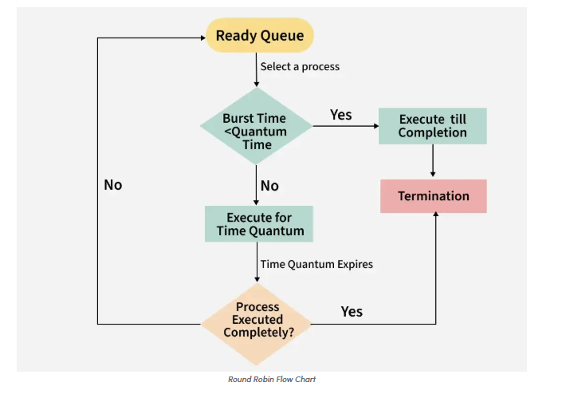
        1. Arrival → Processes enter the ready queue.  
        2. Time Allocation → Each process gets a fixed quantum.  
        3. Execution → Process runs for quantum or until completion.  
        4. Rotation → If unfinished, process goes to the end of the queue.  
        5. Repeat → CPU cycles through until all processes finish.  

        🔹 Key Formulas
        - Turnaround Time (TAT) = Completion Time (CT) − Arrival Time (AT)  
        - Waiting Time (WT) = Turnaround Time (TAT) − Burst Time (BT)  
        - Average TAT = Σ(TAT)/n  
        - Average WT = Σ(WT)/n  

        -   Scenario 1: Same Arrival Time (Quantum = 2 ms)

            | Process | AT | BT | CT | TAT | WT |
            |---------|----|----|----|-----|----|
            | P1      | 0  | 4  | 8  | 8   | 4  |
            | P2      | 0  | 5  | 12 | 12  | 7  |
            | P3      | 0  | 3  | 11 | 11  | 8  |

            - Avg TAT = (8+12+11)/3 = 10.33 ms  
            - Avg WT = (4+7+8)/3 = 6.33 ms

            Gantt Chart:  
            ```
            | P1 |--| P2 |--| P3 |--| P1 |--| P2 |--| P3 |-| P2 |
            0    2    4    6    8    10   11   12
            ```

        -   Scenario 2: Different Arrival Times (Quantum = 2 ms)

            | Process | AT | BT | CT | TAT | WT |
            |---------|----|----|----|-----|----|
            | P1      | 0  | 5  | 7  | 7   | 2  |
            | P2      | 4  | 2  | 6  | 2   | 0  |
            | P3      | 5  | 4  | 11 | 6   | 2  |

            - Avg TAT = (7+2+6)/3 = 5 ms  
            - Avg WT = (2+0+2)/3 = 1.33 ms

            Gantt Chart:  
            ```
            | P1 |--| P1 |--| P2 |--| P1 |-| P3 |--| P3 |
            0    2    4    6    7    9    11
            ```

        ✅ Advantages
        - Fairness: Every process gets equal CPU share.  
        - Simplicity: Easy to implement.  
        - Responsiveness: Good for interactive/time-sharing systems.  

        ❌ Disadvantages
        - Overhead: Frequent context switching if quantum is too small.  
        - Poor responsiveness if quantum is too large (behaves like FCFS).  
        - Not optimal for minimizing average waiting time compared to SJF/SRTF.  
    
    -   Multilevel Queue (MLQ) Scheduling

        🔹 Definition
        - MLQ Scheduling divides processes into multiple queues, each with its own scheduling policy.  
        - Processes are permanently assigned to a queue based on characteristics such as priority, memory needs, or type (system, interactive, batch).  
        - Each queue has a different scheduling algorithm (e.g., RR, FCFS, SJF).  
        - Higher-priority queues are served first; lower-priority queues run only when higher ones are empty.

        🔹 Characteristics
        - Multiple Queues: Processes grouped by type (system, interactive, batch).  
        - Fixed Priorities: Higher-priority queues always preempt lower ones.  
        - Different Algorithms: Each queue can use a different scheduling method.  
        - No Movement: Once assigned, a process stays in its queue (unlike MLFQ).  
        - Scheduling Among Queues:
            - Fixed Priority Preemptive: Higher queues dominate; lower queues run only if higher ones are empty.  
            - Time Slicing: CPU time is divided among queues (e.g., Q1 = 50%, Q2 = 30%, Q3 = 20%).  

        -   Example
            Suppose we have 3 queues:
            - Queue 1 (System) → Round Robin (RR)  
            - Queue 2 (Interactive) → FCFS  
            - Queue 3 (Batch) → SJF  

            Execution Rules:
            - If all queues have processes → Queue 1 runs first.  
            - If Queue 1 is empty → Queue 2 runs.  
            - If Queue 1 and Queue 2 are empty → Queue 3 runs.  

            👉 This ensures fast response for system/interactive tasks, while batch jobs eventually complete in lower queues.

        ✅ Advantages
        - Organized: Separates processes into distinct queues.  
        - Predictable: Easy to anticipate scheduling behavior.  
        - Fast response for system and interactive processes.  
        - Suitable for systems with diverse workloads.  
        - Ensures critical processes are not delayed behind non-essential tasks.  

        ❌ Disadvantages
        - Rigid: Processes cannot move between queues → inefficiency if workload type changes.  
        - Starvation risk: Lower queues may rarely get CPU time.  
        - Idle CPU: If high-priority queues are underloaded, CPU may stay idle while lower queues wait.  
        - Complexity: Requires more bookkeeping and resources.  
        - Reduced flexibility compared to MLFQ (which allows dynamic movement).  

    -   Multilevel Feedback Queue (MLFQ) Scheduling

        🔹 Definition
        - Extension of Multilevel Queue (MLQ) Scheduling.  
        - Unlike MLQ (where processes are permanently assigned to a queue), MLFQ allows processes to move between queues dynamically based on their behavior.  
        - Designed to balance responsiveness for short jobs and fairness for long jobs.  

        🔹 Characteristics
        - Multiple Queues: Each queue has its own scheduling policy (e.g., RR, FCFS).  
        - Dynamic Priorities: Process priority changes depending on CPU usage and waiting time.  
        - Time-Slicing: Higher-priority queues have smaller time quanta; lower-priority queues have larger quanta.  
        - Feedback Mechanism:  
            - If a process uses up its quantum → moved to a lower-priority queue.  
            - If a process waits too long → boosted to a higher-priority queue (to prevent starvation).  
        - Preemption: Higher-priority processes can preempt lower-priority ones.  

        -   Example Implementation
            - Queue 1 → Round Robin, Quantum = 4  
            - Queue 2 → Round Robin, Quantum = 8  
            - Queue 3 → FCFS  

            Rules:
            1. New processes start in Queue 1.  
            2. If not finished in Queue 1’s quantum → move to Queue 2.  
            3. If not finished in Queue 2’s quantum → move to Queue 3.  
            4. Lower queues run only if higher queues are empty.  
            5. Starvation prevention → periodically boost all processes to Queue 1.  

        -   Example Problem
            Process P requires 40 seconds. Quantum starts at 2, increases by 5 at each level.

            - Queue 1: Runs 2s → shifted to Queue 2.  
            - Queue 2: Runs 7s → shifted to Queue 3.  
            - Queue 3: Runs 12s → shifted to Queue 4.  
            - Queue 4: Runs 17s → shifted to Queue 5.  
            - Queue 5: Runs 2s → completes.  

            👉 Interrupted 4 times, finishes in Queue 5.

        ✅ Advantages
        - Flexible: adapts to process behavior.  
        - Prevents starvation (via priority boosting/aging).  
        - Optimizes turnaround time by favoring short jobs.  
        - Reduces response time for interactive tasks.  

        ❌ Disadvantages
        - Complex to implement.  
        - Requires careful tuning of time quanta and priority rules.  
        - Higher CPU overhead due to frequent monitoring and context switching.  


-   Deadlock in Operating System

    🔹 Definition
    - A deadlock is a situation where a set of processes become permanently blocked because each process is waiting for a resource held by another process.  
    - None of the processes can proceed, leading to a system halt for those tasks.  

    🔹 How Deadlock Occurs
    Typical resource usage sequence:  
    1. Request a resource  
    2. Use the resource  
    3. Release the resource  

    👉 Deadlock arises when processes hold some resources while waiting for others.  

    Example:  
    - P1 holds Resource R1 and requests R2.  
    - P2 holds Resource R2 and requests R1.  
    - Neither can proceed → deadlock.  

    -   Examples of Deadlock
        1. Tape Drives:  
        - System has 2 tape drives.  
        - P0 and P1 each hold one and both request the other → deadlock.  

        2. Semaphores:  
        - Semaphores A and B initialized to 1.  
        - P0 executes `wait(A)` then requests `wait(B)`.  
        - P1 executes `wait(B)` then requests `wait(A)`.  
        - Both block each other → deadlock.  

        3. Memory Allocation:  
        - System has 200 KB free.  
        - P0 requests 80 KB, P1 requests 70 KB.  
        - Then P0 requests 60 KB, P1 requests 80 KB.  
        - Both wait indefinitely → deadlock.  

    -   Necessary Conditions for Deadlock
        Deadlock can occur only if all four conditions hold simultaneously:

        1. Mutual Exclusion  
        - Only one process can use a resource at a time (non-sharable resources).  

        2. Hold and Wait  
        - A process holds at least one resource and waits for additional resources.  

        3. No Preemption  
        - Resources cannot be forcibly taken away; they must be released voluntarily.  

        4. Circular Wait  
        - A set of processes wait for each other in a circular chain.  
        -   Example of Circular Wait:  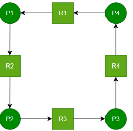
            - P1 holds R1, waiting for R2 (held by P2).  
            - P2 holds R2, waiting for R3 (held by P3).  
            - P3 holds R3, waiting for R4 (held by P4).  
            - P4 holds R4, waiting for R1 (held by P1).  
            - Forms a circular dependency → deadlock. 

    -   Handling Deadlocks in Operating Systems
        Deadlock handling methods are strategies used to ensure processes do not remain permanently blocked, maintaining smooth execution and system reliability.

        -   Four Approaches to Deadlock Handling

        1. Deadlock Prevention
        - Idea: Ensure at least one of the four necessary conditions (Mutual Exclusion, Hold & Wait, No Preemption, Circular Wait) never occurs.  
        - Examples:
            - Avoid Hold & Wait → require processes to request all resources at once.  
            - Allow Preemption → forcibly take resources if needed.  
            - Impose ordering of resources → prevent circular wait.  
        - Pros: Guarantees no deadlock.  
        - Cons: May lead to low resource utilization and reduced concurrency.

        2. Deadlock Avoidance
        - Idea: Make dynamic decisions to ensure the system never enters an unsafe state.  
        - Algorithms:
            - Banker’s Algorithm → works with multiple instances of resources; simulates allocation before granting.  
            - Resource Allocation Graph (RAG) → works with single-instance resources; checks for cycles.  
        - Pros: More flexible than prevention; allows higher concurrency.  
        - Cons: Requires advance knowledge of resource needs; overhead in checking safe states.

        ---

        3. Deadlock Detection & Recovery
        - Detection: Periodically check for circular waits (e.g., using wait-for graphs).  
        - Recovery Methods:
            - Process Termination → abort one or more processes to break the cycle.  
            - Resource Preemption → temporarily take resources from some processes and reallocate.  
        - Pros: Allows maximum resource utilization (no restrictions upfront).  
        - Cons: Recovery can be costly (lost work, inconsistent states).

        4. Deadlock Ignorance (Ostrich Algorithm)
        - Idea: Assume deadlocks are rare → ignore them.  
        - If deadlock occurs → reboot or restart affected processes.  
        - Pros: Simple, minimal overhead.  
        - Cons: Not suitable for critical systems; risk of data loss.  
        - Common in general-purpose OS (e.g., UNIX, Windows) where deadlocks are rare.

-   Deadlock Prevention

    -   Definition
        -   Deadlock prevention is a strategy used in operating systems to ensure processes do not get permanently stuck waiting for resources.  
        -   Think of it like a traffic system: cars (processes) must move through intersections (resources) without gridlock.

    -   Four Necessary Conditions for Deadlock
        Deadlock occurs only if all four conditions hold simultaneously:
        1. Mutual Exclusion → Resources are non-sharable.  
        2. Hold and Wait → A process holds one resource while waiting for another.  
        3. No Preemption → Resources cannot be forcibly taken away.  
        4. Circular Wait → Processes form a cycle, each waiting for the next.

        👉 Deadlock prevention works by eliminating at least one of these conditions.

    -   Methods of Deadlock Prevention

        1. Eliminate Mutual Exclusion
            - Allow resources to be sharable (e.g., read-only files).  
            - Not possible for inherently non-sharable resources (e.g., printers).  
            - We can use Spooling which is a job queue where process requested is inserted into a queue but that queue can also becomes Full. So spooling can reduce this but not completely Elimenate it.

        2. Eliminate Hold and Wait
            - Option A (Eliminate Wait):  
                - Processes must request all resources in advance.  
                - Example: Process1 requests Resource1 and Resource2 together.  
            - Option B (Eliminate Hold):  
                - Processes must release all held resources before requesting new ones.  
                - Example: Process1 releases Resource2 and Resource3 before requesting Resource1.  

        3. Eliminate No Preemption
            - Allow preemption of resources:  
                - If a process requests unavailable resources, it must release all currently held ones.  
                - Resources can be reallocated to other processes.  
            - Ensures no process can indefinitely block others.  

        4. Eliminate Circular Wait
            - Impose a strict ordering of resources.  
            - Assign each resource a unique number.  
            - Processes can only request resources in increasing order.  
            - Prevents cycles since no process can “go backwards.”  

    ✅ Advantages
    - Guarantees no deadlock.  
    - Provides a systematic way to manage resources.  

    ❌ Disadvantages
    - May lead to low resource utilization.  
    - Reduces concurrency (e.g., requiring all resources upfront).  
    - Can be impractical for non-sharable resources.  

-   Deadlock Avoidance — Banker’s Algorithm

    🔹 Definition
        - Banker’s Algorithm is a resource allocation and deadlock avoidance algorithm.  
        - Ensures the system remains in a safe state by simulating allocations before granting them.  
        - Named after the way a banker lends money: only if they can be sure all loans can eventually be repaid.

    🔹 Key Concepts
    - Safe State: There exists at least one sequence of processes such that each can finish execution without deadlock.  
    - Unsafe State: No guarantee that all processes can finish; deadlock may occur.  

    👉 Deadlock avoidance = never allow unsafe states.

    🔹 Data Structures
        Let n = number of processes, m = number of resource types.

        1. Available → 1D array of size *m*.  
        - Available[j] = k → k instances of resource Rj are free.  

        2. Max → 2D array of size *n × m*.  
        - Max[i, j] = k → process Pi may request at most k instances of Rj.  

        3. Allocation → 2D array of size *n × m*.  
        - Allocation[i, j] = k → Pi currently holds k instances of Rj.  

        4. Need → 2D array of size *n × m*.  
        - Need[i, j] = Max[i, j] − Allocation[i, j].  
        - Remaining resources Pi may still request.  

    🔹 Banker’s Algorithm Components

        1. Safety Algorithm
            Checks if the system is in a safe state.

            Steps:
                1. Initialize:  
                    - Work = Available  
                    - Finish[i] = false (none finished yet)  
                2. Find a process Pi such that:  
                    - Finish[i] = false  
                    - Need[i] ≤ Work  
                3. If found:  
                    - Pretend to allocate → Work = Work + Allocation[i]  
                    - Finish[i] = true  
                    - Repeat step 2  
                4. If all Finish[i] = true → system is safe.  

            👉 Simulates process completion to verify safety.

        2. Resource Request Algorithm
            Decides if a process’s request can be granted safely.

            Steps:
                1. Check if Request[i] ≤ Need[i]. If not → error.  
                2. Check if Request[i] ≤ Available. If not → process waits.  
                3. Temporarily allocate:  
                    - Available = Available − Request[i]  
                    - Allocation[i] = Allocation[i] + Request[i]  
                    - Need[i] = Need[i] − Request[i]  
                4. Run Safety Algorithm:  
                    - If safe → grant request.  
                    - If unsafe → rollback and make process wait.  

    📊 Example (Unsafe State) : https://www.geeksforgeeks.org/operating-systems/bankers-algorithm-in-operating-system-2/
    -   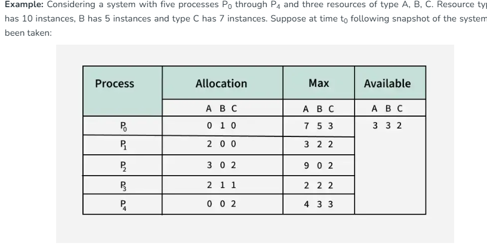
    -   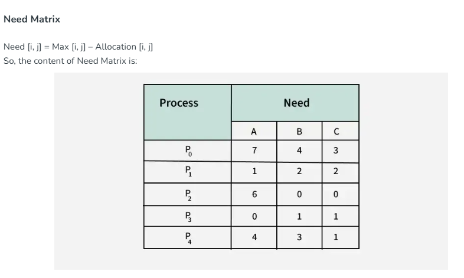
    -   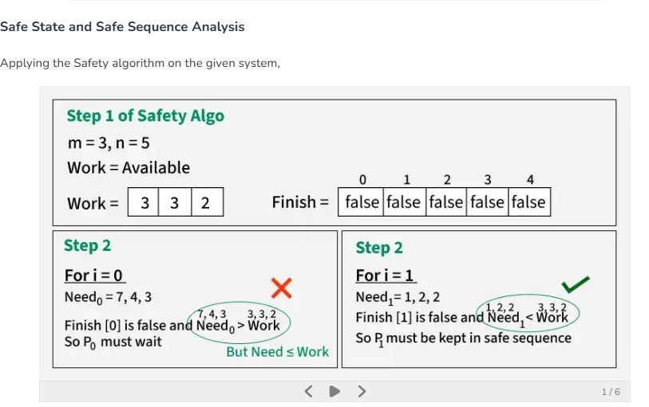
    -   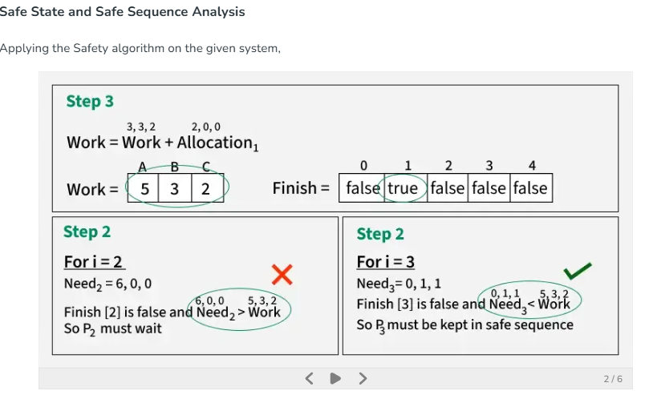
    -   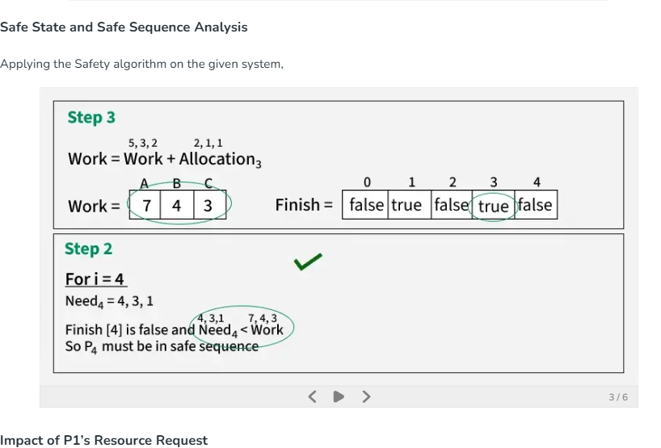
    -   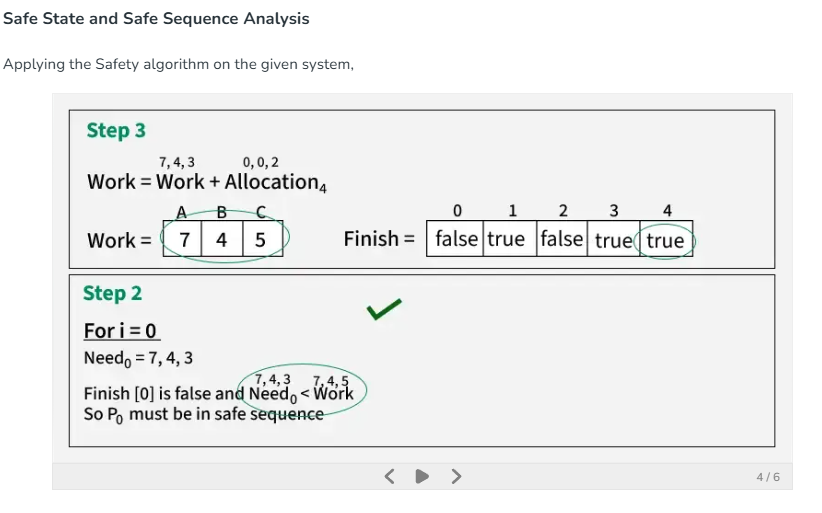
    -   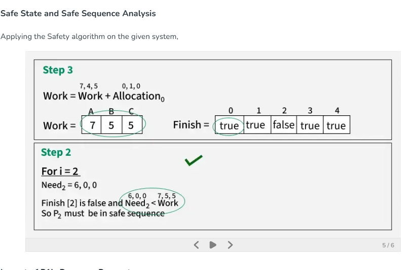
    -   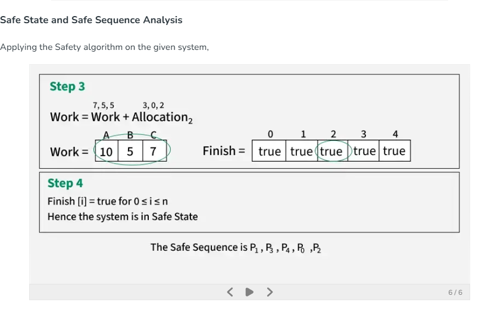
    -   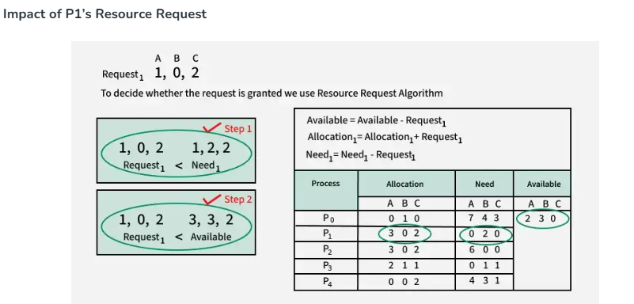

    ✅ Advantages
    - Prevents deadlock by avoiding unsafe states.  
    - Allows higher concurrency than strict prevention.  
    - Flexible resource allocation.  

    ❌ Disadvantages
    - Requires advance knowledge of Max demand.  
    - Computational overhead (simulation for each request).  
    - Complex to implement for large systems. 

-   Deadlock Detection and Recovery
    -   What is Deadlock?
        - A deadlock occurs when two or more processes are permanently blocked, each waiting for resources held by the other.  
        - Analogy: Like cars stuck at a four-way intersection, each blocking the other, none can move.

    -   Deadlock Detection
        Detection involves identifying when processes are stuck waiting for resources.

        1. Single Instance of Resources
        - Use Resource Allocation Graph (RAG).  
        - If a cycle exists → deadlock confirmed.  
        - Example: R1 → P1 → R2 → P2 → R1 (cycle).

        2. Multiple Instances of Resources
        - Cycle detection is necessary but not sufficient.  
        - Algorithms like Banker’s Algorithm can be adapted to periodically check for deadlocks.

        3. Wait-For Graph Algorithm
        - Construct a Wait-For Graph (process-to-process edges).  
        - Detect cycles → indicates deadlock.  
        - Suitable for systems with multiple resource instances.

    -   Deadlock Recovery
        Once detected, the OS must resolve deadlock.

        Methods:
        1. Process Termination
            - Kill all deadlocked processes.  
            - Or kill one at a time until deadlock breaks.  
            - Simple but may cause loss of work.

        2. Process Rollback
            - Roll back processes to a previously saved checkpoint.  
            - Requires checkpointing.  
            - Risk of data loss.

        3. Resource Preemption
            - Temporarily take resources from processes and reallocate.  
            - May cause starvation if repeated.

        4. Concurrency Control
            - Manage access to shared resources to avoid inconsistencies.  
            - Helps prevent deadlocks in concurrent systems.

    -   Prevention vs Detection/Recovery
        - Prevention → avoids deadlocks altogether by breaking one of the four necessary conditions.  
        - Detection/Recovery → allows deadlocks to occur, then detects and resolves them.  

    -   Advantages
        - Improves system stability (avoids indefinite stalls).  
        - Ensures better resource utilization.  
        - Provides insights for better system design.

    -   Disadvantages
        - Performance overhead (regular checks).  
        - Complexity in implementation.  
        - False positives/negatives possible.  
        - Risk of data loss during rollback or termination.

-   Inter-Process Communication (IPC)

    🔹 Definition
    - IPC refers to mechanisms that allow processes to communicate and share data.  
    - Enables concurrent execution of programs in an operating system.  
    - Essential for data consistency, coordination, and resource sharing.

    -   Fundamental Models of IPC
        1. Shared Memory
            - Multiple processes access a common memory region.  
            - Processes read/write directly to this memory.  
            - Fast communication, but requires synchronization (e.g., semaphores).  
            - Analogy: Like global variables, but shared across processes.  

        2. Message Passing
            - Processes exchange data via messages.  
            - One process sends, another receives.  
            - Useful in distributed systems.  
            - Implemented via pipes, sockets, message queues.  

    -   IPC Methods
        -   Pipes: Unidirectional channel between related processes. 
            -   Types: Anonymous & Named.
            -   Parent-child communication
        -   Sockets: Endpoints for communication across networks. 
            -   Supports TCP (reliable) & UDP (fast).
            -   Distributed systems
        -   Shared Memory: Common memory space accessible by multiple processes. 
            -   Fastest IPC method.
            -   High-speed local communication
        -   Semaphores: Synchronization tool to control access to shared resources. 
            -   Prevents corruption.
            -   Critical section handling
        -   Message Queues: Kernel-managed queues for passing structured messages.
            -   Asynchronous communication
        -   RPC (Remote Procedure Call): Allows calling procedures on remote machines as if local.
            -   Distributed computing
        -   RMI (Remote Method Invocation): Java-based, enables invoking methods on remote objects.
            -   Java distributed apps

    -   IPC Across Systems
        - Remote Procedure Calls (RPC) → Abstracts communication, makes distributed systems easier.  
        - Remote Method Invocation (RMI) → Java-specific, allows remote object method calls.  

    ✅ Advantages
    - Enables process cooperation.  
    - Supports distributed systems.  
    - Provides flexibility (different methods for different needs).  

    ❌ Disadvantages
    - Complexity in implementation.  
    - Overhead in synchronization and communication.  
    - Choice of method depends on application requirements (speed, locality, distribution).  

    🎯 Interview Tip
    - Always start with two fundamental models: Shared Memory & Message Passing.  
    - Be ready to explain examples:  
        - Shared Memory → fastest, but needs synchronization.  
        - Message Passing → safer, easier for distributed systems.  
    - Mention RPC vs RMI for cross-system communication.  
    - Compare local IPC (pipes, shared memory) vs distributed IPC (sockets, RPC, RMI).  

-   IPC through Shared Memory

    -   Definition
        - Inter-Process Communication (IPC) allows processes to exchange data and synchronize actions.  
        - Shared Memory IPC → multiple processes access a common memory segment.  
        - Changes made by one process are immediately visible to others.  
        - One of the fastest IPC mechanisms, especially for performance-critical applications.

    -   Why Shared Memory? 
        - Other IPC methods (pipes, FIFO, message queues) require multiple copies of data via the kernel.  
        - Example: Data copied 4 times (server → kernel buffer → client buffer → output).  
        - Shared Memory reduces this to 2 copies (input → shared memory → output).  
        - Hence, low overhead and high speed.

    -   How Shared Memory IPC Works 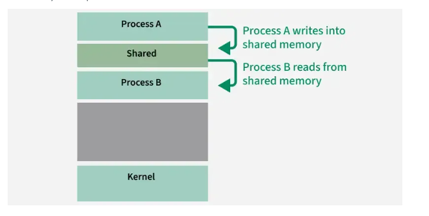
        1. Creation of Shared Memory Segment  
            - Parent process creates a segment using `shmget()`.  
            - Returns a unique identifier (`shmid`).  

        2. Attaching to Shared Memory  
            - Processes attach using `shmat()`.  
            - Once attached, they can directly read/write.  

        3. Synchronization  
            - Multiple processes can access simultaneously.  
            - Use semaphores/mutexes to prevent race conditions.  

        4. Detaching and Deleting  
            - Detach using `shmdt()`.  
            - Remove segment using `shmctl()` when no longer needed.  

    -   System Calls Used
    | Function | Signature | Description |
    |----------|-----------|-------------|
    | `ftok()` | `key_t ftok()` | Generates a unique key. |
    | `shmget()` | `int shmget(key_t key, size_t size, int shmflg)` | Creates shared memory segment, returns ID. |
    | `shmat()` | `void *shmat(int shmid, void *shmaddr, int shmflg)` | Attaches process to shared memory. |
    | `shmdt()` | `int shmdt(void *shmaddr)` | Detaches process from shared memory. |
    | `shmctl()` | `shmctl(int shmid, IPC_RMID, NULL)` | Removes shared memory segment. |

    ✅ Advantages
    - Speed → direct read/write, faster than message passing.  
    - Low Overhead → fewer copies of data.  
    - Flexibility → supports complex data structures (arrays, linked lists, matrices).  
    - Large Data Transfers → efficient for bulk communication.  

    ❌ Disadvantages
    - Complex Synchronization → requires semaphores/mutexes.  
    - Security Risks → unauthorized processes may access/modify data.  
    - Manual Cleanup → must detach and delete segments properly.  
    - Portability Issues → platform-dependent implementation.  

    -   Example — Producer & Consumer (Bounded Buffer Problem)
        - Producer → generates items, stores in shared buffer.  
        - Consumer → retrieves items from buffer.  
        - Bounded Buffer → buffer has limited size.  
            - If full → Producer waits.  
            - If empty → Consumer waits.  

        Pseudo-code (simplified):
        ```c
        // Shared buffer with size N
        buffer[N];
        in = 0; out = 0;

        // Producer
        while (true) {
            wait(empty);        // check if buffer has space
            wait(mutex);        // enter critical section
            buffer[in] = item;  // produce item
            in = (in + 1) % N;
            signal(mutex);      // exit critical section
            signal(full);       // notify consumer
        }

        // Consumer
        while (true) {
            wait(full);         // check if buffer has items
            wait(mutex);        // enter critical section
            item = buffer[out]; // consume item
            out = (out + 1) % N;
            signal(mutex);      // exit critical section
            signal(empty);      // notify producer
        }
        ```

-   IPC Using Message Queues

    -   Definition
        - Inter-Process Communication (IPC) allows processes to exchange data, control information, or synchronize tasks.  
        - Message Queues are one of the most common IPC mechanisms.  
        - They allow processes to send and receive messages in a queue-like manner, typically managed by the kernel.

    -   What is a Message Queue?
        - A linked list of messages stored in the kernel.  
        - Identified by a message queue identifier.  
        - Supports FIFO (First-In-First-Out) communication, but messages can also be retrieved by type field.  
        - Each message contains:  
            - Type field (positive long integer)  
            - Length (non-negative integer)  
            - Data bytes (actual message content)  

    -   Working of Message Queues 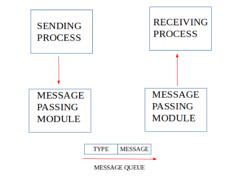
        1. Creating/Accessing a Queue  
            - Use `msgget()` to create a new queue or access an existing one.  

        2. Sending a Message  
            - Use `msgsnd()` to add a message to the queue.  
            - Message includes type and content.  

        3. Receiving a Message  
            - Use `msgrcv()` to retrieve a message.  
            - Can specify type to selectively read messages.  
            - Message is removed once read.  

        4. Deleting a Queue  
            - Use `msgctl()` to remove the queue when no longer needed.  

    -   Example Programs

        Writer (Sender)
        ```c
        include <stdio.h>
        include <sys/ipc.h>
        include <sys/msg.h>
        define MAX 10

        struct mesg_buffer {
            long mesg_type;
            char mesg_text[100];
        } message;

        int main() {
            key_t key;
            int msgid;

            key = ftok("progfile", 65); // generate unique key
            msgid = msgget(key, 0666 | IPC_CREAT); // create queue
            message.mesg_type = 1;

            printf("Write Data : ");
            fgets(message.mesg_text, MAX, stdin);

            msgsnd(msgid, &message, sizeof(message), 0); // send message
            printf("Data sent is : %s\n", message.mesg_text);

            return 0;
        }
        ```

        Reader (Receiver)
        ```c
        include <stdio.h>
        include <sys/ipc.h>
        include <sys/msg.h>

        struct mesg_buffer {
            long mesg_type;
            char mesg_text[100];
        } message;

        int main() {
            key_t key;
            int msgid;

            key = ftok("progfile", 65); // generate unique key
            msgid = msgget(key, 0666 | IPC_CREAT); // access queue

            msgrcv(msgid, &message, sizeof(message), 1, 0); // receive message
            printf("Data Received is : %s\n", message.mesg_text);

            msgctl(msgid, IPC_RMID, NULL); // delete queue
            return 0;
        }
        ```

    -   Functions of Message Queues
        - Message Storage → stores messages until retrieved.  
        - Ordered Communication → ensures delivery order.  
        - Asynchronous Communication → sender and receiver need not be synchronized.  
        - Decoupling of Processes → sender and receiver don’t need to know each other.  
        - Prioritization → messages can be processed based on type/priority.  
        - Error Handling → supports retries, logging of undelivered messages.  

    -   System Calls
        | Function   | Description |
        |------------|-------------|
        | `ftok()`   | Generates a unique key. |
        | `msgget()` | Creates or accesses a message queue. |
        | `msgsnd()` | Sends a message to the queue. |
        | `msgrcv()` | Receives a message from the queue. |
        | `msgctl()` | Performs control operations (e.g., delete queue). |

    ✅ Advantages
    - Simple and robust IPC mechanism.  
    - Supports asynchronous communication.  
    - Decouples processes → improves modularity.  
    - Can handle prioritization and error recovery.  

    ❌ Disadvantages
    - Kernel overhead → messages stored in kernel space.  
    - Limited message size.  
    - Requires explicit cleanup (`msgctl`).  
    - Less efficient than shared memory for large data transfers.  

-   Procedure Call (RPC) in Operating Systems

    🔹 Definition
    - RPC allows a program to execute a function on another computer in a network as if it were local.  
    - The client sends a request with arguments → server executes the function → result is returned.  
    - RPC hides networking details, so developers can think in terms of normal function calls.

    🔹 How RPC Works (Step by Step)
    1. Client Calls Stub → Client calls a local procedure (stub).  
    2. Marshalling → Stub packs parameters into a message.  
    3. Send to Server → Message sent across the network.  
    4. Server Stub → Unpacks message and calls actual server procedure.  
    5. Execution & Return → Server executes and returns result.  
    6. Back to Client → Server stub sends result back, client stub unpacks it.  

    👉 Execution flow alternates between caller and callee, like a query-response model.

    🔹 Types of RPC
    - Callback RPC → Both client and server can act as each other (peer-to-peer, interactive apps).  
    - Broadcast RPC → Client request broadcast to all servers (useful when multiple servers can handle).  
    - Batch-mode RPC → Groups multiple requests, sends together (reduces network overhead).  

    🔹 Key Components
    1. RPC Runtime → Library managing communication (binding, protocols, errors).  
    2. Stub → Helper code hiding complexity.  
        - Client stub → converts calls into messages (marshalling/unmarshalling).  
        - Server stub → provides interface to execute server procedures.  
    3. Binding → Connects client and server.  
        - Naming → Server exports interface.  
        - Locating → Client imports interface before communication.  

    🔹 Call Semantics
    - Retry Request Message → Decide whether to retry if server fails.  
    - Duplicate Filtering → Remove duplicate requests.  
    - Retransmission of Results → Resend lost results without re-executing.  

    ✅ Advantages
    - Easy Communication → Normal procedure calls in high-level languages.  
    - Hidden Complexity → Networking details abstracted.  
    - Flexibility → Works in local and distributed environments.  

    ❌ Disadvantages
    - Limited Parameter Passing → Only by value, no pointers.  
    - Slower Than Local Calls → Network overhead.  
    - Vulnerable to Failures → Depends on network and remote systems.  

    🔹 RPC vs REST
    - RPC → Procedure-oriented, hides networking, good for structured client-server calls.  
    - REST → Resource-oriented, uses HTTP verbs (GET, POST, PUT, DELETE).  
    - Modern RPC → gRPC, DRPC (efficient, widely used).  
    - Choice depends on application requirements (structured calls vs resource-based APIs).  

    🎯 Interview Tip
    - Always explain stub + marshalling/unmarshalling.  
    - Be ready to contrast RPC vs REST.  
    - Mention modern RPC frameworks (gRPC).  
    - Example question: *“How does RPC hide network complexity?”* → Answer: *By using stubs and runtime libraries.*  

-   Process Synchronization in Operating Systems

    -   Definition
        - Process Synchronization is a mechanism used to manage the execution of multiple processes that access shared resources.  
        - Its goals are to:  
            - Ensure data consistency  
            - Prevent race conditions  
            - Avoid deadlocks  

    -   Types of Processes (based on synchronization)
        1. Independent Process  
            - Execution of one process does not affect others.  
        2. Cooperative Process  
            - Execution of one process can affect or be affected by others.  
            - Requires synchronization to avoid conflicts.  

    -   Problems Due to Improper Synchronization
        - Inconsistency → Shared data becomes unreliable when multiple processes update simultaneously.  
        - Loss of Data → One process overwrites another’s update, leading to corruption.  
        - Deadlock → Processes get stuck waiting for each other’s resources.  

    -   Role of Synchronization in IPC (Inter-Process Communication)
        - Prevent Race Conditions → Ensures consistent results.  
        - Mutual Exclusion → Only one process in the critical section at a time.  
        - Process Coordination → Enables producer-consumer relationships.  
        - Deadlock Prevention → Avoids circular waits and indefinite blocking.  
        - Safe Communication → Ensures ordered message passing.  
        - Fairness → Prevents starvation by giving equal resource access.  

    -   Types of Synchronization
        1. Competitive Synchronization  
            - Processes compete for shared resources.  
            - Improper handling → inconsistency or data loss.  

        2. Cooperative Synchronization  
            - Processes depend on each other’s execution.  
            - Improper handling → deadlock.  

        Example (Linux pipeline):  
        ```bash
        ps | grep "chrome" | wc
        ```
        - `ps` → lists processes  
        - `grep` → filters output  
        - `wc` → counts words  
        👉 Cooperative synchronization: processes produce and consume data sequentially.

    -   Conditions That Require Synchronization
        1. Critical Section  
            - Code segment accessing shared variables.  
            - Must allow only one process at a time.  

        2. Race Condition  
            - Output depends on execution order of processes in the critical section.  

        3. Preemption  
            - OS interrupts a process before it finishes using a shared resource.  
            - Without synchronization → inconsistent values may be read.  

-   Critical Section in Synchronization

    🔹 Definition
    - A critical section is a part of a program where shared resources (memory, files, variables, databases) are accessed.  
    - To avoid race conditions and data inconsistency, only one process/thread should execute the critical section at a time.  
    - Synchronization techniques (mutex, semaphore, monitors) ensure safe and predictable execution.

    🔹 Structure of a Critical Section
    1. Entry Section  
        - Process requests permission to enter.  
        - Synchronization tools (mutex, semaphore) control access.  

    2. Critical Section  
        - Actual code accessing/modifying shared resources.  

    3. Exit Section  
        - Process releases lock/semaphore → allows others to enter.  

    4. Remainder Section  
        - Rest of the program not involving shared resources.  

    🔹 Critical Section Problem
    - Occurs when multiple processes access shared resources simultaneously.  
    - Leads to race conditions → final result depends on execution order.  

    Example:  
    Two bank transactions updating the same account balance at the same time → incorrect final balance.

    Pseudo-code:
    ```c
    do {
        flag = 1;
        while(flag);   // entry section
            // critical section
        if (!flag)
            // remainder section
    } while(true);
    ```

    🔹 Requirements of a Solution
    A good solution must ensure:

    1. Mutual Exclusion  
    - Only one process in the critical section at a time.  

    2. Progress  
    - If no process is inside, waiting processes must eventually get access.  
    - Choice of next process should not be postponed indefinitely.  

    3. Bounded Waiting  
    - Limit on how long a process waits before entering.  
    - Prevents starvation.  

    🔹 Solution Approach
    - Use locks (mutex, semaphores, monitors).  
    - Pseudo-code:
    ```c
    acquireLock();
    // critical section
    releaseLock();
    ```
    - Only one thread acquires lock → ensures mutual exclusion.  

    📊 Real-World Examples
    1. Banking System (ATM/Online Banking)  
    - Critical Section: Updating account balance.  
    - Issue: Two withdrawals at once → incorrect balance.  

    2. Ticket Booking System (Airlines/Movies/Trains)  
    - Critical Section: Reserving last available seat.  
    - Issue: Overbooking if two users book simultaneously.  

    3. Print Spooler in Networked Printer  
    - Critical Section: Sending jobs to printer queue.  
    - Issue: Jobs may mix or skip without synchronization.  

    4. Shared Document Editing (Google Docs/MS Word)  
    - Critical Section: Saving/writing shared document.  
    - Issue: Conflicting edits → data loss or version conflicts.  

-   Solutions to Process Synchronization Problems

    🔹 Background
    - In multiprogramming environments, multiple processes compete for shared resources (CPU, memory, files).  
    - Without synchronization → race conditions, inconsistent results, deadlocks.  
    - Over time, solutions evolved from hardware-level tricks to OS-level abstractions.

    🔹 Major Approaches
    1. Interrupt Disable  
    2. Locks (Software & Hardware)  
    3. OS-based Solutions (Mutex, Semaphores, Monitors)  

    1. Interrupt Disable
    - Process disables all hardware interrupts before entering critical section.  
    - Prevents preemption → ensures uninterrupted execution.  

    Problems:
    - Works only in uniprocessor systems.  
    - Dangerous: forgetting to re-enable interrupts → system hang.  
    - Gives too much power to user processes → misuse possible.  
    👉 Rarely used in practice.

    2. Locks
    Locks ensure only one process enters the critical section at a time.

    (a) Software-Based Locks
    - Implemented using shared variables (flags, turn variables, ticket numbers).  
    - Algorithms:  
        - Peterson’s Algorithm → elegant, but only for 2 processes.  
        - Dekker’s Algorithm → early solution, also for 2 processes.  
        - Bakery Algorithm → supports multiple processes (take-a-number system).  

    Problems:
    - Require busy waiting → wastes CPU cycles.  
    - Complex for many processes.  
    - Not suitable for modern multiprocessors.  

    (b) Hardware-Based Locks
    - Modern CPUs provide atomic instructions for lock implementation.  
    - Atomic = indivisible operation → prevents race conditions.  

    Examples:
    - Test-and-Set (TSL) → tests old value & sets lock in one step.  
    - Compare-and-Swap (CAS) → compares memory value, swaps atomically if equal.  
    - Spinlocks → processes busy-wait until lock is free.  

    Limitations:
    - Still involve busy waiting.  
    - No fairness guarantee → starvation possible.  
    - Only solve mutual exclusion, not higher-level coordination.

    2.1 Mutex (Mutual Exclusion Lock)
    - Built on hardware primitives (like spinlocks).  
    - Unlike raw locks, mutex blocks processes instead of busy waiting.  
    - Provides fair scheduling.  
    - Widely used in thread libraries (e.g., Pthreads) and OS kernels.

    3. OS-Based Solutions

    (a) Semaphores
    - Integer variable with two atomic operations:  
    - wait() → decrement, block if < 0.  
    - signal() → increment, wake one waiting process.  
    - Removes busy waiting → blocked processes sleep until resources available.  
    - Useful for producer-consumer problems.

    (b) Monitors
    - High-level construct combining mutual exclusion + condition variables.  
    - Only one process executes in a monitor at a time.  
    - Condition variables (wait, signal) simplify coordination.  
    - Safer and easier to use than raw locks/semaphores.  

    ✅ Advantages of Advanced Solutions
    - Avoid busy waiting → better CPU utilization.  
    - Provide fairness → prevent starvation.  
    - Easier to implement complex synchronization (producer-consumer, readers-writers).  

    ❌ Limitations
    - More complex to implement.  
    - Require OS/kernel support.  
    - Synchronization overhead may affect performance in lightweight tasks.  

-   Peterson’s Algorithm

    🔹 Definition
    - A software-based synchronization algorithm for two processes.  
    - Ensures mutual exclusion, progress, and bounded waiting without hardware support.  
    - Uses two shared variables:  
        1. `flag[i]` → indicates if process *i* wants to enter the critical section.  
        2. `turn` → indicates whose turn it is to enter the critical section.

    🔹 Working
    1. Entry Section  
    - Each process sets its `flag[i] = true` (wants to enter).  
    - Sets `turn = j` (gives priority to the other process).  
    - Waits until either the other process is not interested (`flag[j] = false`) or it’s its own turn.  

    2. Critical Section  
    - Process executes safely on shared resources.  

    3. Exit Section  
    - Sets `flag[i] = false` (done with critical section).  

    4. Remainder Section  
    - Executes rest of the program.  

    🔹 Pseudo-code (for Process i)
    ```c
    do {
        flag[i] = true;          // wants to enter
        turn = j;                // give chance to other
        while (flag[j] && turn == j); // wait if other wants to enter

        // ---- Critical Section ----

        flag[i] = false;         // exit section

        // ---- Remainder Section ----
    } while(true);
    ```

    🔹 Properties
    - Mutual Exclusion → Only one process enters at a time.  
    - Progress → If one process wants to enter, it eventually gets access.  
    - Bounded Waiting → Each process waits for a finite time.  

    ✅ Advantages
    - Simple, elegant solution for two processes.  
    - Does not require hardware support (purely software-based).  
    - Satisfies all three requirements of critical section problem.  

    ❌ Disadvantages
    - Works only for two processes.  
    - Requires busy waiting (CPU cycles wasted).  
    - Not practical for modern multiprocessor systems.  

    📊 Example Use Case
    - Two processes updating a shared variable (e.g., bank balance).  
    - Peterson’s Algorithm ensures only one process updates at a time → prevents race condition.  

-   Semaphores in Process Synchronization

    🔹 Definition
    - A semaphore is an integer variable used to control access to shared resources in concurrent systems.  
    - It ensures that only the allowed number of processes can use a resource at a given time.  
    - Widely used in multiprogramming systems for synchronization and mutual exclusion.

    🔹 Operations
    1. Wait (P / down)  
    - Decrements the semaphore value.  
    - If value < 0 → process is blocked until resource becomes available.  

    2. Signal (V / up)  
    - Increments the semaphore value.  
    - If there are waiting processes → one is unblocked.  

    Workflow:  
    ```c
    wait(S);   // request resource
    // critical section
    signal(S); // release resource
    ```

    🔹 Features of Semaphores
    - Mutual Exclusion → Only one process in critical section at a time.  
    - Process Synchronization → Coordinates execution order.  
    - Resource Management → Controls access to finite resources (e.g., printers).  
    - Reader-Writer Problem → Allows multiple readers but restricts writers.  
    - Deadlock Avoidance → Controls resource allocation order.  

    🔹 Types of Semaphores

    1. Counting Semaphore
        - Value ranges from 0 → N (number of resource instances).  
        - Useful when multiple identical resources exist.  
        - Example: Managing access to 5 printers.  

        Pseudocode:
        ```c
        struct semaphore {
            int count;      // available resources
            queue q;        // waiting processes
        };

        wait(semaphore s) {
            s.count--;
            if (s.count < 0) {
                q.push(p);
                block();
            }
        }

        signal(semaphore s) {
            s.count++;
            if (s.count <= 0) {
                Process p = q.pop();
                wakeup(p);
            }
        }
        ```

    2. Binary Semaphore (Mutex)
        - Value = 0 or 1 → acts like a lock.  
        - Ensures only one process enters critical section.  
        - Example: Managing access to a single file.  

        Pseudocode:
        ```c
        struct semaphore {
            int value; // 0 or 1
            queue q;
        };

        wait(semaphore s) {
            if (s.value == 1) {
                s.value = 0; // acquire lock
            } else {
                q.push(p);
                sleep();
            }
        }

        signal(semaphore s) {
            if (q.empty()) {
                s.value = 1; // release lock
            } else {
                Process p = q.front();
                q.pop();
                wakeup(p);
            }
        }
        ```

    🔹 Example (Two Processes P1 & P2, S initialized to 1)
    - State 1: S = 1, both in non-critical section.  
    - State 2: P1 executes `wait(S)` → S = 0, enters critical section.  
    - State 3: P2 tries `wait(S)` → blocked since S = 0.  
    - State 4: P1 executes `signal(S)` → S = 1, P2 enters.  

    👉 Guarantees mutual exclusion.


    🔹 Limitations of Semaphores
    - Priority Inversion → Low-priority process blocks high-priority one.  
    - Deadlock → Improper use may cause cyclic waiting.  
    - Complexity → Misuse of `wait()`/`signal()` leads to errors.  
    - Busy Waiting → In basic implementations, processes waste CPU cycles checking semaphore value.  

-   Monitors in Process Synchronization

    🔹 Definition
    - A monitor is a high-level synchronization construct that simplifies process/thread synchronization.  
    - Built on top of locks, monitors ensure automatic mutual exclusion.  
    - Unlike semaphores (where programmers explicitly call `wait()` and `signal()`), monitors encapsulate shared data + operations in one structure, making synchronization safer and easier.

    🔹 Key Points
    - A monitor is similar to a class/module grouping shared variables and functions.  
    - Only one thread can execute inside a monitor at a time → automatic mutual exclusion.  
    - In Java, monitors are implemented using `synchronized` methods/blocks (no explicit `monitor` keyword).  
    - Encapsulation: Shared data + operations are bundled together.  
    - Condition variables (`wait()`, `notify()`, `notifyAll()`) provide process coordination.  

    🔹 How Monitors are Implemented
    - Implemented at the programming language level, not directly by the OS.  
    - In Java:  
        - `synchronized` keyword ensures only one thread executes inside the monitor.  
        - Condition variables manage waiting/signaling.  
    - Encapsulation ensures automatic mutual exclusion without explicit semaphore calls.  

    🔹 Condition Variables in Monitors
    - Used inside monitors to control waiting/signaling.  
    - Operations:  
        - `wait()` → releases monitor lock, puts thread to sleep until signaled.  
        - `signal()` → wakes up one waiting thread.  
        - `broadcast()` (in some languages) → wakes up all waiting threads.  

    🔹 Pseudocode Example
    ```java
    class AccountUpdate {
        private int bal;
        condition sufficientFunds;   // condition variable

        void synchronized deposit(int n) {
            bal = bal + n;
            // signal waiting threads that funds are available
        }

        void synchronized withdraw(int n) {
            if (bal < n)
                wait(sufficientFunds);   // wait until funds available
            else
                bal = bal - n;
        }
    }
    ```

    🔹 Java Example (Bank Account Monitor)
    ```java
    class AccountUpdate {
        private int bal;

        void synchronized deposit(int n) {
            bal = bal + n;   // mutual exclusion guaranteed
        }

        void synchronized withdraw(int n) {
            bal = bal - n;   // mutual exclusion guaranteed
        }
    }
    ```

    Explanation:
    - `bal` → shared resource (account balance).  
    - `synchronized` → ensures only one thread executes deposit/withdraw at a time.  
    - Prevents race conditions in concurrent deposits/withdrawals.  

    🔹 Limitations of Monitors
    - Language Dependency → must be built into language/compiler.  
    - Compiler Burden → compiler generates extra code for monitor functionality.  
    - OS Dependency → compiler must interact with OS facilities for critical section handling.  
    - Limited Language Support → supported in Java, C, Ada, Concurrent Euclid, etc.  
    - Reduced Flexibility → tightly coupled with language/compiler → limited portability.  

-   Priority Inversion in Operating Systems

    🔹 Definition
    - Priority Inversion is a scheduling problem where a low-priority task holds a resource needed by a high-priority task, forcing the high-priority task to wait.  
    - Meanwhile, a medium-priority task (not needing the resource) can preempt the low-priority task, delaying the release of the resource further.  
    - Result → The priority order is inverted: medium-priority runs before high-priority, even though high-priority should have precedence.

    🔹 Causes of Priority Inversion
    1. Low-priority task (L) acquires a shared resource.  
    2. High-priority task (H) requests the resource → blocked until L releases it.  
    3. Medium-priority task (M) becomes runnable → preempts L.  
    4. H remains blocked until L eventually resumes and releases the resource.  

    👉 This leads to delays for H, sometimes predictable (bounded) or indefinite (unbounded).

    🔹 Types of Priority Inversion

    1. Bounded Priority Inversion
    - Delay is predictable and limited.  
    - High-priority task (H) waits only for:  
        - Low-priority task (L) to finish its critical section.  
        - Medium-priority task (M) to complete execution.  
    - Example Sequence:  
        - L acquires mutex → enters critical section.  
        - H arrives → blocked.  
        - M preempts L → runs to completion.  
        - L resumes → releases mutex.  
        - H acquires mutex → executes.  
    - Outcome: Delay = L’s critical section time + M’s execution time.

    2. Unbounded Priority Inversion
    - Delay is unpredictable and potentially indefinite.  
    - Happens when medium-priority tasks (M) keep preempting L while L holds the lock.  
    - Since L cannot finish, H remains blocked indefinitely.  
    - Outcome: High-priority task (H) may starve, causing system failure or watchdog timer triggers.  

    🔹 Solutions to Priority Inversion

    1. Priority Inheritance  
    - Temporarily elevates the priority of the low-priority task (L) holding the resource → matches the highest-priority waiting task (H).  
    - Ensures L finishes quickly and releases the resource.  

    2. Priority Ceiling Protocol  
    - Each resource is assigned a maximum priority ceiling.  
    - Prevents lower-priority tasks from acquiring resources needed by higher-priority tasks.  

    3. Avoiding Blocking  
    - Use non-blocking algorithms (e.g., lock-free data structures).  
    - Minimize shared resource usage → reduces chances of inversion.  

    📊 Real-World Example
    - Mars Pathfinder (NASA, 1997) → experienced system resets due to priority inversion.  
    - Solution: Implemented priority inheritance to fix the issue.  

