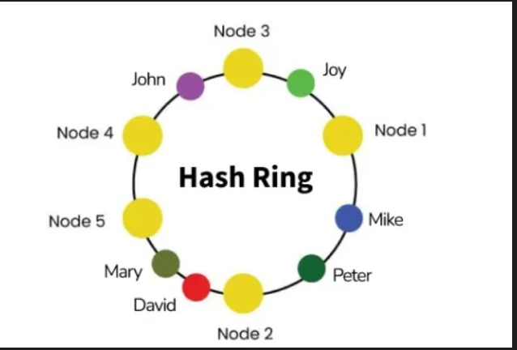
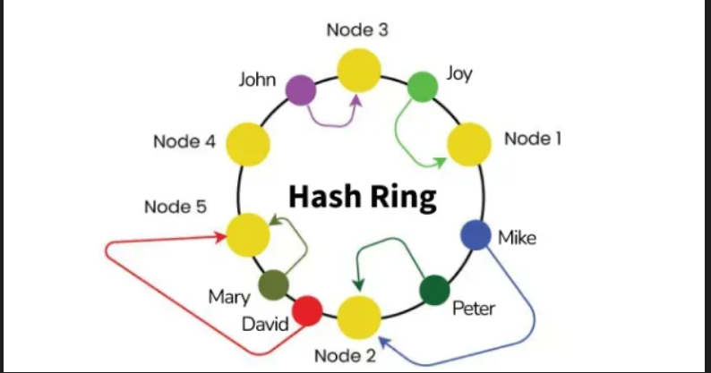

-   Load Balancer
    -   What is Load Balancing?
        Load Balancing is the process of distributing incoming traffic or workloads across multiple backend servers so that:
        - No single server becomes overloaded  
        - System performance remains fast  
        - Failure of one server does not take down the system  
        - Horizontal scaling becomes possible  

    Architecture: Client → Load Balancer → Server Pool (S1, S2, S3...)

    -   Why Load Balancing Is Needed
        - High Availability → Routes traffic to healthy servers if one crashes.  
        - Scalability → Add more servers behind LB to handle more traffic.  
        - Performance Optimization → Even distribution lowers latency.  
        - Fault Isolation → Prevents a slow server from affecting the entire system.  
        - Zero-Downtime Deployments → Servers can be removed during deploys without downtime.  
    
    -   Additional benefits include:
        -   SSL termination
            -   Decrypt incoming requests and encrypt server responses so backend servers do not have to perform these potentially expensive operations
            -   Removes the need to install X.509 certificates on each server
        -   Session persistence
            -   Issue cookies and route a specific client's requests to same instance if the web apps do not keep track of sessions

    -   Types of Load Balancers
        1. Hardware Load Balancers  
        - Expensive physical devices (e.g., F5, Citrix ADC).  
        - High performance.  
        - Used in banks, telecom, government sectors.  

        2. Software Load Balancers  
        - Installed on general hardware.  
        - Examples: Nginx, HAProxy, Envoy, Traefik.  
        - Cheaper and flexible.  

        3. Cloud Load Balancers  
        - Managed services: AWS ALB/NLB, GCP Load Balancer, Azure Load Balancer.  
        - Auto-scaling + global distribution.  

    -   Load Balancer Levels (OSI)
        1. Layer 4 (Transport – TCP/UDP)  
        - Routes based on Source IP, Destination IP, Port.  
        - Faster but less intelligent.  
        - Example: AWS NLB, HAProxy TCP mode.  

        2. Layer 7 (Application – HTTP/HTTPS)  
        - Routes based on URL path, cookie, headers, query params, JWT/user ID, A/B testing rules.  
        - More intelligent but slightly slower.  
        - Example: AWS ALB, Nginx, Envoy.  

    -   Load Balancing Algorithms
        1. Round Robin → Requests distributed sequentially across servers.  
        2. Weighted Round Robin → Stronger servers get more requests.  
        3. Least Connections → New request goes to server with fewest active connections.  
        4. Least Response Time → Routes to fastest responding server.  
        5. IP Hash (Consistent Hashing) → Same client always goes to same server (session affinity).  
        6. Random → Randomly picks a server (effective at scale).  

    -   Health Checks
        Load balancers continuously check server health:
        - Ping check  
        - TCP check  
        - HTTP GET `/health`  
        - Application-level checks (login, DB, cache dependencies)  

        Healthy servers → receive traffic  
        Unhealthy servers → isolated  

    -   Session Affinity (Sticky Sessions)
        Problem: User logs in → next request goes to another server → session missing.  

        Solutions:
        1. Cookie-based stickiness (LB inserts cookie).  
        2. IP Hash (same IP → same server).  
        3. Centralized session storage (Redis, Memcached, Database).  

    -   Load Balancer Architecture
            Internet
                │
        ┌─────────────┐
        │Load Balancer│
        └─────────────┘
        /     |     \
     S1      S2      S3

    -   Deployment Types
        1. Single LB  
            - Clients → LB → Servers  
            - ❌ Single point of failure.  

        2. HA Mode (High Availability)  
            Clients → LB1 (active)
                      LB2 (passive backup)
            - If LB1 fails → LB2 takes over.  
            - Used with VRRP, Keepalived, or cloud LB.  

    -   Load Balancing in Microservices
        1. Client-Side LB → Client picks server (Netflix Ribbon, gRPC round robin).  
        2. Server-Side LB → Classic LB in front of server pool (Nginx, AWS NLB).  
        3. Service Mesh LB → Smart proxies (Envoy sidecars) handle balancing, retries, circuit breaking (Istio, Linkerd).  

    -   Global Load Balancing (GSLB)
        - Used for multi-region deployments.  
        - Distributes traffic between regions (US, EU, Asia).  
        - Techniques: GeoDNS, Anycast routing, CDN routing.  
        - Example: User in India → India DC; User in US → US DC.  

    -   Example – Netflix
        Netflix uses:
        - AWS Elastic Load Balancers  
        - Service discovery + client-side LB  
        - Regional traffic routing  
        - Intelligent fallback mechanisms  

    -   Advantages
        - No single point of failure  
        - Efficient resource usage  
        - Faster response times  
        - Handles traffic spikes  
        - Zero-downtime deployments  
        - Improves reliability & scalability  

    -   Disadvantages
        - More complex architecture  
        - Requires health checks + monitoring  
        - LB itself must be highly available  
        - Session handling issues if not designed properly  

    -   Load Balancing + Consistent Hashing
        - Prevents reshuffling when servers change.  
        - Example:  
            - Add new server → only a few clients remapped.  
            - Remove server → minimal disruptions.  
        - Used in: Nginx, Envoy, Redis Cluster, Cassandra ring. 

-   Consistent Hashing
    Consistent hashing is a technique used in distributed systems to distribute keys/data across many servers while minimizing data movement when servers join or leave.

    -   Where It’s Used
        - Distributed caches (Redis Cluster, Memcached)  
        - Databases (Cassandra, DynamoDB)  
        - Load balancers  
        - Distributed file systems  

    1. Why Do We Need Consistent Hashing?

        ❌ Problem with Normal Hashing
            A common approach: server = hash(key) % N
            Where N = number of servers.  

        - If N changes (server added/removed), almost all keys get remapped.  
        - This causes massive cache misses or data reshuffling.  

        Example:
        - Current: `hash(key) % 3`  
        - Add new server → `hash(key) % 4`  
        - ➡ 75% of keys move to new locations → bad for performance  

    2. How Consistent Hashing Solves This 
        - Servers → mapped to a ring  
        - Keys → mapped to the same ring  
        - Rule: A key always goes to the first server clockwise from its hash position  

           (hash circle)
        0 ----------------- 2^32-1
           |     |      |
         S1     S2     S3

        - When a server joins or leaves → only local movement  
        - Only keys between two adjacent servers are moved, not the whole dataset  

    3. How It Works (Step-by-Step) 

        (a) Create the Hash Ring  
        - Hash space: `0 → 2^32 - 1`  
        - Hash servers: `hash("server1")`, `hash("server2")`, `hash("server3")`  
        - Place them on the circle  

        (b) Hash the Keys  
        - Hash keys (user_id, session_id, cache_key, etc.)  
        - Place them on the same ring  

        (c) Key Assignment Rule  
        - Key belongs to the first server clockwise from its position  
        - Example: Key K → next clockwise server S1  

    4. What Happens When Servers Change?

        ✔ New server joins → gets a position in the ring, only steals keys from the next server clockwise  
        ✔ Server fails → only its keys are reassigned to the next server  

        ➡ Minimal data movement compared to modulo hashing  

    5. Virtual Nodes (VNodes) – Important
        Real clusters rarely have equal load.  
        Solution: give each physical server multiple virtual points on the ring.  

        | Physical Server | Virtual Nodes |
        |-----------------|---------------|
        | S1              | S1A, S1B, S1C |
        | S2              | S2A, S2B, S2C |
        | S3              | S3A, S3B, S3C |

        Benefits:
        - Better load balancing  
        - Fault tolerance  
        - Even distribution of keys  

    👉 Cassandra, DynamoDB, and Redis Cluster rely heavily on VNodes  

    6. Example – Key Assignment
        Servers hash to:  
        - S1 → 10  
        - S2 → 40  
        - S3 → 80  

        Keys:  
        - K1 → 12  
        - K2 → 45  
        - K3 → 70  

        Clockwise assignment:  
        - K1 → S2  
        - K2 → S3  
        - K3 → S3  

        If S2 fails → keys that mapped to S2 now go to S3  

    7. Where Consistent Hashing Is Used
        ✔ Caching → Memcached, Redis Cluster (reduces cache invalidation on scale)  
        ✔ Databases → Cassandra, DynamoDB (decides which node stores each partition)  
        ✔ Load Balancers → Distribute users across servers with minimal session migration  

    8. Pros & Cons

        ✅ Advantages
        - Minimal key movement during scaling  
        - Great for dynamic environments where nodes join/leave  
        - Better load balancing (with virtual nodes)  
        - Works well for distributed caches & databases  

        ⚠️ Disadvantages
        - Needs virtual nodes to avoid imbalance  
        - More complex than simple modulo hashing  
        - Requires a ring structure and hashing strategy 