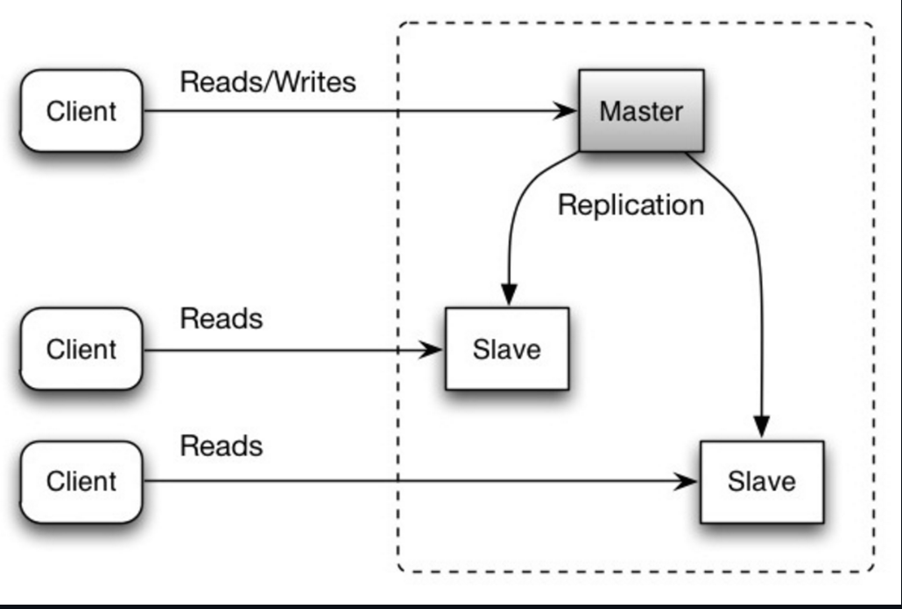
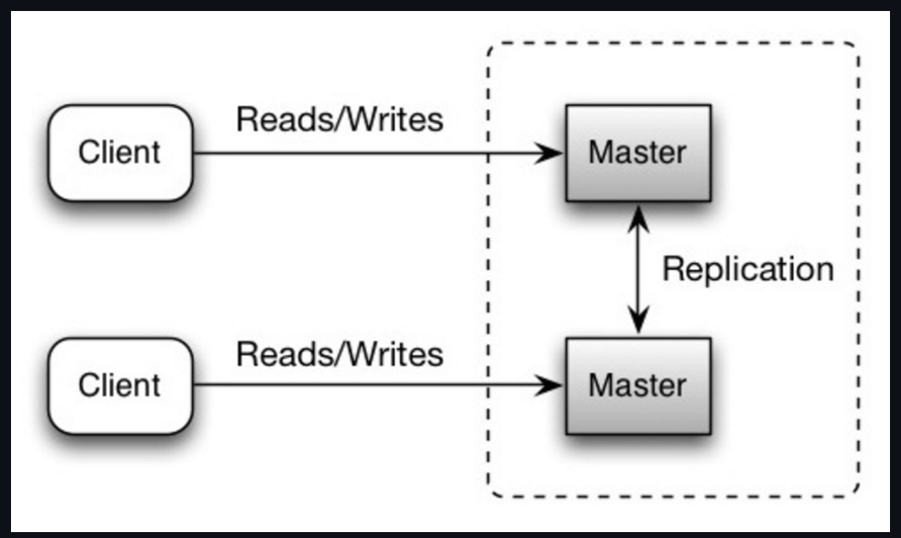

-   Relational Database Management System (RDBMS)

    A relational database stores data in tables (relations) consisting of rows and columns.  
    SQL databases—MySQL, PostgreSQL, SQL Server, Oracle—are classic RDBMS systems.

    RDBMS focuses on:
    - Structured data
    - Relationships between tables
    - Strong consistency
    - Transactions

    ACID Properties of Transactions

    ACID ensures correctness and reliability of database transactions.

    1. Atomicity
    - A transaction is all or nothing  
    - If any operation fails → rollback entire transaction  
    - Example: Money transfer (debit + credit must both succeed)

    2. Consistency
    - A transaction must take the database from one valid state → another valid state  
    - Ensures rules, constraints, triggers, and data integrity

    3. Isolation
    - Concurrent transactions behave as if executed serially  
    - Avoids dirty reads, non-repeatable reads, phantom reads

    4. Durability
    - After commit, changes persist even if the system crashes  
    - Achieved with write-ahead logs, journaling, and persistent storage

-   Scaling Relational Databases

    RDBMS can scale vertically (bigger machine) or horizontally using techniques like:
    - Master–Slave Replication
    - Master–Master Replication
    - Federation
    - Sharding
    - Denormalization
    - SQL tuning (indexes, query optimization)

    Here we cover replication models.

    1. Master–Slave Replication (Primary–Replica) 

        How it works:
        - Master handles all writes + reads  
        - Slaves (replicas) handle only reads  
        - Writes from master are replicated asynchronously or semi-sync to slaves  

        ```
                Writes
        Clients  ----->   Master
                        /   \
                    Reads/     \Reads
                    Slave     Slave
        ```

        Benefits
        - Offload reads to many replicas  
        - Simple architecture  
        - Failover possible (promote slave → master)

        If master fails:
        - System goes read-only  
        - Until a slave is promoted or a new master is created

        Disadvantages of Master–Slave Replication
        - Requires additional logic/process for promoting a slave to master  
        - Replication lag affects read consistency  
        - Includes general replication drawbacks (see common section below)

    2. Master–Master Replication (Multi-Primary) 

        How it works:
        - Two (or more) masters  
        - All masters accept reads + writes  
        - They synchronize writes with each other  

        ```
                Writes ⬆⬇ Sync Writes
        Master A  <-------------------->  Master B
            ^                             ^
            | Reads/Writes                | Reads/Writes
        ```

        Benefits
        - High availability: if one master fails → other can handle everything  
        - Lower write latency geographically (multiple write nodes)

        Disadvantages of Master–Master Replication
        - Must use load balancer or update app logic to choose write node  
        - Often becomes loosely consistent → breaks ACID  
        - Synchronization increases write latency  
        - Conflict resolution becomes complex as number of masters grows  
        - More susceptible to write conflicts (same row updated on two nodes)

    3. Common Disadvantages of Replication (Master–Slave + Master–Master)

        1. Risk of Data Loss
        If master crashes before replication completes, replicas lose the latest data.

        2. Replicas May Lag Behind
        Reads from replicas can return:
        - stale data  
        - inconsistent views  

        Replication delay increases with:
        - high write volume  
        - network latency  
        - many replicas  

        3. Replication Overhead
        More replicas → more replication traffic → more lag.

        4. Write Bottlenecks
        - Master can write in parallel (multiple threads)  
        - Replicas usually apply writes sequentially → they fall behind under load

        5. Additional Hardware & Complexity
        - More nodes  
        - More monitoring  
        - More failure-handling logic  
        - Requires tooling for:
        - failover  
        - conflict resolution  
        - consistency verification  

        Summary Table

        | Feature         | Master–Slave   | Master–Master                |
        | --------------- | -------------- | ---------------------------- |
        | Write nodes     | 1              | Multiple                     |
        | Read scaling    | Excellent      | Limited (consistency issues) |
        | Write conflicts | None           | Yes                          |
        | Failover        | Read-only mode | No downtime usually          |
        | Consistency     | Strong (ACID)  | Often relaxed (eventual)     |
        | Complexity      | Low            | High                         |

-   Federation (Functional Partitioning)

    1. What Is Federation?

        Federation, also known as functional partitioning, is a database scaling technique where a monolithic database is split into multiple smaller databases, each responsible for a specific function or domain.

        Instead of one giant SQL database handling everything (users, products, orders, forums, analytics, etc.), the data is divided based on *business functionality*.

        Example:
        A large application might break one huge DB into:
        - Users DB → authentication, profiles
        - Products DB → catalog, inventory
        - Forums DB → posts, comments
        - Orders DB → carts, purchases

        Each database handles only its domain.  
        👉 This reduces load, improves performance, and allows independent scaling.

    2. Why Federation? (Motivation and Benefits)

        💡 2.1 Reduced Load per Database
        Each DB handles fewer tables → fewer reads/writes → lower replication lag.

        💡 2.2 Better Memory Utilization
        Smaller databases = more data fits into memory → higher cache hit ratio.

        💡 2.3 Increased Write Throughput
        No single master is serializing all writes.  
        Each federated DB has its own master → parallel write scalability.

        💡 2.4 Independent Scaling
        - User service growing fast? Scale Users DB only.  
        - Product traffic rising? Scale Products DB only.  

        This reduces infrastructure cost and complexity.

        💡 2.5 Isolation & Fault Containment
        If the Forums DB goes down, users can still log in or shop → improves availability.

    3. How Federation Works Internally

        Step-by-step mechanism:
        1. Identify logical domains in the system (users, billing, catalog).
        2. Move each domain to its own DB instance.
        3. Route each API/service to its corresponding DB.
        4. Keep cross-DB queries rare or handle in the application layer.
        5. Use read replicas inside each federated DB if needed.

        Typical Architecture Diagram:
        ```
                ┌────────────┐     ┌────────────┐
                │  Users DB   │     │ Products DB│
                └────────────┘     └────────────┘
                    ▲                 ▲
                    │                 │
                ┌─────────────── Application Layer ───────────────┐
                    │                 │
                    ▼                 ▼
            User Service     Product Service
        ```

        Each service talks only to its own DB.

    4. Federation vs. Sharding

        | Feature               | Federation             | Sharding                           |
        | --------------------- | ---------------------- | ---------------------------------- |
        | Partition type        | By function/domain     | By data ranges/keys                |
        | Example               | Users DB, Orders DB    | Users DB split by user_id          |
        | Cross-partition joins | Harder                 | Also hard; joins typically avoided |
        | Use case              | Different data domains | Massive dataset of one domain      |

        They complement each other—large systems often use both (e.g., Users DB → further sharded by user_id).

    5. Disadvantages of Federation (Detailed)

        ❌ 5.1 Not Effective for Huge Monolithic Domains
        If one table/function is extremely large (e.g., billions of users), splitting by function won’t solve it.  
        You’d still need sharding.

        ❌ 5.2 Application Logic Becomes More Complex
        The application must know:
        - which DB to connect to
        - what domain the entity belongs to

        Example: Getting user posts requires:
        - Users DB → user  
        - Forums DB → posts  
        → App needs to coordinate.

        ❌ 5.3 Complex Cross-DB Joins
        SQL joins cannot be done across databases efficiently.

        Example:  
        `SELECT * FROM Users JOIN Orders WHERE Users.id=Orders.user_id`  
        → Now requires *two queries* across different DBs.

        You need:
        - server links, or
        - application-level fan-out queries

        This increases latency and logic complexity.

        ❌ 5.4 More Hardware and Infra
        Each federated DB requires:
        - master
        - replicas
        - backups
        - monitoring
        - failover setup

        The number of instances grows rapidly.

        ❌ 5.5 Operational Complexity
        - Deployment pipelines must handle multiple DBs.  
        - Devs need to understand multiple schemas.  
        - Backups and restores must be domain-aware.  

        This requires more DevOps maturity.

    6. When to Use Federation?

        ✔ Use When:
        - You have clear business domains (users, billing, analytics).
        - The main bottleneck is excessive read/write traffic to one monolithic DB.
        - You want organizational boundaries, e.g., microservices.

        ✘ Avoid When:
        - The system is small; premature federation adds more complexity.
        - Your main issue is a hot table (better solved with sharding).
        - You need many cross-table joins.

    7. Real-World Examples of Federation

        Amazon
        - Separate DBs for orders, carts, recommendations, payments.

        Facebook
        - Messaging DB, main user DB, social graph DB, analytics DB.

        Airbnb / Uber
        - Functional services aligned with microservices.

    8. Summary Table

    | Aspect               | Federation                                                |
    | -------------------- | --------------------------------------------------------- |
    | What?                | Split DBs by function                                     |
    | Purpose              | Reduce load, improve isolation, enable parallel writes    |
    | Benefits             | More cache locality, easier scaling, independent services |
    | Drawbacks            | Complex joins, more infra, more app logic                 |
    | Compared to Sharding | Functional split vs. data split                           |

-   Sharding

    1. What is Sharding?

        Sharding is a database partitioning technique in which a single large logical dataset is split across multiple smaller databases (called *shards*).

        Unlike federation (which splits by *function*), sharding splits the same dataset by some key.

        Example (Users Table Sharding):
        Instead of storing 100M users in one DB:
        - Shard 1 → users with IDs 1–10M
        - Shard 2 → users with IDs 10M–20M
        - Shard 3 → users with IDs 20M–30M
        - …and so on.

        Each shard is a full database with identical schema, but containing only its portion of the data.

    2. Why Sharding? (The Motivation)

        💡 2.1 Reduces Read/Write Load Per DB
        - Fewer disk reads per query  
        - Fewer writes  
        - Faster index lookups  
        → Less traffic = higher performance

        💡 2.2 Reduces Replication Load
        Smaller binlogs → faster replication → reduced lag.

        💡 2.3 Smaller Index Size = Faster Queries
        Smaller shards → smaller indexes → faster query performance.

        💡 2.4 Enables Parallel Writes
        Each shard has its own master → writes scale horizontally.

        💡 2.5 Fault Isolation
        If Shard 3 goes down, others continue to operate.  
        Only a subset of users are affected.

    3. How to Choose a Sharding Key (Techniques)

        A. Range-Based Sharding
        Divide by ID ranges:
        - 0–1M → Shard 1
        - 1M–2M → Shard 2

        Pros: Simple, predictable  
        Cons: Hotspotting possible

        B. Hash-Based Sharding
        Shard = hash(userID) % number_of_shards

        Pros: Even distribution  
        Cons: Hard to rebalance; requires consistent hashing

        C. Directory-Based Sharding
        Lookup service maps keys → shard.

        Pros: Dynamic mapping, easy rebalancing  
        Cons: Metadata store becomes dependency

        D. Geo-Sharding
        Split based on geography:
        - EU → Shard EU
        - NA → Shard NA

        Pros: Reduces latency  
        Cons: Cross-region queries harder

    4. How Sharding Works Internally
        1. Select sharding key (user_id, account_id, region, etc.)
        2. Each shard stores a subset of data.
        3. Application layer routes queries to correct shard.
        4. Each shard may have:
            - Master for writes
            - Replicas for reads
            - Backup nodes

    5. Sharding vs Federation (Quick Comparison)

        | Aspect         | Sharding                     | Federation                  |
        | -------------- | ---------------------------- | --------------------------- |
        | Split by       | Data                         | Function/domain             |
        | Example        | Users table split by user_id | Users DB vs Orders DB       |
        | Schema         | Same schema across shards    | Different schemas           |
        | Goal           | Scale large dataset          | Scale functional boundaries |
        | Cross-DB joins | Hard                         | Hard                        |

    6. Disadvantages of Sharding (Detailed)

        ❌ 6.1 Application Logic Complexity
        App must decide which shard to query, route writes, merge results.

        ❌ 6.2 Uneven Data Distribution
        Hotspots possible due to power users or popular regions.

        ❌ 6.3 Rebalancing is Hard
        Adding shards requires redistributing data and updating mappings.

        ❌ 6.4 Joins Across Shards Expensive
        Cross-shard joins require multiple queries + manual merging.

        ❌ 6.5 More Infrastructure Complexity
        Each shard needs hardware, replicas, backups, monitoring.

    7. When to Use Sharding

        ✔ Use when:
        - Tables extremely large (millions–billions rows)
        - Write throughput bottleneck
        - Vertical scaling insufficient

        ✘ Avoid when:
        - App is small / early stage
        - Frequent cross-shard joins
        - Data not uniformly distributable
    
    
    🔍 Sharding vs Partitioning

        | Concept       | Meaning                                |
        |---------------|----------------------------------------|
        | Partitioning  | Dividing data inside a single DB server |
        | Sharding      | Data partitioned across multiple machines |
    
    🔄 Sharding + Consistent Hashing
        - Sometimes used together  
        - Consistent hashing decides the shard  
        - Shards are placed on a ring  
        - Adding/removing shards only relocates few keys  

        Used in: Cassandra, Dynamo, Redis Cluster  

    8. Real-World Uses
        - Google: sharded by user ID  
        - Facebook: sharded MySQL clusters  
        - Twitter: sharded tweets  
        - Uber: sharded trip records  

-   Denormalization

    1. What is Denormalization?

        Denormalization = storing duplicated/redundant data to improve read performance by reducing joins.

        Example:
        Instead of:
        ```
        orders table
        └── user_id → join → user table (to fetch user_name)
        ```

        Denormalize:
        ```
        orders table includes: order_id, user_id, user_name
        ```

    2. Why Denormalize? (Benefits)

        💡 2.1 Faster Reads
        Avoid joins → less disk IO → faster queries.

        💡 2.2 Better in Distributed DBs
        Cross-db joins expensive → denormalization avoids them.

        💡 2.3 Better for High Read Ratios
        Systems often have 100:1 or 1000:1 read/write ratio → optimize reads.

    3. Common Denormalization Techniques
        - Precomputed aggregates  
        - Materialized views  
        - Storing related data together  
        - Adding redundant columns (e.g., user_name in orders)  
        - Lookup tables  

     4. Disadvantages of Denormalization

        ❌ 4.1 Data Duplication
        Storage overhead.

        ❌ 4.2 Harder Write Path
        Updates must propagate to all copies.

        ❌ 4.3 Hard to Maintain Consistency
        Constraints/triggers needed to sync redundant data.

        ❌ 4.4 Worse Performance Under Heavy Writes
        Writes slower due to multiple updates.

    5. When to Use Denormalization

        ✔ Use when:
        - Read-heavy workloads
        - Real-time systems
        - Distributed systems (sharding, microservices)
        - Analytics/dashboards

        ✘ Avoid when:
        - Writes extremely high
        - Perfect consistency required
        - Duplication unacceptable

-   What is Indexing in DB?
    An index is like a book index. Instead of searching the whole book. You look at the index → instantly find page number
    Same for databases:
        Without index → scan entire table (slow)
        With index → jump directly to data (fast)

    -   Indexing in SQL Databases (RDBMS):
        SQL databases follow a strict schema and store data in tables.
        ✔ How a SQL Index Works:
        -   SQL uses B-Tree / B+Tree indexes.
            Sorted Tree
            ├── 10
            ├── 20
            └── 30
        
        -  Scenario:
            CREATE TABLE users (
                id INT PRIMARY KEY,
                name VARCHAR(50),
                email VARCHAR(100)
            );

            CREATE INDEX idx_email ON users(email);
            You now have an index on the email column.

            🟩 What happens in the background
            1. Index Creation
                -   The database creates a B-Tree (or B+Tree) for the email column.
                -   Each node of the tree contains:
                    -   The email value
                    -   A pointer to the actual row location on disk (row ID / primary key reference)
                    -   B-Tree Example:
                        "k@example.com"
                        /           \
                    "b@example.com"  "z@example.com"
                -   The tree is sorted by email.
                -   Leaf nodes point to the actual data in the users table.

            2. Inserting a New Row
                INSERT INTO users (id, name, email) VALUES (1, 'Akash', 'a@example.com');
                Steps:
                -   Insert row into table data on disk.
                -   Insert email into B-Tree index:
                    -   Traverse B-Tree to correct leaf node.
                    -   Add a pointer to the new row.
                -   Maintain tree balance (split nodes if necessary).

                ✅ Result: Index allows fast search by email without scanning the entire table.

            3. Searching by Email
                SELECT * FROM users WHERE email = 'a@example.com';
                Steps:
                -   SQL engine checks B-Tree index first.
                -   Navigates through tree nodes (O(log n) search).
                -   Finds pointer to row in table.
                -   Fetches the full row data from table.
                ✅ Result: No full table scan, fast retrieval.

            4. Updating Email
                UPDATE users SET email='b@example.com' WHERE id=1;
                Steps:
                -   Update value in the table row.
                -   Remove old value from index.
                -   Insert new value in index at correct position.
                ✅ Result: Index remains consistent with table data.

            5. Deleting a Row
                DELETE FROM users WHERE id=1;
                Steps:
                -   Remove row from table.
                -   Remove corresponding entry from B-Tree index.
    
        -   SQL Indexes Are Strong Because:
            -   Relation: Indexes help join tables quickly
            -   Range queries: B-tree supports min–max efficiently
            -   Complex queries: Optimizer uses multiple indexes
            -   ACID: Index changes are fully consistent
    
    -   Indexing in NoSQL
        NoSQL databases have different types and indexing support depends on the model.

    1. Key-Value Stores
        -   Examples: Redis, Riak, DynamoDB
        -   Indexing Support: Limited / optional (Not needed as much as they used for key-value only for faster lookups like hashmap)

    2. Document Stores
        -   Examples: MongoDB, Couchbase
        -   Indexing Support: Yes
        -   How it Works:
            -   Primary index: _id field (default) → allows fast document retrieval.
            -   Secondary index: user-defined fields → B-Tree or similar structures.
            -   Supports compound indexes (Index multiple fields together to optimize queries involving more than one field), text indexes, geospatial indexes.
        -   Notes: Reads are faster for indexed fields; write performance can slightly degrade due to index updates.

    3. Column-Family Stores
        -   Examples: Cassandra, HBase
        -   Indexing Support: Yes (primary & secondary indexes)
        -   How it Works:
            -   Primary key(also known as partition key): data partitioned across nodes via hashing → direct access.
            -   Secondary index(clustering key): separate hidden index tables mapping column value → primary key.
            -   Queries on indexed columns first consult the index table.
        -   Notes: Optimized for write-heavy workloads; secondary indexes add read overhead in distributed setups.

    4. Graph Databases
        -   Examples: Neo4j, JanusGraph
        -   Indexing Support: Yes (node & edge properties)
        -   How it Works:
            -   Uses B-Trees or Lucene-based indexes for node/edge property lookup.
            -   Traversals leverage adjacency lists rather than full graph scan.
        -   Notes: Indexing improves lookup speed but graph traversal is still key for relationships.

-   SQL Tuning

    SQL tuning (or SQL performance optimization) refers to all techniques used to improve the speed, efficiency, and reliability of SQL queries and database operations.  
    It includes schema design, query rewriting, indexing, server configuration, profiling, and resource tuning.

    Because SQL tuning is huge, the first step is always:

    1. Benchmarking & Profiling

        Before optimizing, you must identify bottlenecks.

        1.1 Benchmarking
        Simulates high load to measure DB performance.

        Tools:
        - `ab (ApacheBench)`
        - `JMeter`
        - `wrk`
        - custom load generators

        Why benchmark?
        - Validate expected throughput
        - Check how DB behaves under peak load
        - Detect contention, lock issues, slow disk response

        1.2 Profiling
        Track actual slow operations inside the database.

        Tools:
        - MySQL Slow Query Log
        - EXPLAIN / EXPLAIN ANALYZE
        - Performance Schema
        - pg_stat_statements (PostgreSQL)
        - Query Profiler in MySQL Workbench

        Insights:
        - Which queries are slow
        - How indexes are used
        - Full table scans
        - Sorting operations (filesort)
        - Temp table usage
        - Joins causing heavy disk I/O

        👉 Benchmarking + Profiling → scientific tuning instead of guessing.

    2. Schema Tuning (Tighten Up Database Schema)

        Schema design directly affects DB performance.

        2.1 Use correct data types
        - CHAR for fixed-length fields  
        Fast random access, good for codes/hashes/statuses
        - VARCHAR for variable-length fields  
        Saves storage, slightly slower due to length lookup

        2.2 Use TEXT for large bodies of text
        - Blog posts, descriptions
        - Stored separately with pointers
        - Enables full-text search
        - Avoids bloating rows

        2.3 Use INT for large ranges
        - INT supports up to 2³² (~4 billion)
        - Use TINYINT, SMALLINT, MEDIUMINT when possible

        2.4 Use DECIMAL for currency
        Avoid float precision issues.  
        Example: `19.99` as float → `19.9899999997`.  
        DECIMAL stores exact values.

        2.5 Avoid large BLOBS
        - Store in object storage (S3, GCS, Azure Blob)
        - Keep only references in DB

        2.6 Use NOT NULL
        - Optimizes index usage
        - Reduces row size
        - Avoids 3-state logic

        2.7 Optimize VARCHAR length
        - `VARCHAR(255)` → 1 byte metadata
        - `VARCHAR(256+)` → 2 bytes
        - Smaller length = smaller pages = faster scans

    3. Index Tuning (The Most Powerful SQL Optimization)

        Indexes dramatically speed up SELECT queries but add overhead.

        3.1 When to use an index
        Index columns used in:
        - WHERE
        - JOIN
        - ORDER BY
        - GROUP BY

        3.2 How indices work
        Usually balanced B-Trees:
        - Search → O(log n)
        - Insert/Delete → O(log n) + rebalancing

        3.3 Advantages
        - Fast lookups
        - Fast sorting
        - Fast joining
        - Better filtering
        - Avoid full table scans

        3.4 Disadvantages
        - More disk + RAM usage
        - Slower writes (indexes updated on each insert/update)
        - Too many indexes hurt performance

        3.5 Bulk operations tip
        Disable indexes → load data → rebuild indexes.

        3.6 Composite Index Rules
        Order matters!  
        Index `(a, b, c)` works for:
        - a
        - a, b
        - a, b, c  
        👉 Not for b alone or c alone.

    4. Query Optimization

        4.1 Avoid Expensive Joins
        - Use denormalization if needed
        - Index join keys
        - Prefer INNER JOIN over OUTER JOIN
        - Avoid unindexed joins
        - Avoid functions on join columns (`LOWER(col)` prevents index use)

        4.2 Avoid SELECT *
        - Fetch only required columns
        - Reduces I/O, improves cache, reduces network transfer

        4.3 Use LIMIT
        Especially for pagination.

        4.4 Rewrite Subqueries into Joins
        Example:

        ```sql
        SELECT * FROM users
        WHERE id IN (SELECT user_id FROM orders);
        ```

        Rewrite as:

        ```sql
        SELECT u.*
        FROM users u
        JOIN orders o ON u.id = o.user_id;
        ```

        4.5 Temporary Table Optimization
        Large GROUP BY/ORDER BY may create temp tables.  
        Ensure:
        - Enough tmp memory
        - Correct indices
        - Avoid sorting unindexed data

    5. Partitioning Tables

        Partitioning splits one large table into smaller pieces.

        Benefits:
        - Faster reads
        - Hot partitions cached
        - Irrelevant partitions pruned
        - Better parallelism

        Types:
        - Range
        - List
        - Hash
        - Composite

        Example:
        ```
        orders_2023
        orders_2024
        orders_2025
        ```

    6. Query Cache Tuning

        Some DBs (MySQL 5.x) had query cache, but:

        Important:
        - Cache invalidates on any write
        - Causes locking/contention
        - Removed in MySQL 8.0

        👉 Use Redis, Memcached, or app-level caching instead.

    7. Additional Advanced Optimizations

        7.1 Connection Pooling
        Reduces connection overhead.  
        Use HikariCP, etc.

        7.2 Proper Isolation Levels
        High isolation (SERIALIZABLE) → more locks, less concurrency.  
        Choose minimum needed.

        7.3 Avoiding Locks
        - Shorter transactions
        - Optimistic locking

        7.4 Using Read Replicas
        - Writes → primary
        - Reads → replicas

    8. Final Summary Cheat Sheet

        | Category                | Techniques                                                       |
        | ----------------------- | ---------------------------------------------------------------- |
        | Benchmark & Profile | Benchmark under load, slow query logs, EXPLAIN plans             |
        | Schema Tuning       | Correct data types, CHAR vs VARCHAR, TEXT, avoid BLOBs, NOT NULL |
        | Index Optimization  | Index WHERE/JOIN/ORDER BY/GROUP BY columns, composite indexes    |
        | Query Rewriting     | Avoid SELECT *, avoid complicated joins, rewrite subqueries      |
        | Partitioning        | Range/hash/list to isolate hot data                              |
        | Cache Tuning        | Avoid MySQL query cache, use Redis                               |
        | Other Optimizations | Pooling, tuning isolation, read replicas                         |

-   NoSQL Databases

    What is NoSQL?

    NoSQL (Not Only SQL) refers to a broad class of databases designed to handle:

    - Massive scale (TB → PB)
    - Distributed systems
    - High read/write throughput
    - Flexible or evolving schemas
    - Semi-structured or unstructured data

    Unlike SQL databases, NoSQL systems do not use rigid tables with fixed schemas. Instead, they use flexible data models such as:

    - Key–value pairs
    - Documents
    - Wide-column families
    - Graph structures

    Most NoSQL systems prioritize scalability and availability over strong consistency, commonly following BASE properties instead of full ACID.

    BASE Properties (Common in NoSQL)

    | Property                 | Meaning                                                |
    | ------------------------ | ------------------------------------------------------ |
    | Basically Available  | System remains operational even under node failures.   |
    | Soft State           | Data may change over time (due to replication delays). |
    | Eventual Consistency | Data will become consistent if no new updates occur.   |

    BASE aligns with the CAP theorem, where many NoSQL databases choose Availability + Partition Tolerance over strict consistency.

    -   Why NoSQL? — Strengths & Motivations

        ✔ 1. Horizontal Scalability
        - Scale by adding more nodes (sharding/partitioning).
        - Ideal for massive distributed systems like Google, Facebook, Netflix.

        ✔ 2. Flexible Schema
        - Store JSON, nested objects, variable fields.
        - No migrations required for schema evolution.

        ✔ 3. High Performance
        - Reads/writes spread across nodes.
        - Data is often kept in memory or SSD.
        - Optimized for high throughput workloads.

        ✔ 4. Big Data Handling
        - Efficient for massive data ingestion (logs, clickstream, IoT).

        ✔ 5. High Availability & Fault Tolerance
        - Built-in replication across nodes or regions.
        - System continues working even if some nodes fail.

    -   Limitations of NoSQL

        ✘ 1. Weaker ACID Guarantees
        - Transaction support is limited.
        - Eventual consistency is common.
        - JOINs and foreign keys not supported.

        ✘ 2. Limited Complex Queries Initially
        - Each NoSQL DB has its own API/syntax.
        - Harder for ad-hoc analytics.

        ✘ 3. Data Duplication (Due to Denormalization)
        - Developer must keep redundant data consistent.

        ✘ 4. Modeling Requires More Care
        - You must model based on access patterns.
        - Wrong schema can hurt performance.

    -   4 Major Types of NoSQL Databases

        -   4 Major Types of NoSQL:

    1. Key–Value Stores
        -   Simple NoSQL type where data is stored as: key → value
        -   The value is usually opaque (JSON, binary, string, etc.).
        -   When to Use: Ultra-fast reads/writes, Caching, Session data, Real-time lookups
        -   Strengths:
            -   Extremely fast (O(1) lookups)
            -   Very easy to scale horizontally
            -   Good for large workloads
        -   Weaknesses:
            -   No complex querying
            -   No relationships
        -   Examples: Redis, Amazon DynamoDB, Memcached

    2. Document Databases
        -   Store semi-structured data as documents (usually JSON/BSON).
        -   Example:
            {
            "user_id": 7,
            "name": "Akash",
            "games": ["Elden Ring", "Cyberpunk 2077"],
            "address": { "city": "Pune", "pin": 411001 }
            }
        -   When to Use:
            -   When your data is flexible (schema changes often)
            -   Nested data
            -   Content management, product catalogs, user profiles
        -   Strengths
            -   Flexible schema
            -   Hierarchical data fits naturally
            -   Powerful indexing and aggregations
        -   Weaknesses
            -   Complex ACID transactions can be limited
            -   Joins are difficult (denormalization required)
        -   Examples: MongoDB, Couchbase, Amazon DocumentDB

    3. Wide-Column (Column-Family) Stores
        -   Inspired by Google BigTable.
        -   Data is stored in tables → column families → rows, but columns can vary per row.
            Column Family
            └── Rows
                └── Columns (key → value pairs)
            Think of a column family as a table, but with a major difference: 
                -   Each row can have a different set of columns
                -   Rows are not required to have the same columns like in SQL.
        -   Typical schema:
            Column Family: user_login_events
            Row key: user_id
                user_123:
                    1710000101: "login"
                    1710000300: "logout"
                    1710000450: "login"
                user_897:
                    1710000200: "login"
        -   When to Use
            -   Write-heavy workloads
            -   Time-series data
            -   IoT data at scale
            -   Logging, analytics
        -   Strengths
            -   Very high write throughput
            -   Horizontally scalable
            -   Tunable consistency (ex: Cassandra quorum)
        -   Weaknesses
            -   Not suitable for ad-hoc queries
            -   Requires modeling based on query patterns
        -   Examples: Apache Cassandra, HBase, Google Bigtable

    4. Graph Databases
        -   Represent data as nodes → edges → relationships.
        -   Example: (Akash) - follows -> (Gaming Channel)
        -   When to Use
            -   Social networks
            -   Recommendation systems
            -   Fraud detection
            -   Knowledge graphs
        -   Strengths
            -   Fast traversal of relationships
            -   Natural modeling of complex graphs
        -   Weaknesses
            -   Not good for large analytical queries
            -   Harder to scale horizontally than Cassandra or Dynamo
        -   Examples: Neo4j, Amazon Neptune, ArangoDB

    -   SQL vs NoSQL — When to Choose What?

        Choose SQL When:
        - Strong consistency is required
        - Schema is well-structured
        - Complex JOINS needed
        - Strong ACID transactions required
        - Mature tooling and community matter

        Choose NoSQL When:
        - High write throughput
        - Large distributed clusters
        - Flexible schema needed
        - Low-latency read/write
        - TB–PB scale data
        - Real-time workloads

        Sample Workloads Perfect for NoSQL
        - Clickstream ingestion
        - Log processing
        - Leaderboards
        - Caching
        - Shopping carts
        - User metadata tables
        - Event and telemetry streams

    -   Advanced Concepts Related to NoSQL

        -   Sharding
            Distributes data across multiple nodes so each node holds only a subset.

            Benefits
            - Improved performance
            - Reduced load per node
            - Parallel reads/writes
            - Higher availability

            Challenges
            - Complex application logic
            - Hotspot shards
            - Rebalancing complexity
            - Cross-shard joins harder

            -  Sharding in NoSQL vs SQL

                SQL:
                - Manual in MySQL/PostgreSQL clusters  
                - Tools: Vitess, Citus  

                NoSQL:
                - Cassandra → consistent hashing + vnodes  
                - MongoDB → shard key + router (mongos)  
                - DynamoDB → automatic partitioning  

        -   Denormalization
            Store duplicated data to avoid expensive joins.

            Pros
            - Faster reads
            - Fewer JOINs
            - Better performance for distributed systems

            Cons
            - Duplicate data
            - Harder consistency maintenance
            - Heavy write loads can worsen performance

    -   Final Summary
        NoSQL databases allow you to scale horizontally and handle massive, distributed workloads with high performance and flexible schemas. They trade off strong ACID guarantees for availability and partition tolerance. When used properly—based on the workload and access patterns—NoSQL systems deliver unmatched performance for modern distributed applications.

-   A CaseStudy of Cassandra DB as a column-wide NoSQL DB:

    -   Problem Scenario:
        A large-scale application (e.g., an e-commerce analytics platform) needs:
        -   Very high write throughput (millions of events/min)
        -   Zero downtime (24×7)
        -   Linear scalability across data centers
        -   Tunable consistency
        -   Fast time-series lookups
        Cassandra is chosen because of its distributed, decentralized, highly available design.

    1. Cassandra Cluster Architecture
        -   Distributed Ring Architecture
            -   All nodes are arranged logically in a ring.
            -   Each node is responsible for part of the data, determined by consistent hashing.
            -   No central coordinator or master.
                Node A ── Node B ── Node C ── Node D ── Node E (Ring)
        -   No Master Node
            -   Every node is equal.
            -   No single point of failure.
            -   Any node can handle reads/writes.
        -   Data Partitioning
            -   Cassandra uses consistent hashing to map a row key to a token range.
            -   Example:
                Row key: user_103
                Mapped to hash(token) → stored on Node C
        -   Replication Across Nodes
            -   Replication Factor (RF) determines how many nodes store each row.
            -   RF = 3 → data is stored on 3 different nodes.
            -   This ensures:
                High availability
                Fault tolerance
                Geographic resilience (with multi-DC replication)

    2. Cassandra Write Path (High Write Performance)
        Step-by-Step Write Flow:
        -   Client sends a write request to any node
            → This node becomes the Coordinator for the request.
        -   Coordinator writes the data to the Commit Log
            Durable, sequential disk write.
            Protects data from crashes.
        -   Data also goes to Memtable (in-memory structure)
            Acts like an in-memory sorted table.
        -   When Memtable fills → flushed to SSTables
            SSTables = immutable disk files. (Sorted String Table)
            Organized for fast sequential reads.
        -   Background Compaction
            Merges SSTables to reduce fragmentation.

        Result:
            Cassandra achieves very fast writes since it uses:
            -   append-only commit logs
            -   in-memory memtables
            -   no read-before-write

    3. Cassandra Read Path
        Step-by-Step Read Flow:
        -   Client sends read to a Coordinator node.
        -   Coordinator checks in this order:
            -   Memtable
            -   SSTable indexes
            -   Bloom filters (to skip SSTables that don’t contain the row)
            -   Partition index + data file
        -   Data from multiple SSTables is merged to return final result.

        Why reads are efficient:
        -   Bloom filters eliminate unnecessary disk I/O.
        -   Data is indexed per partition.
        -   Memtable often contains recent writes.

    4. Replication Model
        Assume: Replication Factor RF = 3
        This means:
        -   Each row is stored on 3 different nodes.
        -   These nodes are chosen based on token ranges around the ring.

        Example:
        Row Key HASH → Primary Node B
        Replicas → Node C, Node D

        This ensures:
        -   A single node failure does NOT cause data loss.
        -   Reads/Writes still succeed with remaining replicas.

    5. Cassandra Quorum Consistency
        Cassandra supports tunable consistency.
        You can choose how many nodes must ACK a read/write.

        For RF = 3:

        Write QUORUM
            -   Requires 2 out of 3 replicas to confirm.
            -   Ensures write is propagated to a majority.

        Read QUORUM
            -   Requires 2 out of 3 nodes to respond.
            -   Coordinator merges results & picks latest timestamp version.

    6. Consistency Rule: R + W > RF
        To achieve strong consistency: R + W > RF

        Example:
        Read QUORUM = R = 2
        Write QUORUM = W = 2
        Replication Factor = RF = 3

        Check rule:

        2 + 2 > 3   → TRUE
        ✔ Strong consistency achieved

        This means:
            A write is guaranteed to be visible for a QUORUM read.
            No stale reads.

    7. End-to-End Example (Mini Case Study)
        Use Case: User Activity Logging
        You store user page views with schema: PRIMARY KEY (user_id, timestamp)
        
        Flow of an Insert (Write)
            User "A123" visits page:

            INSERT INTO user_events (user_id, ts, page)
            VALUES ('A123', 1710000011, '/cart');

            Write steps:
                -   Client sends to Node X
                -   Node X → coordinator
                -   Write to commit log
                -   Write to memtable
                -   Replicate to 2 more nodes (because RF=3)
                -   Write considered successful when 2 nodes ACK (QUORUM)

        Flow of a Read
            Query all events of user A123:

            SELECT * FROM user_events WHERE user_id='A123';

            Read steps:
                -   Coordinator asks 2 replicas (QUORUM)
                -   They return their latest SSTable/Memtable data
                -   Coordinator reconciles timestamps
                -   Client gets strongly consistent answer

    8. Why Cassandra Works Well for This Case
        ✔ Zero downtime: Even if 1–2 nodes fail, QUORUM still works.
        ✔ High write throughput: Suitable for time-series/logs.
        ✔ Linear horizontal scalability: Add more nodes → system gets faster.
        ✔ Tunable consistency
            Choose:
            -   QUORUM for accuracy
            -   ONE for speed
            -   ALL for strict consistency
        ✔ Geographical replication: Multi-datacenter support is native.