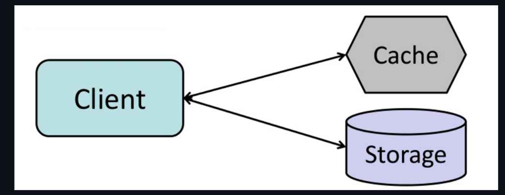
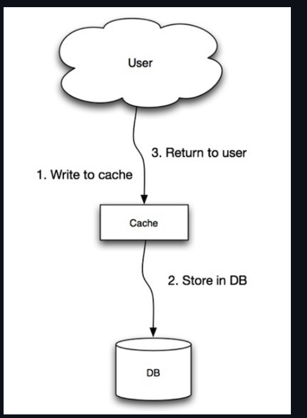
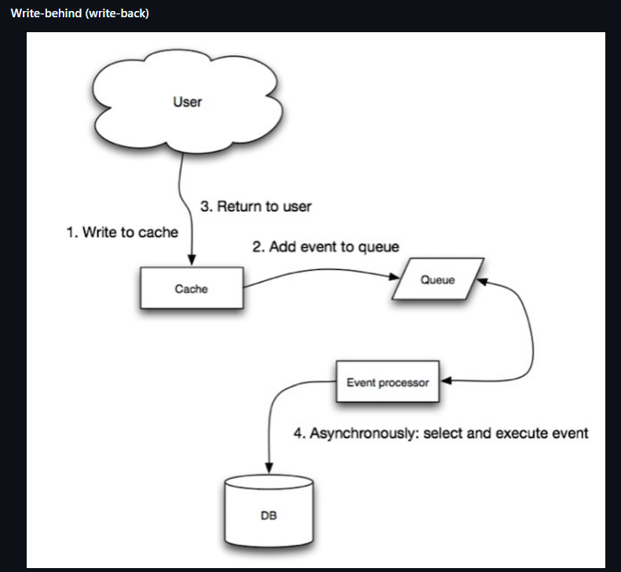

-   what is Caching ?

    Caching is a high-speed data access layer used to serve frequently accessed data faster than the primary data store (database, disk, or remote service). It reduces latency, lowers load on backend systems, and significantly improves scalability.

    In large-scale distributed systems—such as Netflix, Instagram, Amazon, LinkedIn—caching is one of the most important optimization techniques.

-   Why Do We Need Caching?

    1.1 Improve Performance (Lower Latency)
    - Data served from RAM is thousands of times faster than disk or network calls.
    - Example: DB query = 10–50 ms. Redis lookup = <1 ms.

    1.2 Reduce Database Load
    - Prevents hotspots where certain items (“celebrity profile”, “product page”, “trending posts”) receive disproportionate traffic.
    - Helps databases maintain a uniform distribution of reads/writes.

    1.3 Improve Scalability
    - Cache absorbs spikes (Black Friday, major events, viral content).
    - Allows systems to handle high QPS without scaling databases aggressively.

    1.4 Minimize Cost
    - Scaling database hardware is expensive.
    - RAM-based caching is cheaper per request at massive scale.

-   Where Caching Is Used in a System

    Caching can exist at multiple layers:

    2.1 Client-Side Caching
    - Browser cache stores images, CSS, JS.
    - Reduces network calls.
    - Uses HTTP caching headers (ETag, Cache-Control, Last-Modified).

    2.2 CDN Caching
    - CDN nodes (Akamai, Cloudflare, CloudFront) store:
        - Images
        - Videos
        - Static assets
        - API responses (sometimes)
    - Reduces latency by serving content from geographically closer nodes.

    2.3 Web Server / Reverse Proxy Caching
    - Tools like Varnish, NGINX, Squid cache:
        - Static content
        - Pre-rendered pages
    - Eliminates need to hit the app servers.

    2.4 Application-Level Cache (In-Memory)
    - Redis, Memcached used by application:
        - Cache DB query results
        - Cache rendered HTML
        - Cache user sessions
        - Cache frequently accessed objects
    - Most common layer in system design interviews.

    2.5 Database Caching
    - DB engines maintain internal caches:
        - MySQL: Buffer Pool
        - PostgreSQL: Shared Buffers
        - Oracle: SGA
    - Automatically caches frequently used pages/rows/indexes.

-   How a Cache Works – The Fundamentals

    3.1 Locality of Reference
    Caching depends on predictability of access patterns:
    - Temporal Locality: Recently used data is likely to be used again.
    - Spatial Locality: Data near recently used data might be used soon.

    Examples:
    - Accessing the same user profile repeatedly.
    - Sequential reading of posts in a feed.

    3.2 Cache Operations
    - Cache Hit → data found in cache → ultra-fast response.
    - Cache Miss → fetch from DB/remote, update cache.
    - Cache Eviction → remove old entries when cache is full.

    3.3 Cache Storage Types
    - In-memory (Redis, Memcached)
    - Disk-based cache (SSD-backed caches)
    - Distributed cache (Redis Cluster, Hazelcast, AWS ElastiCache)

-   What to Cache (Practical Examples)

    4.1 Database Query Results
    - Expensive SQL joins or aggregations
    - Example: “top 10 products”, “user timeline”

    4.2 Fully Rendered Pages
    - HTML fragments or API responses
    - Example: Amazon product detail page

    4.3 User Sessions
    - Auth tokens, session metadata
    - Redis is commonly used

    4.4 Activity Feeds
    - Precomputed home feed timeline
    - Used by Twitter, Instagram, Facebook

    4.5 Frequently Accessed Objects
    - User object, product object, metadata items

-   Cache Update Techniques (Very Important for Interviews)

    5.1 Cache-Aside (Lazy Loading) 
        Most common pattern.

        Process:
        1. App requests data → cache miss.
        2. Fetch from DB.
        3. Store in cache.
        4. Return data.

        Pros:
        - Only requested data is cached.
        - Good for read-heavy workloads.

        Cons:
        - First request is slow.
        - Data can become stale.

        Used in: Memcached, Redis

    5.2 Write-Through 
        Write to cache → cache writes to DB synchronously.

        Pros:
        - Cache always consistent.
        - Reads are fast after write.

        Cons:
        - Write latency increases.
        - Cache stores even rarely accessed data.

    5.3 Write-Behind (Write-Back) 
        Write to cache → async write to DB.

        Pros:
        - Very fast writes.
        - Reduces DB load.

        Cons:
        - Risk of data loss if cache fails.
        - Complex.

        Used in:
        - High write throughput systems
        - Log aggregation
        - Event systems

    5.4 Refresh-Ahead
        Cache predicts items needed soon and refreshes before TTL expiry.

        Pros:
        - Smooth experience
        - Avoids cache misses

        Cons:
        - Wrong predictions → wasted cache space.

-   Cache Eviction Policies

    When cache is full, items must be removed.

    Common Strategies
    - LRU (Least Recently Used) – most widely used.
    - LFU (Least Frequently Used) – for stable heavy items.
    - FIFO (First In First Out).
    - Random Replacement – simple, effective at scale.

    Redis supports:
    - LRU
    - LFU
    - Random
    - TTL-based eviction

-   Cache Invalidation – The Hardest Problem

    Consistency between cache and DB is critical.

    Why it’s hard?
    - Data changes frequently.
    - Cache might have stale information.
    - Distributed nature adds race conditions.

    Strategies:
    1. TTL (Time-to-Live)
        - Auto-expire items.
        - Simple, but can cause thundering herd on expiry.

    2. Invalidate on Updates
        - Update DB → remove/update cache entry.

    3. Event-driven invalidation
        - Pub/Sub system (Redis Pub/Sub, Kafka)
        - All nodes receive invalidation events.

    4. Versioning
        - Use version-based keys: `user:123:v45`
        - Guaranteed consistency.

-   Common Cache Architectures

    8.1 Local Cache (in-process)
    - Within application memory (e.g., Java HashMap, Guava Cache)

    Pros:
    - Fastest possible

    Cons:
    - No shared cache across instances
    - Risk of stale data

    8.2 Distributed Cache
    - Redis Cluster
    - Memcached Cluster
    - Hazelcast

    Pros:
    - Shared across multiple servers
    - Scalable & consistent

    Cons:
    - Requires network
    - More complex

    8.3 CDN Cache
    Used for:
    - Images
    - JS/CSS
    - Videos
    - Static pages

    Key concepts:
    - TTL
    - Edge nodes
    - Cache-Control headers

-   When to Use Caching (Decision Points)

    Use caching when:
    - ✔ Data is read frequently and updated rarely
    - ✔ Latency is critical
    - ✔ Backend systems are overloaded
    - ✔ Traffic is spiky
    - ✔ Recomputing or re-fetching data is expensive

    Do not use caching when:
    - ✘ Data is highly dynamic
    - ✘ Strong consistency is required
    - ✘ Cache invalidation complexity outweighs benefits
    - ✘ Memory cost > performance gain

-   Real-World Caching Use Cases

    10.1 Social Media Feeds (Instagram, Twitter, Facebook)
    - Cache timelines
    - Cache user graph (followers/following)

    10.2 E-commerce (Amazon, Flipkart)
    - Cache product details
    - Cache search results

    10.3 Gaming
    - Cache player profiles
    - Leaderboard data

    10.4 Financial Systems
    - Cache exchange rates
    - Cache feature flags
    - Cache risk models

    10.5 Microservices Architecture
    - Cache service responses
    - API gateway-level caching

-   Caching Mistakes to Avoid

    🚫 Caching everything  
    🚫 Storing large blobs in cache  
    🚫 Using long TTLs for dynamic data  
    🚫 Relying on local cache in distributed systems  
    🚫 Not planning cache warm-up/busting strategies  
    🚫 Using file-based cache (dangerous for autoscaling)  

-   Summary Table

    | Topic             | Description                                             |
    | ----------------- | ------------------------------------------------------- |
    | Purpose       | Improve speed, reduce load, increase scalability        |
    | Where used    | Client, CDN, Reverse proxy, Application, DB             |
    | Types         | Local, Distributed, Global (CDN), In-memory             |
    | Patterns      | Cache-aside, Write-through, Write-behind, Refresh-ahead |
    | Eviction      | LRU, LFU, FIFO, TTL                                     |
    | Key problems  | Invalidation, stale data, consistency                   |
    | Best for      | Read-heavy workloads, expensive queries                 |
    | Not ideal for | Highly dynamic data, strong consistency                 |

