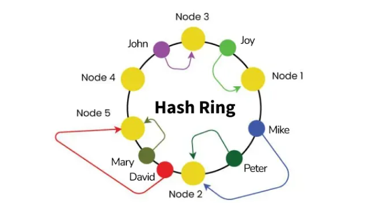

-   Load Balancer
    A Load Balancer (LB) is a system that distributes incoming network or application traffic across multiple servers to ensure:
    -   High availability
    -   Reliability
    -   Scalability
    -   Faster response time
    -   Zero or minimal downtime
    It sits between clients and backend servers.

    -   Why Do We Need a Load Balancer?
    Without LB:
    -   One server handles everything → overload → crashes.
    -   No redundancy → if server dies → system down.
    -   Uneven distribution → wasted CPU on some, overloaded others.
    With LB:
    -   Traffic spreads evenly
    -   Fault tolerance (if one server dies, others take over)
    -   Better performance
    -   Scalable architecture (add/remove servers easily)

    -   What a Load Balancer Does
        1. Distributes Client Requests: Evenly or intelligently routes incoming traffic to multiple servers.
        2. Health Checks: Continuously checks which servers are alive. If a server fails → LB stops sending traffic to it.
        3. Failover / Redundancy: Automatic rerouting when a server crashes.
        4. SSL Termination: LB can decrypt HTTPS traffic → reduces CPU load on servers.
        5. Caching (in some LBs): Stores responses & serves them quickly.
        6. Session Persistence: Ensures requests from the same user go to the same backend server (sticky sessions).

    -   Types of Load Balancers
    1. Hardware Load Balancers
        -   Physical devices (expensive, used in large enterprises).
        Example: F5 Big-IP, Citrix Netscaler
    2. Software Load Balancers
        -   Installed on servers.
        Example: Nginx, HAProxy, Envoy
    3. Cloud Load Balancers
        -   Fully managed by cloud providers.
        Examples: AWS ELB / ALB, Google Cloud Load Balancer, Azure Load Balancer

    -   Load Balancing Algorithms
    1. Round Robin: Sends requests one-by-one to each server in order.
    2. Weighted Round Robin: Servers with more capacity get more requests.
    3. Least Connections: Send traffic to the server with the fewest active connections.
    4. IP Hash: Same client IP → same backend server (session affinity). (Consistent Hashing)
    5. Random Choice: Randomly choose any available server.

    -   Layer 4 vs Layer 7 Load Balancers
        -   Layer 4 (Transport Layer LB)
            -   Uses TCP/UDP info (no looking inside HTTP content).
            -   Very fast
            -   Works on ports & IPs
                Example: AWS NLB, HAProxy L4 mode
        -   Layer 7 (Application Layer LB)
            -   Understands HTTP/HTTPS.
            -   Can route by URL path, headers, cookies
            -   Example: /api → API servers, /static → CDN
            -   Can do authentication, cache, WAF, etc.
                Examples: AWS ALB, Nginx, Envoy, Cloudflare

-   Consistent Hashing
    Consistent hashing is a technique used in distributed systems to distribute keys/data across many servers while minimizing data movement when servers join or leave.

    -   Where It’s Used
        - Distributed caches (Redis Cluster, Memcached)  
        - Databases (Cassandra, DynamoDB)  
        - Load balancers  
        - Distributed file systems  

    1. Why Do We Need Consistent Hashing?

        ❌ Problem with Normal Hashing
            A common approach: server = hash(key) % N
            Where N = number of servers.  

        - If N changes (server added/removed), almost all keys get remapped.  
        - This causes massive cache misses or data reshuffling.  

        Example:
        - Current: `hash(key) % 3`  
        - Add new server → `hash(key) % 4`  
        - ➡ 75% of keys move to new locations → bad for performance  

    2. How Consistent Hashing Solves This 
        - Servers → mapped to a ring  
        - Keys → mapped to the same ring  
        - Rule: A key always goes to the first server clockwise from its hash position  

           (hash circle)
        0 ----------------- 2^32-1
           |     |      |
         S1     S2     S3

        - When a server joins or leaves → only local movement  
        - Only keys between two adjacent servers are moved, not the whole dataset  

    3. How It Works (Step-by-Step)

        (a) Create the Hash Ring  
        - Hash space: `0 → 2^32 - 1`  
        - Hash servers: `hash("server1")`, `hash("server2")`, `hash("server3")`  
        - Place them on the circle  

        (b) Hash the Keys  
        - Hash keys (user_id, session_id, cache_key, etc.)  
        - Place them on the same ring  

        (c) Key Assignment Rule  
        - Key belongs to the first server clockwise from its position  
        - Example: Key K → next clockwise server S1  

    4. What Happens When Servers Change?

        ✔ New server joins → gets a position in the ring, only steals keys from the next server clockwise  
        ✔ Server fails → only its keys are reassigned to the next server  

        ➡ Minimal data movement compared to modulo hashing  

    5. Virtual Nodes (VNodes) – Important
        Real clusters rarely have equal load.  
        Solution: give each physical server multiple virtual points on the ring.  

        | Physical Server | Virtual Nodes |
        |-----------------|---------------|
        | S1              | S1A, S1B, S1C |
        | S2              | S2A, S2B, S2C |
        | S3              | S3A, S3B, S3C |

        Benefits:
        - Better load balancing  
        - Fault tolerance  
        - Even distribution of keys  

    👉 Cassandra, DynamoDB, and Redis Cluster rely heavily on VNodes  

    6. Example – Key Assignment
        Servers hash to:  
        - S1 → 10  
        - S2 → 40  
        - S3 → 80  

        Keys:  
        - K1 → 12  
        - K2 → 45  
        - K3 → 70  

        Clockwise assignment:  
        - K1 → S2  
        - K2 → S3  
        - K3 → S3  

        If S2 fails → keys that mapped to S2 now go to S3  

    7. Where Consistent Hashing Is Used
        ✔ Caching → Memcached, Redis Cluster (reduces cache invalidation on scale)  
        ✔ Databases → Cassandra, DynamoDB (decides which node stores each partition)  
        ✔ Load Balancers → Distribute users across servers with minimal session migration  

    8. Pros & Cons

        ✅ Advantages
        - Minimal key movement during scaling  
        - Great for dynamic environments where nodes join/leave  
        - Better load balancing (with virtual nodes)  
        - Works well for distributed caches & databases  

        ⚠️ Disadvantages
        - Needs virtual nodes to avoid imbalance  
        - More complex than simple modulo hashing  
        - Requires a ring structure and hashing strategy  

- Sharding 
    Sharding is the process of splitting a large database or dataset into smaller, independent pieces (shards) so that:
    - Data is distributed across multiple machines  
    - Each shard handles only part of the total load  
    - The system achieves horizontal scalability  

    👉 Sharding = Horizontal Partitioning

    Example:
    - Users A–F → Server 1  
    - Users G–M → Server 2  
    - Users N–Z → Server 3  

 -  Why Sharding Is Needed ?
    As data grows, a single database instance hits limits:

    - CPU overloaded  
    - RAM insufficient  
    - Queries slow  
    - Storage full  
    - Write throughput bottleneck  

    ➡ Sharding lets you add more machines instead of upgrading to bigger ones.

 -  How Sharding Works (Simple)
    - Data is divided based on a shard key (column/attribute used for partitioning).  
    - Each shard is a complete independent DB, not just a table slice.  

    Example shard keys:
    - `user_id`  
    - `customer_id`  
    - `region`  
    - `email prefix`  

 -  Types of Sharding

    1. Hash-Based Sharding

        shard = hash(user_id) % N

        - ✔ Even distribution  
        - ❌ Adding/removing shards = heavy data movement (fixed by consistent hashing)  

        Used in: Redis (some modes), MongoDB (default hash sharding)

    2. Range-Based Sharding

        Shard 1 → user_id 1–10,000
        Shard 2 → user_id 10,001–20,000
        Shard 3 → user_id 20,001–30,000

        - ✔ Easy to query by range  
        - ❌ Hotspots possible (e.g., recent users all go to last shard)  

        Used in: MySQL sharded systems, Big OLTP systems

    3. Directory / Lookup Table Sharding

        User A → Shard 1
        User B → Shard 3
        User C → Shard 2

        - ✔ Flexible  
        - ✔ Easy to add shards  
        - ❌ Directory must be highly available  

        Used in: Uber (trips data), Facebook (lookup-based)

    4. Geo-Sharding
        Split by geographical region:
        - Asia shard  
        - Europe shard  
        - US shard  

        - ✔ Low latency  
        - ✔ Data residency compliance  
        - ❌ Hard to read across regions  

        Used in: Google Spanner, AWS DynamoDB Global Tables

 -  Sharding in NoSQL vs SQL

    SQL:
    - Manual in MySQL/PostgreSQL clusters  
    - Tools: Vitess, Citus  

    NoSQL:
    - Cassandra → consistent hashing + vnodes  
    - MongoDB → shard key + router (mongos)  
    - DynamoDB → automatic partitioning  

 ✅ Advantages of Sharding
    - Scales horizontally (add servers easily)  
    - Improves read/write throughput  
    - Reduces load per database  
    - Improves fault isolation  
    - Enables storage distribution  

 ⚠️ Disadvantages of Sharding
    - Complex to maintain  
    - Cross-shard queries are slow  
    - Joins across shards are difficult  
    - Resharding (changing shard key) is painful  
    - Distributed transactions are expensive  

 📖 Sharding Example – User Table

    Without sharding → one DB:

        users(id, name, email, password)

        ➡ Grows to 500M users → slow.

    With sharding:
        - Shard 1: users 0–100M  
        - Shard 2: users 100M–200M  
        - Shard 3: users 200M–300M  
        - Shard 4: users 300M–400M  
        - Shard 5: users 400M–500M  

    Each shard has its own CPU, RAM, storage.

 🔍 Sharding vs Partitioning

    | Concept       | Meaning                                |
    |---------------|----------------------------------------|
    | Partitioning  | Dividing data inside a single DB server |
    | Sharding      | Data partitioned across multiple machines |

    👉 Sharding = Distributed Partitioning

 🔄 Sharding + Consistent Hashing
    - Sometimes used together  
    - Consistent hashing decides the shard  
    - Shards are placed on a ring  
    - Adding/removing shards only relocates few keys  

    Used in: Cassandra, Dynamo, Redis Cluster  

